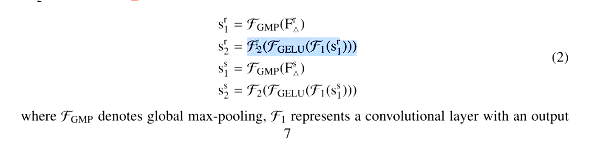
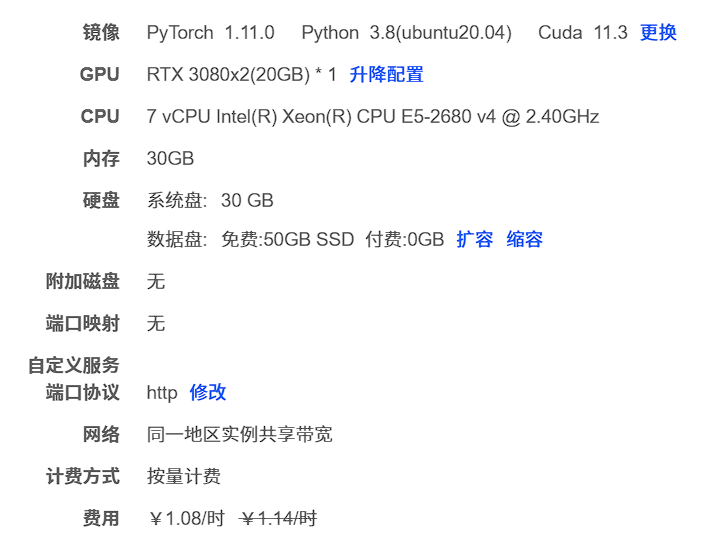
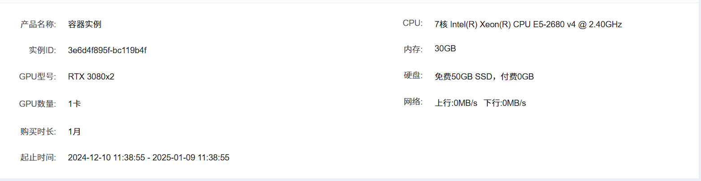

[toc]
# 可以借鉴的话---第二个蓝色
# Total
## 改动大就明说受什么启发，改动小就在引言一句带过。  
  
个人比较推荐的，直接坦诚地cite别人的文章，并且要讨论别人是怎么做的，存在哪些问题，并且要指出自己的创新点怎么样解决好了这个问题  
  
## 一定是围绕一个核心论点
（解决某一个最重要的问题或者核心任务）展开说的，其他的是解决核心问题的过程中顺带解决的子问题，尤其是引言部分，一定要好好理这个逻辑关系，  
  
规划好这两三个研究点，分别解决什么问题，是独立问题，还是继续改进的递进关系，还是其他的，这个逻辑关系要规划好  

## 图表一定要在文章中引用到
{
According to Fig.5, 
As illustrated in  Figure 1,
}
## 有了现象一定需要解释

## 多用GPT!!!!! !! !!! ! !!! !!!! !!!!!! !!!! !!!! !!! !!!
# Abstract
## line
- **大背景**->
概述intro的第一段话
- **概述**->
we show that ...{      
在什么基础上学习网络可以……
利用……
可以exceed the state-of-the-art in semantic segmentation……
}
our key insight/理念 is ...{
在什么条件下去构建一个什么样的网络
}
- **网络组成**->
为了达到做过具体目标，我们的网络	is composed of……
- **意义**->
所提出的网络很好的……，克服了……，融合了……和……
因此可以很好的……（从而运用在……）
- **结果**->
在什么数据集上证明了其很好的表现，
## atten
其权重取值不受两个向量xi,xjxi,xj​​之间的距离影响，因此可以解决长距离依赖问题
[soft-atten](https://allenwind.github.io/blog/9478/)  

# Intro---最多四段，要不然虎头蛇尾
## line
- **大背景**->
扩展摘要的第一句话
- **前人工作**->
*一定要进行点评*，这样才能引出自己的模型
早期的一两句话**概述**说出模型名字即可，近期的要详述，写出其特点和方法

**记得把借鉴的网络能的话写上去**，也可以不用全写（如果和你领域不太相关的模块），之后在方法中点明即可

尽管它们表现很好，但是存在有如下问题。第一个……第二个……

- **自己模型**->
Therefore，Inspired by the ……前人的缺点还有大背景的那个
我们提出了（模型结构）来解决……
你的第一篇审稿人的意见---引言倒数第二段这里说明 提出的新颖模块 如何更**高效合作**进行的融合的。对比 method 部分的开始，是说 输入经过这些模块**会经过 什么样的变化**
我们这篇的贡献可以被总结为:
1. 基于什么什么架构，**记得写上backbone**的优点，which解决了第一个问题
2. 设计了什么什么模块,in order to 缓解第二个问题
3. （创新模块）
- **结果**->
在……数据集上实现了很高的性能
It outperforms  the ViT / DeiT [20, 63] and ResNe(X)t models [30, 70] significantly by ……什么手段（就是那些创新的模块），具体而言，在……指标上…………

# Related Works
## vital
- **直接开始分点作答**，不用再重复话了->
- **分点作答**，加粗->
就是按照本论文的*相关的几方面*展开/从*标题细分*{
……充当了重要角色
我们also inspired by the success of 
……与我们最相关了
}
- **每一段点评+引出自己的**->
- **与我们类似的**->
Most related to ours is the model of Cordonnier et al. (2020), which……，但是……存在缺陷，我们也……克服了这个
## 注意
把**对比实验写上去**，也可以不用全写，留几个直接参考文献
写人名或者网络名都可以

# Method	
## line
Overview of the proposed FTransUNet
Illustration of the proposed CMFNet
- **Overall Framework**->
总体架构**不写**公式！！！！！
**介绍一下这个模型是怎么输入和输出的，中间大概的处理过程**
对于backbone部分的，**点到为止**，不用写上借鉴的部分的结构
In this paper, our primary focus is …… as shown in Fig. 2.
- **各个部件分开介绍**->
写上 可能的用的 **数学 表示**
**具体介绍这个模块的作用。**
它主要设计一些公式。那公式怎么写，你就看图说话。
然后公式怎么写——
为了去挖掘什么什么，为了去提取什么什么，首先计算什么什么
然后提取到的东西，我把它定义做什么什么。
然后这个计算过程可以被定义为。然后下面就开始写公式挑完 where 什么符号 denote 什么功能

## 公式

如果你仔细看深度学习很多文章的公式，基本上都是Y=f(X)的形式的，也就是说告诉读者输入（X）是啥，用什么（f(·)）处理的，输出（Y）是啥而已。

你就做了啥操作，你就给他连着括弧写就行了。
  

思想：**严格翻译模型图，或者翻译代码**
步骤：
1. 上边先说这个模块的流程
2. 这个什么什么功能的计算可以被描述为：如下的数学公式
3. where定义里面的变量
4. 简单总结一下
# Experiment
## line
- **datasets**
大致介绍
划分数据集
-  **Expermental implements**
训练超参数和环境
Training & Fine-tuning    参考vit第5页
-  **Evaluation Metrics**
-  **Performance Comparison**

**Final results on the Vaihingen.** **Best values are highlighted with bold,while the underlined denote the second best.Notably,** **Given the rare occurrence of the 'clutter' class, we did not take it into account**
看着**表格**说话。把篇幅凑够。然后我们有两个数据集，那你就把两个数值都描述出来？你比如说数据集 a，你是在描述比谁高多少？那你第二个数据你可以描述我获取得了什么样的精度，你这样稍微不一样，你再去描述。
**可视化图**

Comparison on DepthTrack
Comparison on LasHer
Comparison on VisEvent
-  **Ablation Study**
结果如表格就发现。加入哪些东西，效果会很好，加入另外一个东西，然后效果会影响的更大，因此认为哪一个模块？对于这个任务很重要，同时加上什么模块之后能进一步提高它的效果

## 注意
**有了现象一定需要解释**
**对比实验的对比其他模型要记得引用出来**

## 配置

[AutoDL算力云 | 弹性、好用、省钱。租GPU就上AutoDL](https://www.autodl.com/console/cost/order/detail/173380193585561390)

# conclusion
## line 
提出存在的问题（）
因此，
This paper presents  a successful case of a……（领域） and the proposed method（网络模型全称） 在什么数据集上实现了很好的效果。	……（网络模型简成）……（创新之处），通过和其他……对比和消融也验证了……（组件）的必要性。
（可以的话写上展望……）
We are currently seeking a method based on low-rank decomposition for segmentation, leveraging RGB and multiple remote sensing auxiliary modalities, provided that only a single parameter set is involved. This approach can effectively alleviate the challenges arising from heterogeneous characteristics among these.

# ref

<!--stackedit_data:
eyJoaXN0b3J5IjpbLTU4NjgyNTI0XX0=
-->