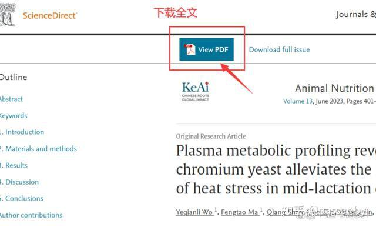

# 检索、下载
## 知网
- 知网检索到的外文文献基本上只有摘要
	- 点击DOI号链接进入文献来源全文页，没办法 直接通过操作知网进行 下载的，最终还是要 回到发布页上边的
	- 

## 推荐

### 谷歌学术
- ==Edge的bing 和 Chrome的google 都去搜索一次，可能SEO 排名不一样！！！==

- 先试试 https://scholar.google.com/
- 再去 镜像网址：https://ac.scmor.com/
	- [烂番薯！！！](https://xueshu.lanfanshu.cn/)
	- ==旁白有 SCI-HUB 的地址的！==
	- **请不要在镜像站上登录谷歌账户，也不要搜索敏感词**
- 

### sci-hub
- https://tool.yovisun.com/scihub/

## 互助论坛
### 科研通
- https://www.ablesci.com/
- [每日签到可以获得10分](https://www.ablesci.com/post/detail?id=NQKd7P)
- 

### 谷粉互助
- [谷粉互助](https://bbs.91bdqu.com/)
- [每日签到赠送10积分](https://bbs.91bdqu.com/suggest/51098xs.html)

## 直接开源开源获取的
### Open Access Library
https://www.oalib.com/

### DOAJ（Directory of Open Access Journals）
- https://doaj.org/

### CORE
- https://core.ac.uk/

# 期刊查询
- https://www.ablesci.com/journal
	- 支持连接到 LetPub！

# 获取同行评论
## 有些期刊会公开，比如NC
- https://www.zhihu.com/question/611311980/answer/3113171341

# 期刊/会议知识
## IEEE
- IEEE的文章大体分为3类，letter,magazine,journal/transaction
- IEEE letter:属于快报形式，一般发表最新的研究成果，文章要求短小，理论推导要求不高。
- IEEE Magazine:这才是属于杂志类，==一般要求用文字和图表来表述些最新研究成果，不允许有过多的公式推导==
- IEEE Jour/Trans:这两个属于同一类，期刊杂志，但两者面向的读者和表达方式上略有不同。两者都需要有很大的创新点，和比较详细的公式推导。
- Trans:具体到一个相对较细的专业方向上，如IEEE Trans. Sign.Proc.。
- 而`jour`:面向的读者群却更加广泛,如IEEE J-SAC,所以jour需要对背景知识有更加全面的介绍。
- ==虽然jour没有trans.的专注度高，但是其理论深度的要求也很高，而且其影响因子往往远远高于Trans.==

