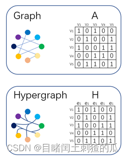

# GNN（Graph Neural Networks）
- 聚合——更新——循环
- ==通过邻居 信息减少自己的不确定性！！！=
	- 就类似于 近朱者赤近墨者黑
	- 可以通过 邻居判断的，==加权邻居的信息==
		- 注意力机制添加
- 

- ==GNN 就是 特征提取的！！！提取其他节点的特征和结构信息
-  GNN 的输入就是图，比如社交网络

[更详细 分析GNN](../../论文精读/李沐论文精度系列.md#[零基础多图详解图神经网络（GNN/GCN）【论文精读】](https%20//www.bilibili.com/video/BV1iT4y1d7zP?t=0.1))

# GCN （Graph Convolutional Network）
- GNN  的特殊形式
- 图卷积神经网络是卷积神经网络在图域上的自然推广，弥补了CNN中**平移不变性**在非矩阵结构数据上不适用的问题，使得网络能够对输入数据的图结构进行编码
- 

- [同济子豪兄-GNN](../../论文精读/同济子豪兄-GNN.md)
- [简单粗暴带你理解GCN图卷积神经网络](https://www.bilibili.com/video/BV1Xy4y1i7sq?t=0.6)

# HGN （Hypergraph Neural Networks）

- [传统的图结构将特征数据之间的关系简单的表达为二元关系，丢失了原始数据中很多高阶的关联关系](https://blog.csdn.net/weixin_44585583/article/details/125062903)
- 然而 超图的拉普拉斯矩阵扩展了节点邻域，使其可以聚合更丰富的高阶信息

- 两者的区别体现在邻接矩阵上，GCN表示为A，HGN表示为H。
	- 图左边，GCN中节点为成对连接，**节点之间只能表达为2元关系**。超图则是任意多个节点连接，可以表达多元复杂关系 
	- 图右边，GCN中的A表示节点与节点之间是否有关系，HGN表示**节点与边是否有关联**

# GAT（Graph Attention Networks）
- 对节点及其一阶邻域节点做求和聚合时，也可改用**加权求和**
- 为了保持 permutation invariant
- 一种思路是采用标量打分函数 `f(nodei​,nodej​)`，依据**节点对计算权重**
- 该函数用于衡量邻域节点相对于中心节点的相关程度；权重可通过 softmax 归一化，让模型侧重选取和任务最相关的邻节点。

# GAE

