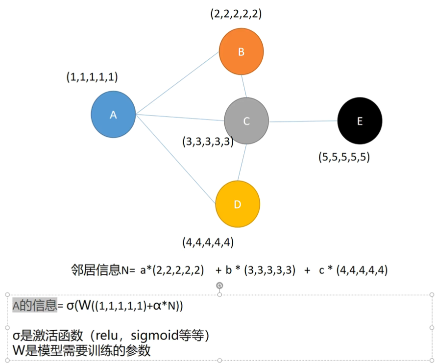

# GNN（Graph Neural Networks）
- 聚合——更新——循环
- ==通过邻居 信息减少自己的不确定性！！！=
	- 就类似于 近朱者赤近墨者黑
	- 可以通过 邻居判断的，==加权邻居的信息==
		- 注意力机制添加
- 

- ==GNN 就是 特征提取的！！！提取其他节点的特征和结构信息
-  GNN 的输入就是图，比如社交网络

[零基础多图详解图神经网络（GNN/GCN）【论文精读】](../../论文精读/李沐论文精度系列.md#[零基础多图详解图神经网络（GNN/GCN）【论文精读】](https%20//www.bilibili.com/video/BV1iT4y1d7zP?t=0.1))

# GCN （Graph Convolutional Network）
- GNN  的特殊形式
- 

- [同济子豪兄-GNN](../../论文精读/同济子豪兄-GNN.md)

- https://www.bilibili.com/video/BV1Xy4y1i7sq?t=0.6

# HGN （Hypergraph Neural Networks）
- 

# GAT

# GAE

