>[医学影像分类](https://zhuanlan.zhihu.com/p/181835442)

# 概述
## [如何选择？](https://zhuanlan.zhihu.com/p/369782283)
### 大概
- ==骨折首选X光或CT==
- ==脑肿瘤需MRI明确范围==
- 甲状腺结节可结合超声与核医学评估性质

### CT与DR的比较
- CT细看 且 不重叠
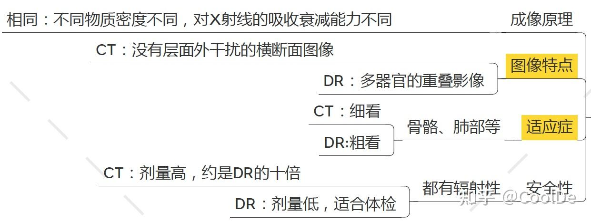

### CT与超声的比较：
- ==超声：喜水怕气、欺软怕硬==
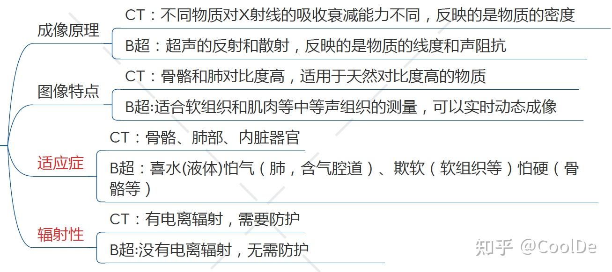

### CT与MRI的比较：
- MRI 用于 软组织更好
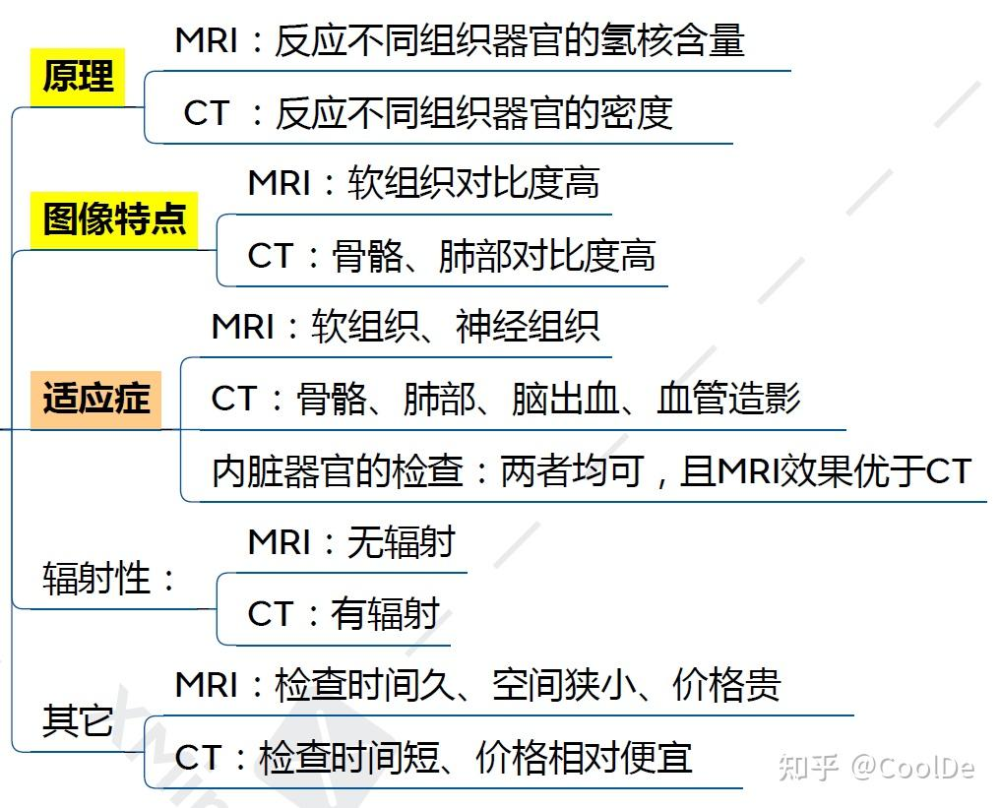

## 四大类
- 医学影像大致分为4类：
	- **X射线投影成像(**SPR，CR，DDR，DSA etc.**), [CT成像](https://zhida.zhihu.com/search?content_id=170303555&content_type=Article&match_order=1&q=CT%E6%88%90%E5%83%8F&zhida_source=entity)**
	- **超声成像**
	- **磁共振成像**(MRI，MRSI)
	- **核素成像(**PET，SPECT，γCamera**)**

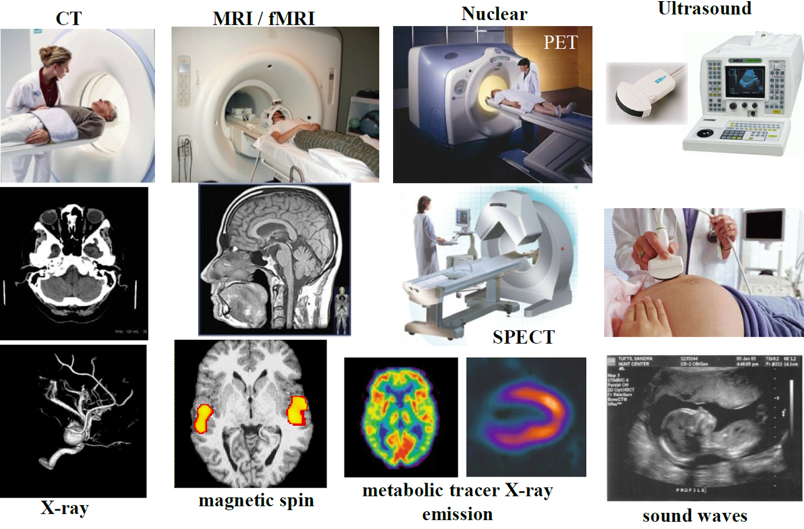

## 单词
- magnet   n.磁铁
- magnetic  adj.有磁性的
- resonance  n.共鸣
- resonate  v.共鸣
- ultrasound cleaner 超声波清洗器
- spin   v.旋转
- tomography  n.断层成像

# 放射医学
## X射线成像
- 利用X射线穿透人体不同组织后的衰减差异成像
- 利用X射线穿透人体不同组织后的衰减差异成像。
	1. 普通X光：常用于骨骼、胸部（如肺炎、骨折）检查
	2. 数字化X光：包括CR（计算机X线摄影）和DR（数字X线摄影），图像更清晰，辐射量更低
	3. 造影检查：通过对比剂增强显影，如胃肠钡餐、血管造影（DSA）
特点：快速、**成本低，但对软组织分辨率**有限，存在辐射风险
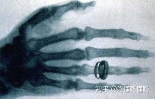

- X光能够穿过人体组织，但是穿过不同组织的时候，射线会受到不同程度的吸收
- ==骨骼吸收的X射线量比肌肉吸收的量要多==，通过不同人体组织后的X射线量也就不一样，于是胶片上的亮暗就反映了人体密度分布的信息
- X光成像原理非常简单，X射线从一端发出，穿过人体后，在另一端被探测器接收，接收到的直接就是一张二维图像，因此快捷又便宜。
- 我们去医院拍X平片的时候，图像都是瞬间采集完成的

## DR （Digital Radiography，数字化X线摄影）
- 它主要由X射线发生装置、平板探测器和**图像处理系统**等组成，广泛应用于医院放射科，进行骨骼、胸部等部位的常规检查
- 该技术成像速度快、图像清晰，且辐射剂量低于传统X光机
- 数字成像，显示在显示屏上，类似**数码相机**
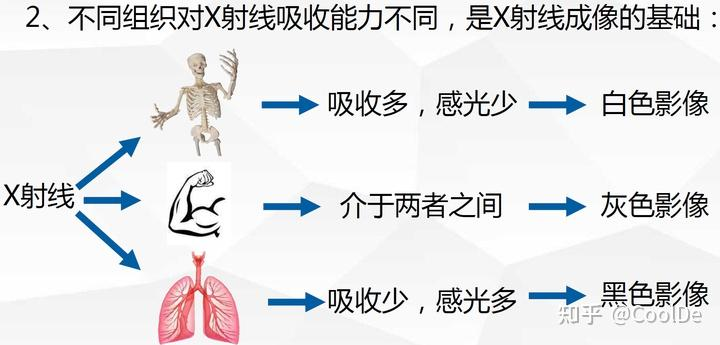

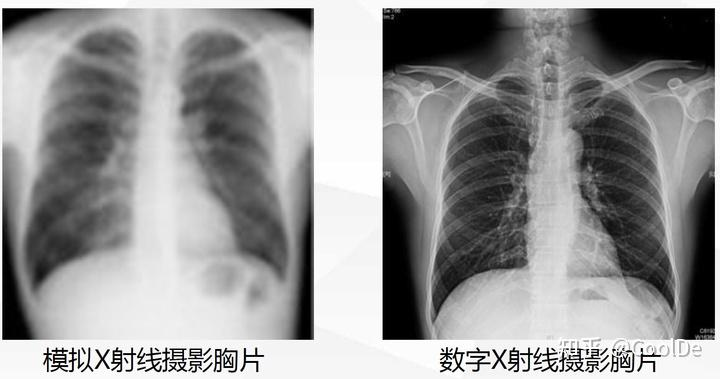

## CT（Computed Tomography，计算机断层扫描）
- 通过X射线多角度扫描，经计算机重建断层图像。
	- 普通CT：用于脑出血、肿瘤、肺结节等精细结构检查。
	- 增强CT：注射碘对比剂以提高血管或病变的显示效果。
	- 多排螺旋CT：扫描速度快，可三维重建器官（如心脏冠脉成像）
特点：分辨率高，**可区分微小病变**，但辐射剂量高于X光

- 常见的CT其实应该被称为X ray-CT，它使用的还是X光，只是多个一个“Computed Tomography（CT，计算断层成像）”，也就是用了一种新的成像方式而已
	- 因为X 光是一张 投影图，本应立体的鼻子在这张二维图像上完全叠在了一起
	- 这时候如果某处有个病灶，我们根本看不出来它的深浅位置
	- ==如果我们想看像切西瓜那样的一层一层的**断面图**呢？==
	- ==让CT仪的发射和接收器自己绕着病人转起来==
	- ==DR会重影，CT不会，图像更清晰
- CT的方式就是从不同角度去拍摄图像。
- 我们每旋转一个角度就拍摄一次，然后利用大量不同角度拍到的投影图，**用数学算法反计算出一个断层面图像**，从而可以看到每一个断面的图像。这便是计算断层成像
- 
- ==X光的一大缺陷在于，它是**有辐射的**！尤其是CT，它在每一个角度都要拍摄一次，一次扫描下来吃的剂量也不算少了==
- 

### [颅内CT](https://zhuanlan.zhihu.com/p/601666890)
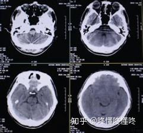

- 大脑和脊柱一起组成了中枢神经系统(CNS)，遍布中枢神经系统的是灰质和白质的对比区域
- **灰质**使人能够控制运动、记忆和情绪。它主要由处理和释放信息的神经元细胞体组成
- **白质**区域充当了灰质和身体其他部分之间的沟通渠道。
- ==灰质位于人脑的外部，而白质则嵌入人脑内部。在脊髓中观察到相反的模式，灰色区域被白质包围
	- ==灰质负责信息处理，而白质则负责沟通
- 在灰质中，有大量的神经元细胞体，这使它呈现出粉灰色。相比之下，白质主要由有髓鞘的轴突组成，这使它的颜色更浅
- 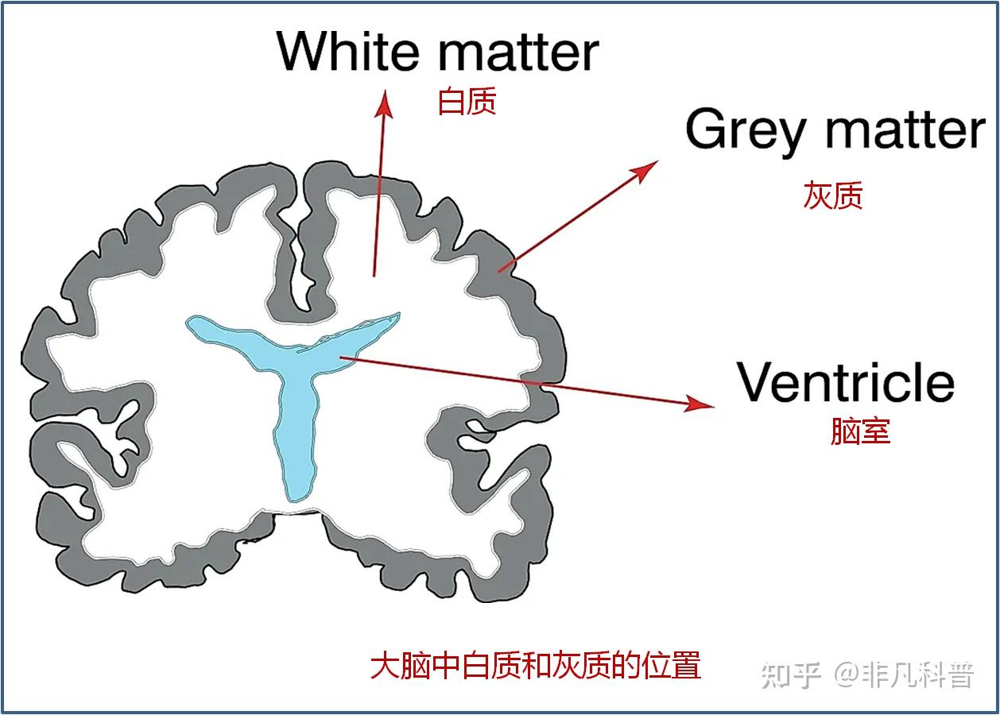

# MRI（Magnetic Resonance Imaging，磁共振成像）
- ==利用**磁场与射频脉冲**激发人体内的**水中的氢原子**产生信号成像==
	- 常规MRI：对脑、脊髓、关节、肌肉等软组织显示效果极佳
	- 功能MRI：如`fMRI`（脑功能成像）、`DWI`（弥散加权成像），用于研究脑活动或早期脑梗死
	- 磁共振血管成像（MRA）：无创评估血管病变（如动脉瘤）
特点：无辐射，多参数成像，但检查时间长，**不适合体内有金属植入物**的患者

- 图像质量好，能够成三维断面像，且**没！有！辐！射！**
- 还有要注意的是，MRI有一个超级强的磁场，因此不能带非钛质金属进入
- ==MRI能敏感地检出组织成份中**水含量**的变化，因而常比CT更有效和更早地发现病变==
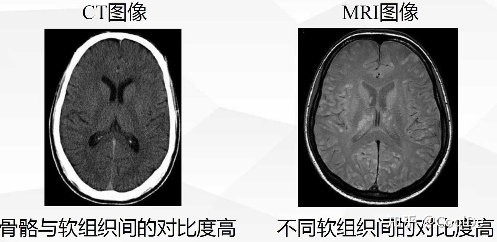

## [磁共振加权图像  WI](https://zhuanlan.zhihu.com/p/553793050)
- ==T1看解剖呈低信号，T2看病变呈高信号==
	- 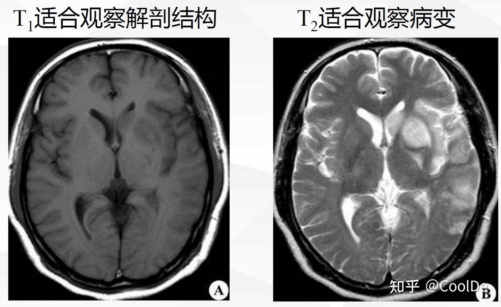
- 在磁共振图像中各种参数都对信号强度有贡献，但是其各自的贡献程度是不相同的
	- 加强某一个参数对图像信号强度的影响，以突出这种参数在图像对比度中的作用，这种MRI图像就叫做加权像（weighted imaging, WI）
	- 比如T1加权像主要反映**组织T1值**对图像灰度的影响；T2加权像主要反映**组织T2值**对图像影响

- T1加权像（T1 weighted imaging, T1WI）、T2加权像（T2 weighted imaging, T2WI）
	- 影响图像对比度的主要参数有重复时间（time of repetition, TR）和回波时间（time of echo, TE）
- 质子密度加权像（proton density weighted imaging, PDWI）
- 扩散加权成像（diffusion weighted imaging, DWI）等
- 当然，除了这些传统的解剖加权像，还有一些突出功能或者其他特性的加权像
	- 比如：磁敏感加权像（susceptibility weighted imaging, SWI）
### T1——水暗
- T1加权像中，组织的T1值越大，其信号强度越低，反映在灰度图像中就是越黑；
- ==液体（特别是纯水）由于T1值特别大，所以在T1加权像上表现为低信号（黑）。脂肪组织则是相反，其T1值比较短，在T1加权像上表现为高信号（亮）==
- 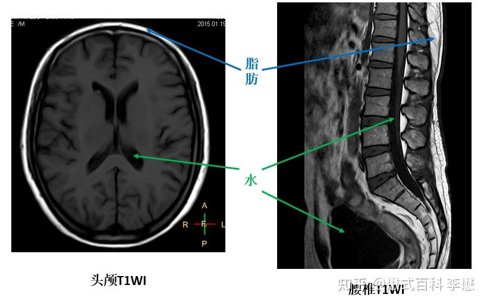

### T2——水亮
- T2加权像中，组织的T2值越大，其信号强度越高，反映在灰度图像中就是越白；反之亦然
- ==液体（特别是纯水）的T2值比较大，所以在T2加权像上表现为高信号（白）。很多疾病的表现都有水肿、渗出等改变，所以在T2加权像上都是高信号
	- ==这也是为什么T2主要看病变的原因==
- 有些组织的T2值特别短，比如肌腱、韧带，在T2加权像上表现为低信号。所以，如果在T2加权像上发现韧带或者肌腱走形区出现高信号及低信号被打断，则可能是韧带、肌腱水肿或断裂
- 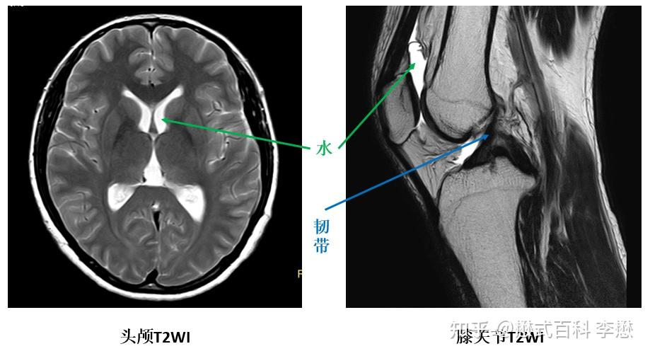

### [PDWI——脂肪亮](https://pengyizhang.github.io/2020/04/18/mri-t1-t2-pd/)

|              |                                                             |
| ------------ | ----------------------------------------------------------- |
| 图像           |  |
| water signal | 长的TR会导致高的水信号，但是短的TE意味着小于T2扫描的信号，所以**水信号强度是middle**          |
| fat signal   | 长的TR导致高的脂肪信号，而短的TE使得脂肪信号比T2成像更高，所以**脂肪信号是明亮的**              |
| TR           | 长 1000-3000ms                                               |
| TE           | 短 15ms                                                      |

## fMRI
- 功能磁共振成像技术Functional Magnetic Resonance imaging，fMRI
- fMRI用于**脑功能定位**的磁共振成像,是一种非常有效的研究脑功能的非介入技术，可以反映大脑在受刺激或发生病变时脑功能的变化，打开了从语言、记忆和认知等领域对大脑进行探索的大门
- 其基本原理基于[血氧水平依赖](https://zhida.zhihu.com/search?content_id=255517788&content_type=Article&match_order=1&q=%E8%A1%80%E6%B0%A7%E6%B0%B4%E5%B9%B3%E4%BE%9D%E8%B5%96&zhida_source=entity)（Blood Oxygenation Level Dependent, BOLD）效应
	- 血液动力学
- ==目前，fMRI主要被运用于对人及动物的脑或脊髓之研究中==

# 超声成像
- 通过**超声波反射**生成实时动态图像。
	- B超：用于腹部器官（肝、肾）、产科（胎儿监测）检查
	- 彩色多普勒超声：评估血流状态（如心脏瓣膜病、下肢静脉血栓）
	- 介入超声：引导穿刺活检或引流治疗
特点：安全无创、便携，但受气体或骨骼遮挡影响显影

- 超声波是除了X射线之外的另一种有穿透力的东西
- 超声仪要比其他几种机器小巧不少，扫描时技师手握一个探头，想看哪里扫哪里
- ==相比于X射线和CT，超声波对人体没有损伤，因此常用于产检==
- ==超声的穿透力不如X光等， 因此更适合**浅表组织**的扫描==
	- 心脏超声，血管超声，

- 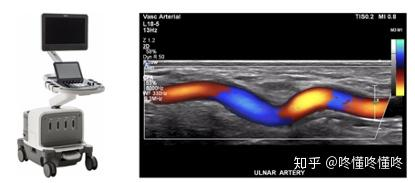
- 超声成像虽然图像看起来略渣渣（信噪比低），但是它时间分辨率高，也就是说，**可以实时地拍视频**，而不是半天才扫出几张照片，因此可以扫跳动的心脏

## 三种成像模式
- 主要以下几种成像模式：
	- **A-mode** (Amplitude) imaging 显示显示单个声波的采样电压信号的振幅作为时间的函数。这种模式被认为是1D的，用来测量两个物体之间的距离（声速除以两个波峰之间的时间差的一半）。这种模式在超声系统中已不再使用。
	- **B-mode** (Brightness)。该模式和A-modle一样，除了其亮度是来表达采样得到的信号的振幅。B-mode成像是使用发射波扫描一个平面来产生一个2D图像。通常，为每条扫描线产生多组脉冲来产生声波，每组脉冲用于扫描线上的一个焦点
	- **D-mode**(Doppler)[多普勒成像](https://zhida.zhihu.com/search?content_id=170303555&content_type=Article&match_order=1&q=%E5%A4%9A%E6%99%AE%E5%8B%92%E6%88%90%E5%83%8F&zhida_source=entity)，彩色血流成像。除了时间和幅度，回波的频率变化也蕴含着重要的生理信息。D(Doppler)-mode就是基于多普勒原理估计血流的速度和方向的

## 心脏超声 Echocardiogram
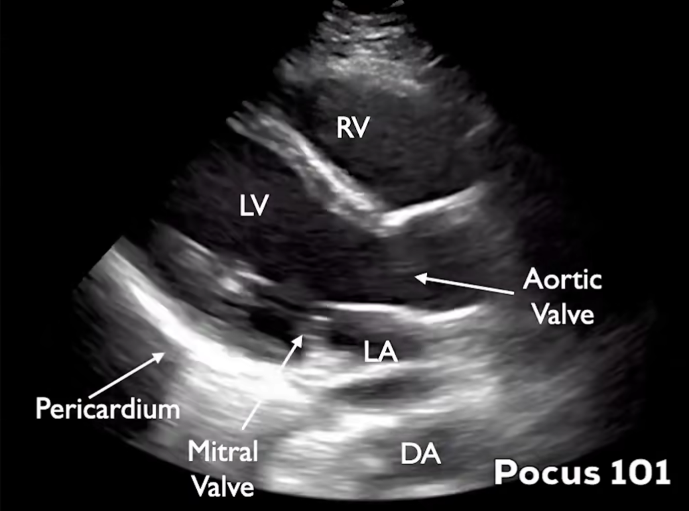

- 这是心脏超声里非常经典的**胸骨旁长轴切面（Parasternal Long Axis, PLAX）**，就像把心脏从中间 “纵向切开”
- 心房位于心脏上部，负责接收回心血液；心室位于心脏下部，负责将血液泵出心脏
	- 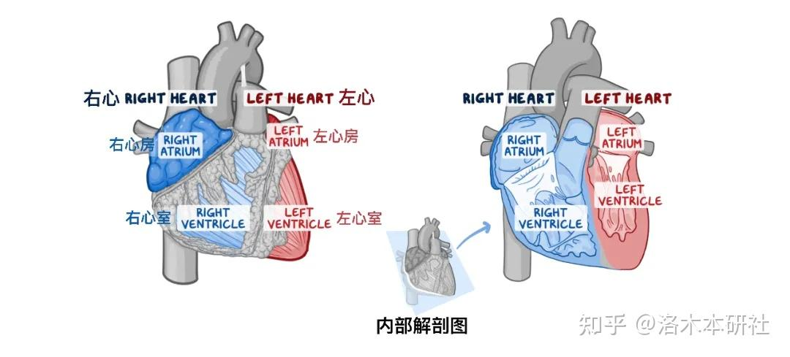

| 标注缩写             | 全称               | 中文名称 | 作用 & 位置                                              |
| :--------------- | :--------------- | :--- | :--------------------------------------------------- |
| **RV**           | Right Ventricle  | 右心室  | 图上方的腔室，是心脏的 “泵血车间” 之一，负责把静脉血泵去肺部                     |
| **LV**           | Left Ventricle   | 左心室  | 图左侧的大腔室，是心脏最强的泵，==负责把富含氧气的血泵到全身==                    |
| **LA**           | Left Atrium      | 左心房  | 图下方偏中间的腔室，负责接收从肺部回来的富氧血，再传给左心室                       |
| **DA**           | Descending Aorta | 降主动脉 | 图最下方的管状结构，是左心室泵出的血液离开心脏后，向下走的主动脉部分                   |
| **Aortic Valve** | -                | 主动脉瓣 | 连接左心室和主动脉的 “单向阀门”，心脏收缩时打开，让血进入主动脉；舒张时关闭，防止血液倒流回左心室   |
| **Mitral Valve** | -                | 二尖瓣  | 连接左心房和左心室的 “单向阀门”，舒张时打开，让左心房的血流入左心室；收缩时关闭，防止血液倒流回左心房 |
| **Pericardium**  | -                | 心包   | 包裹在心脏外面的一层薄膜，像一个 “保护套”，图中能看到它的强回声边缘                  |
- 心包有没有积液（图里的 Pericardium 如果和心脏壁之间出现无回声的黑带，就提示有心包积液）
- 黑色（无回声）：代表液体（比如心腔内的血液，在超声下是黑色的）
- 白色 / 亮白色（高回声）：代表密度高的组织（比如瓣膜、心包、心肌壁，回声强，所以是亮的）

# 核医学影像——捕捉功能性代谢
- 通过**放射性核素标记**化合物追踪代谢或功能变化
	- SPECT（单光子发射计算机断层扫描）：用于心肌灌注、骨扫描。
	- PET（正电子发射断层扫描）：结合CT或MRI（如PET-CT），用于肿瘤、神经系统疾病的功能代谢显像
特点：反映生理过程，但需接触放射性物质，分辨率较低

### PET
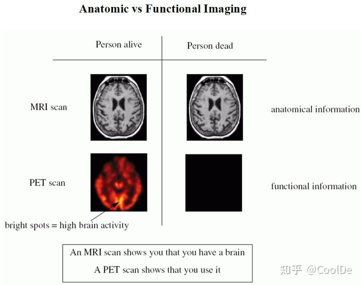

|                         | 活人（Person alive） | 死人（Person dead） | 提供的信息类型                                              |
| :---------------------- | :--------------- | :-------------- | :--------------------------------------------------- |
| **MRI scan（磁共振扫描）**     | 清晰的大脑结构图像        | 和活人几乎一样的大脑结构图像  | **解剖信息（anatomical information）**：告诉你「器官长什么样、在不在」     |
| **PET scan（正电子发射断层扫描）** | 有红 / 亮色的热点，代表脑活动 | 完全的黑色，没有任何信号    | **功能信息（functional information）**：告诉你「器官有没有在工作、活动强不强」 |
- MRI 只证明你有个大脑，就像给大脑拍一张高清的 “解剖照片”，它靠磁场和射频信号，把大脑的**结构细节**拍得清清楚楚
- PET 证明你在用这个大脑，是看**代谢和功能活动**的技术，它需要给人体注射带放射性标记的物质（比如葡萄糖类似物），大脑里**越活跃的区域，消耗的葡萄糖就越多**，放射性标记就聚集得越多，在图像上就会呈现出亮的 “热点”
	- PET/MRI
	- PET/CT

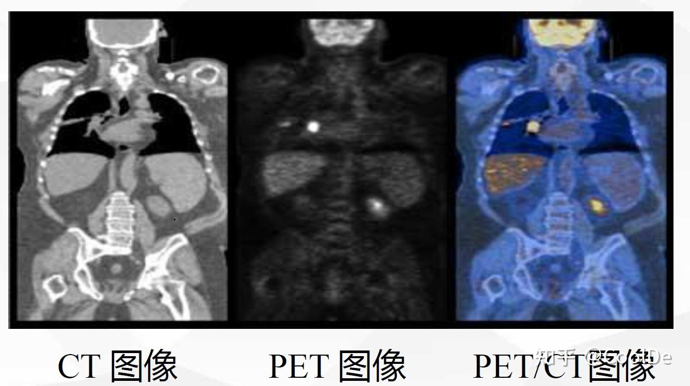

## SPECT
- SPECT(Single Photon Emission Computed Tomography)：是单光子发射型计算机断层成像的英文字头缩写
	- SPECT成像所需要的放射性核素大多是衰变产生单一能量的γ（伽玛）光子
- PET(Positron Emission Computed Tomography)：是正电子发射型计算机断层成像的英文字头缩写
	- PET成像所使用的是发射正电子的放射性核素

- SPECT 的核心是 “单光子追踪”——检查前会注射含微量放射性的 “示踪剂”，这些示踪剂会随着血液流向特定器官（比如心脏、甲状腺、肾脏），并释放出微弱的 γ 射线（单光子）
- PET 的作用是 “找异常代谢”：注射的显像剂（比如常用的 ¹⁸F-FDG）会被代谢活跃的细胞（比如肿瘤细胞）大量吸收，这些细胞吸收后会释放正电子，与体内电子结合产生 γ 光子，PET 探头捕捉这些光子，就能锁定 “代谢异常的区域”；

# 内镜影像
- 通过光学设备直接观察体内腔道
	- 胃镜/肠镜：检查消化道病变（如溃疡、息肉）
	- 支气管镜：评估呼吸道疾病（如肺癌）
	- 关节镜：辅助骨科微创手术
特点：直观准确，但属于**有创操作**，需专业操作。

# 术语
## 伪影
- 伪影指医学影像检查（如CT、MRI、超声等）中出现的非**真实结构或异常信号**，由设备、患者或操作因素干扰导致，可能影响图像质量和诊断准确性。常见类型包括运动伪影、金属伪影、射线硬化伪影等
- 

