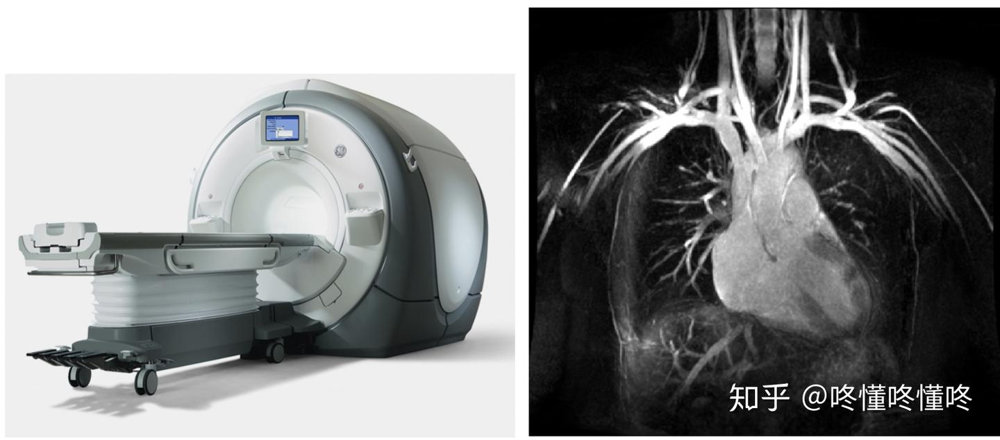

# [医学影像分类](https://zhuanlan.zhihu.com/p/181835442)
## 概述
- ==骨折首选X光或CT==
- ==脑肿瘤需MRI明确范围==
- 甲状腺结节可结合超声与核医学评估性质

- 医学影像大致分为4类：
	- **X射线投影成像(**SPR，CR，DDR，DSA etc.**), [CT成像](https://zhida.zhihu.com/search?content_id=170303555&content_type=Article&match_order=1&q=CT%E6%88%90%E5%83%8F&zhida_source=entity)**
	- **超声成像**
	- **磁共振成像**(MRI，MRSI)
	- **核素成像(**PET，SPECT，γCamera**)**

- magnet   n.磁铁
- magnetic  adj.有磁性的
- resonance  n.共鸣
- resonate  v.共鸣
- ultrasound cleaner 超声波清洗器
- spin   v.旋转
- tomography  n.断层成像

## 放射医学
### X射线成像
- 利用X射线穿透人体不同组织后的衰减差异成像
- 利用X射线穿透人体不同组织后的衰减差异成像。
	1. 普通X光：常用于骨骼、胸部（如肺炎、骨折）检查
	2. 数字化X光：包括CR（计算机X线摄影）和DR（数字X线摄影），图像更清晰，辐射量更低
	3. 造影检查：通过对比剂增强显影，如胃肠钡餐、血管造影（DSA）
特点：快速、**成本低，但对软组织分辨率**有限，存在辐射风险

- X光能够穿过人体组织，但是穿过不同组织的时候，射线会受到不同程度的吸收
- ==骨骼吸收的X射线量比肌肉吸收的量要多==，通过不同人体组织后的X射线量也就不一样，于是胶片上的亮暗就反映了人体密度分布的信息
- X光成像原理非常简单，X射线从一端发出，穿过人体后，在另一端被探测器接收，接收到的直接就是一张二维图像，因此快捷又便宜。
- 我们去医院拍X平片的时候，图像都是瞬间采集完成的

### CT（Computed Tomography，计算机断层扫描）
- 通过X射线多角度扫描，经计算机重建断层图像。
	- 普通CT：用于脑出血、肿瘤、肺结节等精细结构检查。
	- 增强CT：注射碘对比剂以提高血管或病变的显示效果。
	- 多排螺旋CT：扫描速度快，可三维重建器官（如心脏冠脉成像）
特点：分辨率高，**可区分微小病变**，但辐射剂量高于X光

- 常见的CT其实应该被称为X ray-CT，它使用的还是X光，只是多个一个“Computed Tomography（CT，计算断层成像）”，也就是用了一种新的成像方式而已
	- 因为X 光是一张 投影图，本应立体的鼻子在这张二维图像上完全叠在了一起
	- 这时候如果某处有个病灶，我们根本看不出来它的深浅位置
	- ==如果我们想看像切西瓜那样的一层一层的**断面图**呢？==
	- ==让CT仪的发射和接收器自己绕着病人转起来==
- CT的方式就是从不同角度去拍摄图像。
- 我们每旋转一个角度就拍摄一次，然后利用大量不同角度拍到的投影图，**用数学算法反计算出一个断层面图像**，从而可以看到每一个断面的图像。这便是计算断层成像
- 
- ==X光的一大缺陷在于，它是**有辐射的**！尤其是CT，它在每一个角度都要拍摄一次，一次扫描下来吃的剂量也不算少了==
- 

## MRI（Magnetic Resonance Imaging，磁共振成像）
- ==利用**磁场与射频脉冲**激发人体内的**水中的氢原子**产生信号成像==
	- 常规MRI：对脑、脊髓、关节、肌肉等软组织显示效果极佳
	- 功能MRI：如`fMRI`（脑功能成像）、`DWI`（弥散加权成像），用于研究脑活动或早期脑梗死
	- 磁共振血管成像（MRA）：无创评估血管病变（如动脉瘤）
特点：无辐射，多参数成像，但检查时间长，**不适合体内有金属植入物**的患者

- 图像质量好，能够成三维断面像，且**没！有！辐！射！**
- 还有要注意的是，MRI有一个超级强的磁场，因此不能带非钛质金属进入
- MRI的原理较其他技术更为复杂，它基于原子核的[核磁共振](https://zhida.zhihu.com/search?content_id=128541590&content_type=Article&match_order=1&q=%E6%A0%B8%E7%A3%81%E5%85%B1%E6%8C%AF&zhida_source=entity)现象
	- 关键就在于，有的原子核（水中的氢原子）恢复得很慢，有的原子核（如脂肪中的氢原子）恢复得很快，因此就产生了可以用于成像的有对比的信号
- 

### fMRI

## 超声成像
- 通过超声波反射生成实时动态图像。
	- B超：用于腹部器官（肝、肾）、产科（胎儿监测）检查
	- 彩色多普勒超声：评估血流状态（如心脏瓣膜病、下肢静脉血栓）
	- 介入超声：引导穿刺活检或引流治疗
特点：安全无创、便携，但受气体或骨骼遮挡影响显影

- 超声波是除了X射线之外的另一种有穿透力的东西
- 超声仪要比其他几种机器小巧不少，扫描时技师手握一个探头，想看哪里扫哪里
- ==相比于X射线和CT，超声波对人体没有损伤，因此常用于产检==
- ==超声的穿透力不如X光等， 因此更适合**浅表组织**的扫描==
	- 心脏超声，血管超声，

- 
- 超声成像虽然图像看起来略渣渣（信噪比低），但是它时间分辨率高，也就是说，**可以实时地拍视频**，而不是半天才扫出几张照片，因此可以扫跳动的心脏
### 心脏超声 Echocardiogram

- 这是心脏超声里非常经典的**胸骨旁长轴切面（Parasternal Long Axis, PLAX）**，就像把心脏从中间 “纵向切开”
- 心房位于心脏上部，负责接收回心血液；心室位于心脏下部，负责将血液泵出心脏
	- 

| 标注缩写             | 全称               | 中文名称 | 作用 & 位置                                              |
| :--------------- | :--------------- | :--- | :--------------------------------------------------- |
| **RV**           | Right Ventricle  | 右心室  | 图上方的腔室，是心脏的 “泵血车间” 之一，负责把静脉血泵去肺部                     |
| **LV**           | Left Ventricle   | 左心室  | 图左侧的大腔室，是心脏最强的泵，==负责把富含氧气的血泵到全身==                    |
| **LA**           | Left Atrium      | 左心房  | 图下方偏中间的腔室，负责接收从肺部回来的富氧血，再传给左心室                       |
| **DA**           | Descending Aorta | 降主动脉 | 图最下方的管状结构，是左心室泵出的血液离开心脏后，向下走的主动脉部分                   |
| **Aortic Valve** | -                | 主动脉瓣 | 连接左心室和主动脉的 “单向阀门”，心脏收缩时打开，让血进入主动脉；舒张时关闭，防止血液倒流回左心室   |
| **Mitral Valve** | -                | 二尖瓣  | 连接左心房和左心室的 “单向阀门”，舒张时打开，让左心房的血流入左心室；收缩时关闭，防止血液倒流回左心房 |
| **Pericardium**  | -                | 心包   | 包裹在心脏外面的一层薄膜，像一个 “保护套”，图中能看到它的强回声边缘                  |
- 心包有没有积液（图里的 Pericardium 如果和心脏壁之间出现无回声的黑带，就提示有心包积液）
- 黑色（无回声）：代表液体（比如心腔内的血液，在超声下是黑色的）
- 白色 / 亮白色（高回声）：代表密度高的组织（比如瓣膜、心包、心肌壁，回声强，所以是亮的）

## 核医学影像
- 通过**放射性核素标记**化合物追踪代谢或功能变化
	- SPECT（单光子发射计算机断层扫描）：用于心肌灌注、骨扫描。
	- PET（正电子发射断层扫描）：结合CT或MRI（如PET-CT），用于肿瘤、神经系统疾病的功能代谢显像
特点：反映生理过程，但需接触放射性物质，分辨率较低

### PET

### SPECT

## 内镜影像
- 通过光学设备直接观察体内腔道
	- 胃镜/肠镜：检查消化道病变（如溃疡、息肉）
	- 支气管镜：评估呼吸道疾病（如肺癌）
	- 关节镜：辅助骨科微创手术
特点：直观准确，但属于**有创操作**，需专业操作。

