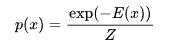
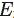
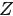
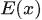
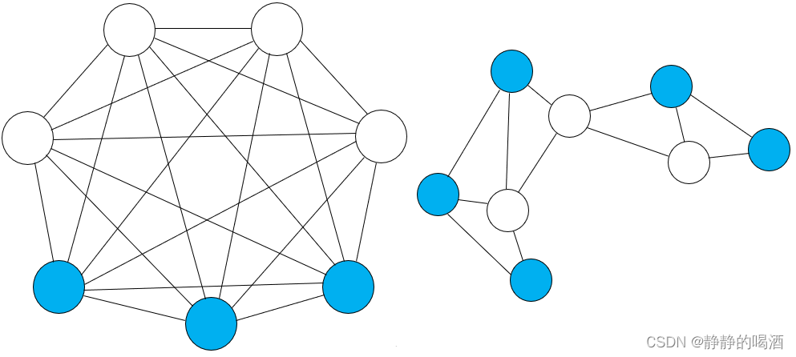
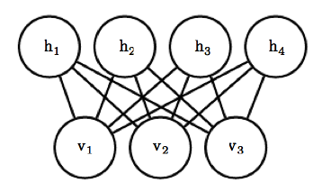
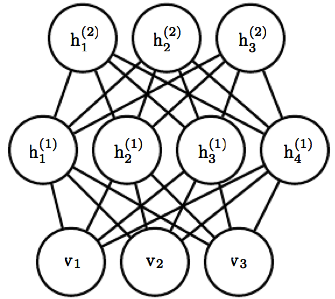
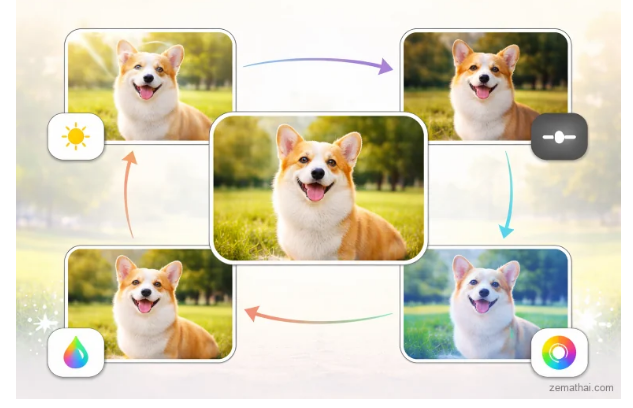

# <span style="color: rgb(25, 60, 71);"><span style="background-color: rgb(238, 249, 253);">(2023-04-13) Self-Supervised Learning from Images with a Joint-Embedding Predictive Architecture</span></span>

| <!-- --> |
| -------------------------------------------------------------------------------------------------------------------------------------------------------------------------------------------------------------------------------------------------------------------------------------------------------------------------------------------------------------------------------------------------------------------------------------------------------------------------------------------------------------------------------------------------------------------------------------------------------------------------------------------------------------------------------------------------------------------------------------------------------------------------------------------------------------------------------------------------------------------------------------------------------------------------------------------------------------------------------------------------------------------------------------------------------------------------------------------------------------------------------------------------------------------------------------------------------------------------------------------------------------------------------------------- |
| **<span style="color: rgb(25, 60, 71);"><span style="background-color: rgb(219, 238, 221);">Author:</span></span>**<span style="color: rgb(25, 60, 71);"><span style="background-color: rgb(219, 238, 221);"> Mahmoud Assran; Quentin Duval; Ishan Misra; Piotr Bojanowski; Pascal Vincent; Michael Rabbat; Yann LeCun; Nicolas Ballas;</span></span>                                                                                                                                                                                                                                                                                                                                                                                                                                                                                                                                                                                                                                                                                                                                                                                                                                                                                                                                        |
| **<span style="color: rgb(25, 60, 71);"><span style="background-color: rgb(243, 250, 244);">Journal: </span></span><span style="color: rgb(255, 0, 0);"><span style="background-color: rgb(243, 250, 244);">, </span></span><span style="color: rgb(25, 60, 71);"><span style="background-color: rgb(243, 250, 244);">2023.</span></span>**                                                                                                                                                                                                                                                                                                                                                                                                                                                                                                                                                                                                                                                                                                                                                                                                                                                                                                                                                  |
| **<span style="color: rgb(25, 60, 71);"><span style="background-color: rgb(219, 238, 221);">Journal Tags:</span></span>**                                                                                                                                                                                                                                                                                                                                                                                                                                                                                                                                                                                                                                                                                                                                                                                                                                                                                                                                                                                                                                                                                                                                                                    |
| **<span style="color: rgb(25, 60, 71);"><span style="background-color: rgb(243, 250, 244);">Local Link: </span></span>**<span style="color: rgb(25, 60, 71);"><span style="background-color: rgb(243, 250, 244);"><a href="zotero://open-pdf/0_2UELNU6U" rel="noopener noreferrer nofollow">Assran 等 - 2023 - Self-Supervised Learning from Images with a Joint-Embedding Predictive Architecture.pdf</a></span></span>                                                                                                                                                                                                                                                                                                                                                                                                                                                                                                                                                                                                                                                                                                                                                                                                                                                                      |
| **<span style="color: rgb(25, 60, 71);"><span style="background-color: rgb(219, 238, 221);">DOI: </span></span>**<span style="color: rgb(25, 60, 71);"><span style="background-color: rgb(219, 238, 221);"><a href="https://doi.org/10.48550/arXiv.2301.08243" rel="noopener noreferrer nofollow">10.48550/arXiv.2301.08243</a></span></span>                                                                                                                                                                                                                                                                                                                                                                                                                                                                                                                                                                                                                                                                                                                                                                                                                                                                                                                                                |
| **<span style="color: rgb(25, 60, 71);"><span style="background-color: rgb(243, 250, 244);">Abstract: </span></span>***<span style="color: rgb(25, 60, 71);"><span style="background-color: rgb(243, 250, 244);">This paper demonstrates an approach for learning highly semantic image representations without relying on hand-crafted data-augmentations. We introduce the Image-based Joint-Embedding Predictive Architecture (I-JEPA), a non-generative approach for self-supervised learning from images. The idea behind I-JEPA is simple: from a single context block, predict the representations of various target blocks in the same image. A core design choice to guide I-JEPA towards producing semantic representations is the masking strategy; specifically, it is crucial to (a) sample target blocks with sufficiently large scale (semantic), and to (b) use a sufficiently informative (spatially distributed) context block. Empirically, when combined with Vision Transformers, we find I-JEPA to be highly scalable. For instance, we train a ViT-Huge/14 on ImageNet using 16 A100 GPUs in under 72 hours to achieve strong downstream performance across a wide range of tasks, from linear classification to object counting and depth prediction.</span></span>* |
| **<span style="color: rgb(25, 60, 71);"><span style="background-color: rgb(219, 238, 221);">Tags:</span></span>**                                                                                                                                                                                                                                                                                                                                                                                                                                                                                                                                                                                                                                                                                                                                                                                                                                                                                                                                                                                                                                                                                                                                                                            |
| **<span style="color: rgb(25, 60, 71);"><span style="background-color: rgb(243, 250, 244);">Note Date: </span></span>**<span style="color: rgb(25, 60, 71);"><span style="background-color: rgb(243, 250, 244);">2026/6/8 17:08:34</span></span>                                                                                                                                                                                                                                                                                                                                                                                                                                                                                                                                                                                                                                                                                                                                                                                                                                                                                                                                                                                                                                             |


2h 的讲解视频：<https://youtu.be/t_RvDTzi3vU?t=2>

## <span style="color: rgb(224, 255, 255);"><span style="background-color: rgb(102, 205, 170);">📜 Research Core</span></span>

***

> Tips: What was done, what problem was solved, innovations and shortcomings?

### ⚙️ Content

### 💡 Innovations

### 🧩 Shortcomings

## <span style="color: rgb(32, 178, 170);"><span style="background-color: rgb(175, 238, 238);">🔁 Research Content</span></span>

***

### intro

#### 自监督的方法

*   基于不变性的方法：对同一张图像做裁剪、翻转、色彩变换等数据增广

    *   SimCLR / SimCLRv2：对比学习标杆
    *   MoCo (Momentum Contrast)：动量对比学习，引入**<span style="color: rgb(0, 0, 0);">动量编码器 + 队列</span>**存储大量负样本
    *   BYOL (Bootstrap Your Own Latent)：依靠**<span style="color: rgb(0, 0, 0);">动量网络 + 预测头</span>**，仅约束同一图像两个视图特征对齐，彻底摆脱负样本依赖
    *   <span style="color: rgb(78, 179, 28);">但是这种 对比的方法，是 hard-code ，是硬编码的！对于 分类、分割等需要不同的处理——I-JEPA中所说</span>

*   生成式方法：让模型完成图像补全、降噪、重建等生成任务，自主挖掘图像纹理、结构、语义等视觉规律

    *   MAE (Masked Autoencoder)：随机掩码图像大部分区域，模型根据可见像素**<span style="color: rgb(0, 0, 0);">还原被遮挡部分</span>**

    *   VAE (Variational Autoencoder)：变分自编码器，学习图像隐空间分布，通过**<span style="color: rgb(0, 0, 0);">编码 - 解码重建原图</span>**实现表征学习

    *   Denoising Autoencoder (DAE)：降噪自编码器，给图像添加高斯噪声、椒盐噪声，模型学习**<span style="color: rgb(0, 0, 0);">去噪还原</span>**，挖掘底层视觉特征GPT for Vision / iGPT

    *   GPT for Vision / iGPT：将图像像素序列化，用类 Transformer 自回归方式**<span style="color: rgb(0, 0, 0);">逐像素生成图像</span>**

    *   <span class="highlight" data-annotation="%7B%22attachmentURI%22%3A%22http%3A%2F%2Fzotero.org%2Fusers%2F19634653%2Fitems%2F2UELNU6U%22%2C%22pageLabel%22%3A%221%22%2C%22position%22%3A%7B%22pageIndex%22%3A0%2C%22rects%22%3A%5B%5B394.54035999999985%2C102.75807839999989%2C545.1150963999995%2C111.39565259999988%5D%2C%5B308.86199999999997%2C90.80307839999989%2C545.1150963999994%2C99.44065259999988%5D%2C%5B308.86199999999997%2C78.84807839999989%2C473.13531139999947%2C87.48565259999988%5D%5D%7D%2C%22citationItem%22%3A%7B%22uris%22%3A%5B%22http%3A%2F%2Fzotero.org%2Fusers%2F19634653%2Fitems%2FZ6XJ6D55%22%5D%2C%22locator%22%3A%221%22%7D%7D" ztype="zhighlight"><a href="zotero://open/library/items/2UELNU6U?page=1">“Masked pretraining tasks require less prior knowledge than view-invariance approaches and easily generalize beyond the image modality”</a></span><span class="citation" data-citation="%7B%22citationItems%22%3A%5B%7B%22uris%22%3A%5B%22http%3A%2F%2Fzotero.org%2Fusers%2F19634653%2Fitems%2FZ6XJ6D55%22%5D%2C%22locator%22%3A%221%22%7D%5D%2C%22properties%22%3A%7B%7D%7D" ztype="zcitation">(<span class="citation-item"><a href="zotero://select/library/items/Z6XJ6D55">Assran 等, 2023, p. 1</a></span>)</span>

    *   <span style="color: rgb(78, 179, 28);">但是 这种方法 提取的的representation 不如基于invariance 的方法效果好</span>

#### off-the-shelf evaluationss

*   off-the-shelf evaluations：

    *   **<span style="color: rgb(0, 0, 0);">无需额外定制、直接拿来就能用</span>**的通用模型评测方式，是机器学习 / 大模型领域常用表述
    *   ✅ **<span style="color: rgb(0, 0, 0);">不 / 极少更新预训练模型主干参数</span>**

*   [linear-probing（线性探测）：](https://blog.csdn.net/2301_80482040/article/details/149194548)

    *   <span style="color: rgb(0, 0, 0);">冻结预训练模型的全部参数，</span>**<span style="color: rgb(0, 0, 0);">只训练一层线性分类器</span>**<span style="color: rgb(0, 0, 0);">；</span>

    *   <span style="color: rgb(0, 0, 0);">用它检验预训练模型提取特征的质量，流程简单、不用微调主干网络，属于开箱即用的评估手段</span>

    *   **<span style="color: rgba(0, 0, 0, 0.75);"><span style="background-color: rgb(255, 255, 255);">添加一个新的、未经训练的线性分类器：</span></span>**<span style="color: rgba(0, 0, 0, 0.75);"><span style="background-color: rgb(255, 255, 255);"> 在冻结的预训练特征提取器的输出之上，</span></span>**<span style="color: rgba(0, 0, 0, 0.75);"><span style="background-color: rgb(255, 255, 255);">添加一个全新的、简单的线性层</span></span>**<span style="color: rgba(0, 0, 0, 0.75);"><span style="background-color: rgb(255, 255, 255);">（</span></span>`nn.Linear`<span style="color: rgba(0, 0, 0, 0.75);"><span style="background-color: rgb(255, 255, 255);">）。这个线性层通常被称为 </span></span>**<span style="color: rgba(0, 0, 0, 0.75);"><span style="background-color: rgb(255, 255, 255);">Probe Layer</span></span>**<span style="color: rgba(0, 0, 0, 0.75);"><span style="background-color: rgb(255, 255, 255);"> 或 </span></span>**<span style="color: rgba(0, 0, 0, 0.75);"><span style="background-color: rgb(255, 255, 255);">Classifier Head</span></span>**

    *   <span style="color: rgba(0, 0, 0, 0.75);"><span style="background-color: rgb(255, 255, 255);">新添加的分类器是一个</span></span>**<span style="color: rgba(0, 0, 0, 0.75);"><span style="background-color: rgb(255, 255, 255);">线性变换</span></span>**<span style="color: rgba(0, 0, 0, 0.75);"><span style="background-color: rgb(255, 255, 255);"> (</span></span>`y = Wx + b`<span style="color: rgba(0, 0, 0, 0.75);"><span style="background-color: rgb(255, 255, 255);">)，没有任何非线性激活函数（如 ReLU）。这强制分类决策只能基于特征空间中的线性边界，所以叫做 线性探测了！</span></span>

<!---->

*   <span style="color: rgb(0, 0, 0);">k-NN Evaluation（k 近邻评估）</span>

    *   完全**零训练**：用模型提取图像特征，直接做 k 近邻分类
    *   <span style="color: rgba(0, 0, 0, 0.8);"><span style="background-color: rgb(239, 234, 231);">对于分类任务，查看K个最近邻居中最常见的类别，作为预测结果。对于回归任务，预测结果可以是K个最近邻居的平均值或加权平均值</span></span>

*   Zero-Shot Classification 零样本分类

    *   <span style="background-color: rgba(255, 212, 0, 0.5);">典型如 CLIP 系列，</span>**<span style="color: rgb(0, 0, 0);"><span style="background-color: rgba(255, 212, 0, 0.5);">不做下游训练</span></span>**<span style="background-color: rgba(255, 212, 0, 0.5);">，直接用图文匹配做分类，完全开箱即用</span>

*   Few-Shot Evaluation 少样本评估

    *   仅用少量标注样本 + 轻量适配（prompt / 线性头），不微调主干，属于标准现成评测

*   Semi-Supervised Evaluation 半监督评估

    *   固定主干，仅用少量标注 + 大量无标注数据训练分类头，流程标准化

*   Segmentation/Detection Frozen Backbone

    *   冻结预训练主干，只训练检测 / 分割头，用于评估通用视觉表征

#### GPU hours

*   <span class="highlight" data-annotation="%7B%22attachmentURI%22%3A%22http%3A%2F%2Fzotero.org%2Fusers%2F19634653%2Fitems%2F2UELNU6U%22%2C%22pageLabel%22%3A%222%22%2C%22position%22%3A%7B%22pageIndex%22%3A1%2C%22rects%22%3A%5B%5B528.5174147999995%2C450.41307840000064%2C545.1151063999994%2C459.0506526000006%5D%2C%5B328.78700000000003%2C438.45807840000066%2C545.1148963999996%2C447.0956526000006%5D%2C%5B328.78700000000003%2C426.16435000000064%2C395.0582151999998%2C436.12695000000065%5D%5D%7D%2C%22citationItem%22%3A%7B%22uris%22%3A%5B%22http%3A%2F%2Fzotero.org%2Fusers%2F19634653%2Fitems%2FZ6XJ6D55%22%5D%2C%22locator%22%3A%222%22%7D%7D" ztype="zhighlight"><a href="zotero://open/library/items/2UELNU6U?page=2">“Pretraining a ViT-H/14 on ImageNet requires less than 1200 GPU hours”</a></span><span class="citation" data-citation="%7B%22citationItems%22%3A%5B%7B%22uris%22%3A%5B%22http%3A%2F%2Fzotero.org%2Fusers%2F19634653%2Fitems%2FZ6XJ6D55%22%5D%2C%22locator%22%3A%222%22%7D%5D%2C%22properties%22%3A%7B%7D%7D" ztype="zcitation">(<span class="citation-item"><a href="zotero://select/library/items/Z6XJ6D55">Assran 等, 2023, p. 2</a></span>)</span>

*   **<span style="color: rgba(0, 0, 0, 0.95);">GPU hours（GPU 小时）</span>**<span style="color: rgba(0, 0, 0, 0.95);">：</span><span style="color: rgba(0, 0, 0, 0.8);"><span style="background-color: rgb(239, 234, 231);">衡量深度学习或大模型训练所消耗 GPU 资源的核心指标</span></span>

    *   GPU Hours = GPU数量 × 训练总时长（小时）

    *   **<span style="color: rgba(0, 0, 0, 0.8);"><span style="background-color: rgb(239, 234, 231);">模型参数量（D）</span></span>**<span style="color: rgba(0, 0, 0, 0.8);"><span style="background-color: rgb(239, 234, 231);">：参数越多，计算量越大</span></span>

    *   **<span style="color: rgba(0, 0, 0, 0.95);">通用统计单位</span>**<span style="color: rgba(0, 0, 0, 0.95);">，任何型号 GPU（A100、V100、3090、H100 等）都能用它计量</span>

    *   通用结果，不分卡型号，只看数量

### <span class="highlight" data-annotation="%7B%22attachmentURI%22%3A%22http%3A%2F%2Fzotero.org%2Fusers%2F19634653%2Fitems%2F2UELNU6U%22%2C%22pageLabel%22%3A%222%22%2C%22position%22%3A%7B%22pageIndex%22%3A1%2C%22rects%22%3A%5B%5B320.8172000000002%2C353.4763632000007%2C383.7135072000001%2C364.2240880000007%5D%5D%7D%2C%22citationItem%22%3A%7B%22uris%22%3A%5B%22http%3A%2F%2Fzotero.org%2Fusers%2F19634653%2Fitems%2FZ6XJ6D55%22%5D%2C%22locator%22%3A%222%22%7D%7D" ztype="zhighlight"><a href="zotero://open/library/items/2UELNU6U?page=2">“Background”</a></span> <span class="citation" data-citation="%7B%22citationItems%22%3A%5B%7B%22uris%22%3A%5B%22http%3A%2F%2Fzotero.org%2Fusers%2F19634653%2Fitems%2FZ6XJ6D55%22%5D%2C%22locator%22%3A%222%22%7D%5D%2C%22properties%22%3A%7B%7D%7D" ztype="zcitation">(<span class="citation-item"><a href="zotero://select/library/items/Z6XJ6D55">Assran 等, 2023, p. 2</a></span>)</span>

#### **<span style="color: rgb(51, 51, 51);"><span style="background-color: rgb(255, 255, 255);">基于能量的模型(Energy-Based Models)</span></span>**

*   <span style="color: rgb(40, 40, 40);"><span style="background-color: rgb(255, 255, 255);">基于能量的模型（EBM）的原型是</span></span>**<span style="color: rgb(40, 40, 40);"><span style="background-color: rgb(255, 255, 255);">统计物理</span></span>**<span style="color: rgb(40, 40, 40);"><span style="background-color: rgb(255, 255, 255);">中用来统计粒子分布的模型。</span></span>

*   <span style="color: rgb(40, 40, 40);"><span style="background-color: rgb(255, 255, 255);">在一个密闭空间中有能量高的区域和能量低的区域，表现为能量函数中空间中的不同大小。由于热力学第二定律粒子会倾向于维持一种能量低的状态，最终达到均衡，因此这些粒子在这个空间中会形成基于能量函数的平稳分布</span></span>

*   <span style="color: rgb(40, 40, 40);"><span style="background-color: rgba(255, 212, 0, 0.5);">EBM最早在机器学习中的应用是在1985年提出的名为玻尔兹曼机（</span></span>`Boltzmann machine`<span style="color: rgb(40, 40, 40);"><span style="background-color: rgba(255, 212, 0, 0.5);">）的概率模型，其主要思想是用能量来学习未知的概率分布。</span></span>

    *   <span style="color: rgb(40, 40, 40);"><span style="background-color: rgba(255, 212, 0, 0.5);">统计力学的结论表明，任何概率分布都可以转变成基于能量的模型，所以利用基于能量的模型的这个形式，是一种学习概率分布的通法</span></span>

    *   <span style="color: rgb(40, 40, 40);"><span style="background-color: rgb(255, 255, 255);">对于变量，其概率密度分布可以表示为：</span></span><span style="color: rgb(40, 40, 40);"><span style="background-color: rgb(255, 255, 255);">其中，</span></span><span style="color: rgb(40, 40, 40);"><span style="background-color: rgb(255, 255, 255);">是能量函数，</span></span><span style="color: rgb(40, 40, 40);"><span style="background-color: rgb(255, 255, 255);">是归一化常数。能量</span></span><span style="color: rgb(40, 40, 40);"><span style="background-color: rgb(255, 255, 255);">越小，对应变量的概率就越大。</span></span>

*   <span style="background-color: rgba(255, 212, 0, 0.5);">有些可视化以及清晰的见解来自<a href="https://link.zhihu.com/?target=https%3A//www.youtube.com/watch%3Fv%3DpiaPIKO1MFY%26ab_channel%3DMachineLearningStreetTalk" rel="noopener noreferrer nofollow">ICLR 2020: Yann LeCun and Energy-Based Models</a>。所谓的能量模型并不是一种新的技术，而是LeCun的一种尝试：将当前的DL，ML统一在能量模型的框架中</span>

*   <span style="background-color: rgba(255, 212, 0, 0.5);">能量函数通常写作 E(x,y) ，用于衡量 x和y 的 compatibility，也可以理解为 x和y 是否匹配，能量越小匹配度越高</span>

*

*   <span style="color: rgb(33, 37, 41);"><span style="background-color: rgb(255, 255, 255);">Yann LeCun 反复强调过一个观点：当前LLM基于概率、逐 Token 预测的设计路线，很可能走不到人类水平的AI。他的团队更看好另一条路，基于能量的模型（EBM）</span></span>

    *   <span style="background-color: rgba(255, 102, 102, 0.5);">EBM比概率方法有更大的回旋余地，用能量函数替代概率分布的建模框架</span>
    *   <span style="color: rgb(33, 37, 41);"><span style="background-color: rgb(255, 255, 255);">关键优势在于：概率方法不可解的场景下，EBM是可解的。</span></span>
    *   <span style="background-color: rgba(255, 212, 0, 0.5);">概率模型必须做归一化，往往需要在所有可能的变量配置空间上计算积分，而很多时候这个积分根本算不出来。EBM不要求归一化，这个问题被天然绕过了</span>

#### **<span style="color: rgb(40, 40, 40);"><span style="background-color: rgb(255, 255, 255);">基于能量的生成式模型</span></span>**

*   <span style="color: rgb(40, 40, 40);"><span style="background-color: rgb(255, 255, 255);">近些年，EBM在深度学习领域重新进入大众视野，并在生成式模型中有着广泛应用</span></span>
*   <span style="color: rgb(40, 40, 40);"><span style="background-color: rgb(255, 255, 255);">EBM将样本服从的分布建模为一个玻尔兹曼分布，能量函数为具有复杂表示能力的神经网络。通过训练将真实样本的能量函数降低，生成样本的能量函数增加，从而通过优化能量函数达到生成合格样本的效果</span></span>

#### Boltzmann Machines

*   <span style="color: rgb(25, 27, 31);"><span style="background-color: rgb(255, 255, 255);">玻尔兹曼机是一种基于能量的模型（an energy-based model）</span></span>

*   <span style="color: rgb(25, 27, 31);"><span style="background-color: rgba(255, 212, 0, 0.5);">所以利用基于能量的模型的这个形式，是一种学习概率分布的通法</span></span>

*   <span style="color: rgb(51, 51, 51);"><span style="background-color: rgb(255, 255, 255);">由</span></span>**<span style="color: rgb(51, 51, 51);"><span style="background-color: rgb(255, 255, 255);">可见层和隐含层的二值随机神经元构成对称连接结构</span></span>**<span style="color: rgb(51, 51, 51);"><span style="background-color: rgb(255, 255, 255);">，其概率分布遵循统计物理学中的玻尔兹曼定律</span></span>

*   

#### Restricted Boltzmann Machines 有限玻尔兹曼机

*   <span style="color: rgb(25, 27, 31);"><span style="background-color: rgb(255, 255, 255);">RBM只有一层可见变量和一层隐变量，同时可见变量之间，隐变量之间不直接相连。即对应的图是一个二部图</span></span>
*   

#### deep Boltzmann machine 深度有限玻尔兹曼机

*   <span style="color: rgb(25, 27, 31);"><span style="background-color: rgb(255, 255, 255);">如果有多层隐单元层，则一般称为深度有限玻尔兹曼机（deep Boltzmann machine）</span></span>
*   

### 💧 Data

### 👩🏻‍💻 Method

### 🔬 Experiment

#### <span class="highlight" data-annotation="%7B%22attachmentURI%22%3A%22http%3A%2F%2Fzotero.org%2Fusers%2F19634653%2Fitems%2F2UELNU6U%22%2C%22pageLabel%22%3A%225%22%2C%22position%22%3A%7B%22pageIndex%22%3A4%2C%22rects%22%3A%5B%5B320.8172%2C392.4183631999998%2C424.0981728%2C403.1660879999998%5D%5D%7D%2C%22citationItem%22%3A%7B%22uris%22%3A%5B%22http%3A%2F%2Fzotero.org%2Fusers%2F19634653%2Fitems%2FZ6XJ6D55%22%5D%2C%22locator%22%3A%225%22%7D%7D" ztype="zhighlight"><a href="zotero://open/library/items/2UELNU6U?page=5">“Image Classification”</a></span> <span class="citation" data-citation="%7B%22citationItems%22%3A%5B%7B%22uris%22%3A%5B%22http%3A%2F%2Fzotero.org%2Fusers%2F19634653%2Fitems%2FZ6XJ6D55%22%5D%2C%22locator%22%3A%225%22%7D%5D%2C%22properties%22%3A%7B%7D%7D" ztype="zcitation">(<span class="citation-item"><a href="zotero://select/library/items/Z6XJ6D55">Assran 等, 2023, p. 5</a></span>)</span>

##### <span class="highlight" data-annotation="%7B%22attachmentURI%22%3A%22http%3A%2F%2Fzotero.org%2Fusers%2F19634653%2Fitems%2F2UELNU6U%22%2C%22pageLabel%22%3A%226%22%2C%22position%22%3A%7B%22pageIndex%22%3A5%2C%22rects%22%3A%5B%5B164.12500000000003%2C464.9080784000002%2C286.36610200000007%2C473.93419400000016%5D%2C%5B50.11200000000002%2C452.9530784000002%2C173.8873424000001%2C461.59065260000017%5D%5D%7D%2C%22citationItem%22%3A%7B%22uris%22%3A%5B%22http%3A%2F%2Fzotero.org%2Fusers%2F19634653%2Fitems%2FZ6XJ6D55%22%5D%2C%22locator%22%3A%226%22%7D%7D" ztype="zhighlight"><a href="zotero://open/library/items/2UELNU6U?page=6">“Table 2 shows performance on the 1% ImageNet benchmark.”</a></span> <span class="citation" data-citation="%7B%22citationItems%22%3A%5B%7B%22uris%22%3A%5B%22http%3A%2F%2Fzotero.org%2Fusers%2F19634653%2Fitems%2FZ6XJ6D55%22%5D%2C%22locator%22%3A%226%22%7D%5D%2C%22properties%22%3A%7B%7D%7D" ztype="zcitation">(<span class="citation-item"><a href="zotero://select/library/items/Z6XJ6D55">Assran 等, 2023, p. 6</a></span>)</span>

*   <span style="color: rgba(0, 0, 0, 0.95);"><span style="background-color: rgba(255, 212, 0, 0.5);">标准 ImageNet-1k 有 128 万训练图、1000 类</span>；</span>**<span style="color: rgba(0, 0, 0, 0.95);">1% ImageNet</span>**<span style="color: rgba(0, 0, 0, 0.95);">指仅使用原训练集 1% 的数据做训练，是</span>**<span style="color: rgba(0, 0, 0, 0.95);">小样本图像分类基准</span>**

*   <span style="color: rgba(0, 0, 0, 0.95);"><span style="background-color: rgba(255, 212, 0, 0.5);">仅一万多张训练样本，验证集仍用完整 ImageNet 验证集统一评测</span></span>

    *   **<span style="color: rgba(0, 0, 0, 0.95);">小样本学习（Few-shot）评测</span>**<span style="color: rgba(0, 0, 0, 0.95);">：检验模型数据效率，看少量数据下泛化能力</span>

    *   **<span style="color: rgba(0, 0, 0, 0.95);">轻量化 / 低数据场景验证</span>**<span style="color: rgba(0, 0, 0, 0.95);">：模拟真实业务缺少标注数据的场景</span>

*   <span style="background-color: rgba(255, 212, 0, 0.5);">ImageNet 22k 是ImageNet的完整版本，包含22000个类别的图像，大约</span><span style="background-color: rgba(255, 212, 0, 0.5);">1400万张图像组成</span>。与ImageNet 1k相比，ImageNet 22k的类别数量和数据规模都大大增加

##### <span class="highlight" data-annotation="%7B%22attachmentURI%22%3A%22http%3A%2F%2Fzotero.org%2Fusers%2F19634653%2Fitems%2F2UELNU6U%22%2C%22pageLabel%22%3A%226%22%2C%22position%22%3A%7B%22pageIndex%22%3A5%2C%22rects%22%3A%5B%5B424.42815999999976%2C471.96607840000024%2C545.1150963999999%2C480.6036526000002%5D%2C%5B308.86199999999997%2C460.01107840000026%2C511.41162059999937%2C468.6486526000002%5D%5D%7D%2C%22citationItem%22%3A%7B%22uris%22%3A%5B%22http%3A%2F%2Fzotero.org%2Fusers%2F19634653%2Fitems%2FZ6XJ6D55%22%5D%2C%22locator%22%3A%226%22%7D%7D" ztype="zhighlight"><a href="zotero://open/library/items/2UELNU6U?page=6">“low-level and dense prediction tasks, such as object counting and depth prediction”</a></span> <span class="citation" data-citation="%7B%22citationItems%22%3A%5B%7B%22uris%22%3A%5B%22http%3A%2F%2Fzotero.org%2Fusers%2F19634653%2Fitems%2FZ6XJ6D55%22%5D%2C%22locator%22%3A%226%22%7D%5D%2C%22properties%22%3A%7B%7D%7D" ztype="zcitation">(<span class="citation-item"><a href="zotero://select/library/items/Z6XJ6D55">Assran 等, 2023, p. 6</a></span>)</span>

*   <span style="color: rgb(87, 96, 106);">目标计数时，模型</span>**<span style="color: rgb(87, 96, 106);">不需要精细像素级细节</span>**<span style="color: rgb(87, 96, 106);">，仅靠粗略、概括性表征信息就足够完成任务</span>

##### Color Jittering——<span style="color: rgb(0, 0, 0);"><span style="background-color: rgb(255, 255, 255);">颜色抖动</span></span>

*   

<!---->

*   颜色抖动（Color Jitter）是一种基于颜色的数据增强方法，它通过随机改变图像的亮度、对比度、饱和度和色相，来扩大训练阶段所见到的颜色分布

    *   <span style="background-color: rgba(255, 212, 0, 0.5);">降低模型对颜色变化的敏感度</span>

<!---->

```
brightness_transform = transforms.ColorJitter(brightness=0.5) 
bright_img = brightness_transform(img)
```

##### [jigsaw puzzle](https://www.zhihu.com/question/491758602/answer/2167900779)

*   <span style="color: rgb(25, 27, 31);"><span style="background-color: rgb(255, 255, 255);">jigsaw是锯子/切割的意思</span></span><span style="color: rgb(25, 27, 31);"><span style="background-color: rgb(255, 255, 255);">puzzle指所有令人难以理解/困惑的事物</span></span>

*   <span style="background-color: rgba(255, 212, 0, 0.5);">jigsaw puzzle是 puzzle中的一种。 也就是 ｛将被切割好的各种小块块拼在一起还原成一张图画｝的这个行为</span>

    *   

#### <span class="highlight" data-annotation="%7B%22attachmentURI%22%3A%22http%3A%2F%2Fzotero.org%2Fusers%2F19634653%2Fitems%2F2UELNU6U%22%2C%22pageLabel%22%3A%226%22%2C%22position%22%3A%7B%22pageIndex%22%3A5%2C%22rects%22%3A%5B%5B320.8172%2C327.79036320000034%2C374.6275551999999%2C338.5380880000003%5D%5D%7D%2C%22citationItem%22%3A%7B%22uris%22%3A%5B%22http%3A%2F%2Fzotero.org%2Fusers%2F19634653%2Fitems%2FZ6XJ6D55%22%5D%2C%22locator%22%3A%226%22%7D%7D" ztype="zhighlight"><a href="zotero://open/library/items/2UELNU6U?page=6">“Scalability”</a></span> <span class="citation" data-citation="%7B%22citationItems%22%3A%5B%7B%22uris%22%3A%5B%22http%3A%2F%2Fzotero.org%2Fusers%2F19634653%2Fitems%2FZ6XJ6D55%22%5D%2C%22locator%22%3A%226%22%7D%5D%2C%22properties%22%3A%7B%7D%7D" ztype="zcitation">(<span class="citation-item"><a href="zotero://select/library/items/Z6XJ6D55">Assran 等, 2023, p. 6</a></span>)</span>

### 📜 Conclusion

## <span style="color: rgb(0, 77, 153);"><span style="background-color: rgb(135, 206, 250);">🤔 Personal Summary</span></span>

***

> Tips: What aspects did you question, how do you think it can be improved?

### 🙋‍♀️ Key Records

### 📌 To be resolved

### 💭 Thought Inspiration
