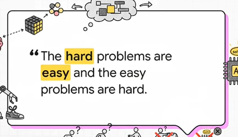

# (2026-02-02) EchoJEPA: A Latent Predictive Foundation Model for Echocardiography

| <!-- --> |
| ----------------------------------------------------------------------------------------------------------------------------------------------------------------------------------------------------------------------------------------------------------------------------------------------------------------------------------------------------------------------------------------------------------------------------------------------------------------------------------------------------------------------------------------------------------------------------------------------------------------------------------------------------------------------------------------------------------------------------------------------------------------------------------------------------------------------------------------------------------------------------------------------------------------------------------------------------------------------------------------------------------------------------------------------------------------------------------------------------------------------------------------------------------------------------------------------------------------------------------------------------------------------------------------------------------------------------------------------------------------------------------------------------------------------------------------------------------------------------------------------------------------------------------------- |
| **Author:** Alif Munim; Adibvafa Fallahpour; Teodora Szasz; Ahmadreza Attarpour; River Jiang; Brana Sooriyakanthan; Maala Sooriyakanthan; Heather Whitney; Jeremy Slivnick; Barry Rubin; et al.                                                                                                                                                                                                                                                                                                                                                                                                                                                                                                                                                                                                                                                                                                                                                                                                                                                                                                                                                                                                                                                                                                                           |
| **Journal: , 2026.**                                                                                                                                                                                                                                                                                                                                                                                                                                                                                                                                                                                                                                                                                                                                                                                                                                                                                                                                                                                                                                                                                                                                                                                               |
| **Journal Tags:**                                                                                                                                                                                                                                                                                                                                                                                                                                                                                                                                                                                                                                                                                                                                                                                                                                                                                                                                                                                                                                                                                                                                                                                                                                                                                                                                                                                                                 |
| **Local Link: **<a href="zotero://open-pdf/0_84QQEUT2" rel="noopener noreferrer nofollow">Munim 等 - 2026 - EchoJEPA A Latent Predictive Foundation Model for Echocardiography.pdf</a>                                                                                                                                                                                                                                                                                                                                                                                                                                                                                                                                                                                                                                                                                                                                                                                                                                                                                                                                                                                                                                                                                                                                     |
| **URL: **<a href="https://arxiv.org/abs/2602.02603v4" rel="noopener noreferrer nofollow">https://arxiv.org/abs/2602.02603v4</a>                                                                                                                                                                                                                                                                                                                                                                                                                                                                                                                                                                                                                                                                                                                                                                                                                                                                                                                                                                                                                                                                                                                                                                                           |
| **Abstract: ***Foundation models for echocardiography often struggle to disentangle anatomical signal from the stochastic speckle and acquisition artifacts inherent to ultrasound. We present EchoJEPA, a foundation model trained on 18 million echocardiograms across 300K patients, representing the largest pretraining corpus for this modality to date. By leveraging a latent predictive objective, EchoJEPA learns robust anatomical }representations that ignore speckle noise. We validate this using a novel multi-view probing framework with frozen backbones, where EchoJEPA outperforms leading baselines by approximately 20% in left ventricular ejection fraction (LVEF) estimation and 17% in right ventricular systolic pressure (RVSP) estimation. The model also exhibits remarkable sample efficiency, reaching 79% view classification accuracy with only 1% of labeled data versus 42% for the best baseline trained on 100%. Crucially, EchoJEPA demonstrates superior generalization, degrading by only 2% under physics-informed acoustic perturbations compared to 17% for competitors. Most remarkably, its zero-shot performance on pediatric patients surpasses fully fine-tuned baselines, establishing latent prediction as a superior paradigm for robust, generalizable medical AI.* |
| **Tags:**                                                                                                                                                                                                                                                                                                                                                                                                                                                                                                                                                                                                                                                                                                                                                                                                                                                                                                                                                                                                                                                                                                                                                                                                                                                                                                                                                                                                                         |
| **Note Date: **2026/6/24 22:33:56                                                                                                                                                                                                                                                                                                                                                                                                                                                                                                                                                                                                                                                                                                                                                                                                                                                                                                                                                                                                                                                                                                                                                                                                                                                                                         |

# 📜 Research Core

***

> Tips: What was done, what problem was solved, innovations and shortcomings?

## 单词的学习

*   readily：乐意地

<!---->

*   echo cardio graphy：心脏回声成像，标准译名**超声心动图（心脏彩超）**

    *   echo-：回声；cardio-：心脏；-graphy：成像 / 检查技术
    *   cardiac /ˈkɑːdiæk/：心脏的；与心脏相关的

*   disentangle：dis-（分开、解除）+ entangle（纠缠、缠绕）→ 解开缠绕；理清混杂事物

*   anatomical /ˌænəˈtɒmɪkl/：anatomy（解剖学）+ 形容词后缀 -ical

*   stochastic /stəˈkæstɪk/  ： 随机的——————deterministic  确定性的

*   speckle /ˈspekl/  ：名词斑点，动词 布满斑点

*   acquisition artifacts ：**采集伪影**，多见于影像科学（CT/MRI/ 显微成像）、信号采集、传感器领域

*   corpus  /ˈkɔːpəs/ ：指大量真实文本、语音素材的集合

*   acoustic perturbations

    *   acoustic /əˈkuːstɪk/ ：acoustic wave 声波

    *   perturbations /ˌpɜːtəˈbeɪʃnz/ ：mental perturbations 心绪纷乱

*   pedi atric /ˌpiːdiˈætrɪk/ ：pediatric department 儿科

*   paradigm /ˈpærədaɪm/：scientific paradigm 科学范式

*   conscious control：有意识调控 / 主观自主控制

    *   指人凭借清醒主观意识主动管控自身行为、情绪、思维、动作，而非本能、潜意识自动驱动

*   real world implications：实际的现实意义

    *   not just like funny toy problems

*   kidney：肾脏

*   urine：尿，尿液

    *   urine test 尿检

*   morovix paradox：<https://youtu.be/GLeC88evwgk>

    *   paradox /ˈpærədɒks/：悖论；自相矛盾的人 / 事

*   redact /rɪ'dækt/：vt. 编辑,编写， **删除、隐藏私人或敏感信息**

    *   *redacted document*（已编辑或隐藏敏感信息的文档）

    *   在法律、政府或保险文件中，公开前常会对敏感信息进行 redaction 处理

## ⚙️ Content

### 引入

语言非常擅长描述事物，但是 不是真实的感觉 到运动的规律

#### The slowness of Being

*   The slowness of Being

    *   海量输入，贫瘠输出
    *   词不达意是天生不可避免的
    *   文字、语言是极度压缩、失真的工具，是低分辨率、低代表性的表示方法
    *   language is a much lower bandwidth information
    *   describe the world rather than understand the world

> Our senses take in an enormous, high-dimensional stream (~10⁹ bits/s), but our conscious control and behavior appear limited to ~10 bits/second.
>
> 我们感官每秒摄入海量、高维度信息流（约 10 亿比特），但我们能有意识掌控、向外输出的行为，带宽仅每秒 10 比特。

> Because what comes out (words/actions) is so bandwidth-limited relative to what goes in, language is an poor proxy for understanding.
>
> **因为输出（语言、行动）相比输入带宽极度匮乏，语言根本无法完整还原我们内心真实的理解与感受。**

#### Sensory Data

*   Sensory Data（感官数据）

    *   视觉感官**信息密度**远高于文字，文字是高度压缩、抽象的信息；而视觉是高维度、高密度原始感官数据。

    *   短短几年的视觉观察，信息量就能匹敌人类全部互联网文字积累。

*   LLM 更多是 **pattern match **模式匹配，本质就是一个概率模型，可能会出现幻觉，对于 未见过的数据很难应对

    *   LLM  很难做一个 完全智能的，自己能够 盈利的智能体！！！

#### morovix paradox

*   morovix paradox 这种悖论实际上正是人工智能下一阶段发展方向转变的核心原因

    *   from  purely cognitive models like llms  toward embodied、 multimodal、 physical ai systems
    *   the next phase of ai development will involve physical ai and world models
    *   

> "It is comparatively easy to make computers exhibit adult level performance on intelligence tests or playing checkers, and difficult or impossible to give them the skills of a one-year-old when it comes to perception and mobility."
>
> 翻译：
>
> 让计算机在智力测试、下跳棋这类任务上达到成年人水平相对容易；但在感知、肢体行动这类能力上，赋予它一岁婴儿都具备的技能，却极其困难，甚至几乎做不到。

## 💡 Innovations

## 🧩 Shortcomings

# 🔁 Research Content

***

## 💧 Data

## 👩🏻‍💻 Method

## 🔬 Experiment

## 📜 Conclusion

# 🤔 Personal Summary

***

> Tips: What aspects did you question, how do you think it can be improved?

## 🙋‍♀️ Key Records

## 📌 To be resolved

## 💭 Thought Inspiration

*   所以 JEPA 非常适合 的就是 医学影像领域！！！

    *   EchoJEPA！！！

        *   可以用于 其他的 疾病/其他的超声 迁移过来！！！
        *   \==把最新 的通用JEPA 的方法迁移过来！！！==

    *   因为 很多医学影响 已经包含了 大量噪声和伪影

    *   JEPA 用于医学分割（加权的Multi-block），还有 JEPA用于 影像重建

        *   单独训练 解码器 重新回到像素空间哦，<a href="zotero://open/library/items/JQFXTF5V?page=9">“we use the V-JEPA pretrained models to predict the representations of the missing regions, and then use the decoder to project the representations to pixel space.”</a>(<a href="zotero://select/library/items/8MBK8GEP">Bardes 等, 2024, p. 9</a>)

<!---->

*   MC-JEPA：引入动态理解 用于 实时的分割

*   LeWordModel——端到端 低参数，去分割 超低参数实时部署的，结合其他wm 的关键提点的方法

    *   比如 深度监督！
    *   比如 结合MC-JEPA！！！
    *   提高 长程规划的能力

<!---->

*   有点像 对比学习 的两个网络相互学习：

    *   经过2018年以来视觉领域对比学习的蓬勃发展，其基本的训练框架基本统一，并且有用的tricks也被互相借鉴和验证
    *   所以 看看相关工作的 innovation

*   分层 JEPA（H-JEPA, Hierarchical JEPA），每一层就可以看作 传统网络的一层，利用Resnet等的技巧！残差连接+注意力机制！

    *   尺度、多粒度的多模态建模，可以利用mdfformer 的深层监督哦

<!---->

*   \~\~多模态的JEPA：结合sam 的输入语言和 图片，能够进一步 提高分割的效果！
*   在 **流形（Manifold）** 中进行了推演，把握了“彻底放弃像素重建、直接在抽象空间中推演环境演变”的核心
*
