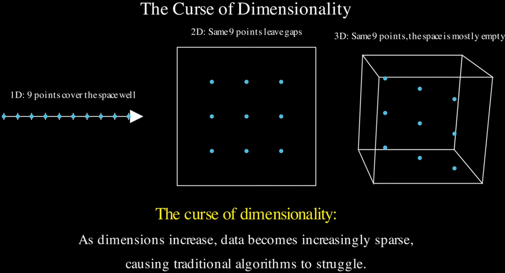

# JEPA

| <!-- --> |
| ----------------------------------------------------------------------------------------------------------------------------------------------------------------------------------------------------------------------------------------------------------------------------------------------------------------------------------------------------------------------------------------------------------------------------------------------------------------------------------------------------------------------------------------------------------------------------------------------------------------------------------------------------------------------------------------------------------------------------------------------------------------------------------------------------------------------------------------------------------------------------------------------------------------------------------------------------------------------- |
| **Author:** Anna Dawid; Yann LeCun;                                                                                                                                                                                                                                                                                                                                                                                                                                                                                                                                                                                                                                                                                                                     |
| **Journal: Journal of Statistical Mechanics: Theory and Experiment, 2024(10): 104011, 2024.**                                                                                                                                                                                                                                                                                                                                                                                                                                                                                                                                                    |
| **Journal Tags: **ㅤㅤ ㅤㅤ Q2 ㅤㅤ ㅤㅤ ㅤㅤ ㅤㅤ ㅤㅤ ㅤㅤ物理3区 ㅤㅤ ㅤㅤ                                                                                                                                                                                                                                                                                                                                                                                                                                                                               |
| **Local Link: **<a href="zotero://open-pdf/0_FULD73P9" rel="noopener noreferrer nofollow">Dawid和LeCun - 2024 - Introduction to Latent Variable Energy-Based Models A Path Towards Autonomous Machine Intelligence.pdf</a>                                                                                                                                                                                                                                                                                                                                                                                                                                                                                                                               |
| **DOI: **<a href="https://doi.org/10.1088/1742-5468/ad292b" rel="noopener noreferrer nofollow">10.1088/1742-5468/ad292b</a>                                                                                                                                                                                                                                                                                                                                                                                                                                                                                                                                                                                                                             |
| **Abstract: ***Current automated systems have crucial limitations that need to be addressed before artificial intelligence can reach human-like levels and bring new technological revolutions. Among others, our societies still lack Level 5 self-driving cars, domestic robots, and virtual assistants that learn reliable world models, reason, and plan complex action sequences. In these notes, we summarize the main ideas behind the architecture of autonomous intelligence of the future proposed by Yann LeCun. In particular, we introduce energy-based and latent variable models and combine their advantages in the building block of LeCun's proposal, that is, in the hierarchical joint embedding predictive architecture (H-JEPA).* |
| **Tags:**                                                                                                                                                                                                                                                                                                                                                                                                                                                                                                                                                                                                                                                                                                                                                                                                                                                       |
| **Note Date: **2026/6/19 17:33:56                                                                                                                                                                                                                                                                                                                                                                                                                                                                                                                                                                                                                                                                                                                       |

> <https://youtu.be/7UkJPwz_N_0?t=587>

## 📜 Research Core

***

> Tips: What was done, what problem was solved, innovations and shortcomings?

### ⚙️ Content

#### APA 与 MLA：有什么区别？完整对比

|                                                                                                                     | **APA**         | **MLA**     |
| ------------------------------------------------------------------------------------------------------------------- | ----------------------------------------------------------------------------------------------------------------------- | ------------------------------------------------------------------------------------------------------------------- |
| **适用领域**    | 社会科学、心理学、教育学    | 人文学科、文学、语言学 |
| **文内引用格式**  | (作者 年份)         | (作者 页码)     |
| **参考文献标题**  | References      | Works Cited |
| **日期位置**    | 作者后面            | 引用末尾        |
| **期刊名称**    | 斜体，首字母大写        | 斜体，首字母大写    |
| **书名**      | 斜体，句式大小写        | 斜体，标题大小写    |
| **作者格式**    | 姓，名首字母缩写        | 姓，名         |
| **URL/DOI** | 必须包含            | 通常包含        |
| **缩写**      | et al., p., pp. | et al.      |
| **页码格式**    | 引用中用 (p. ##)    | 引用中用 (页码)   |

### 💡 Innovations

### 🧩 Shortcomings

## 🔁 Research Content

***

### 💧 Data

*   JEPA 最初版论文，关于其基本架构，会有很多图表

#### <a href="zotero://open/library/items/Z963ASFR?page=18">“Figure 8: Self-Supervised Learning (SSL) and Energy-Based Models (EBM).”</a> (<a href="zotero://select/library/items/G5N54RJ6">Dawid 和 LeCun, 2024, p. 18</a>)

*   plausible：看似合理的、说得通的

*   **自监督 SSL 本质**：不用人工标签，让模型自动挖掘输入内部的依赖关系，完成「补全缺失信息」的填空任务；输入拆成已知观测x、未知待求y。

*   **EBM 建模思路**：设计能量函数\(F(x,y)\)量化\(x,y\)匹配度，训练目标是让真实数据对能量尽可能小，虚假组合能量尽可能大。

*   **EBM 对比普通模型的优势**：天然支持**多模态依赖**，一个x可以对应无穷多合理y，完美适配图像补全、视频预测这类存在多种合理答案的任务。

#### <a href="zotero://open/library/items/Z963ASFR?page=19">“Latent-Variable Energy-Based Model (LVEBM).”</a> (<a href="zotero://select/library/items/G5N54RJ6">Dawid 和 LeCun, 2024, p. 19</a>)

*   #### LVEBM  Inference 的过程

1.  给定观测对  \((x,y)\)；

2.  在隐变量全集  $\mathcal{Z}$  里搜索，找到让三元能量  $E_w(x,y,z)$  最小的隐变量  $\tilde{z}$ ；

3.  将最优隐变量代入三元能量，得到只关于 $x,y$ 的等效能量 $F_w(x,y)$；

4.  用 $F_w(x,y)$ 的大小判断 $x,y$ 是否兼容：能量越低，二者匹配度越高。

#### <a href="zotero://open/library/items/Z963ASFR?page=21">“A few standard architectures and their capacity for collapse.”</a> (<a href="zotero://select/library/items/G5N54RJ6">Dawid 和 LeCun, 2024, p. 21</a>)

*   deterministic algorithm 确定性算法

*   $s_x=\text{Enc}(x)$、$s_y=\text{Enc}(y)$，是编码器 Enc 压缩提取后的**低维特征表征**

    *   **s = State** 中文：**状态表征 / 内在状态向量**

    *   这套符号来自 LeCun 提出的**世界模型 / JEPA 联合嵌入预测架构**

    *   编码器$\text{Enc}$把原始观测压缩成**内在状态s**，只保留对预测、匹配有用的核心信息

    *   这个s代表模型眼中 “世界当前片段的状态”，因此命名为 State

*   坍缩：模型找到了一条 **偷懒的** “作弊捷径”，不再学习数据内在依赖关系

    *

#### <a href="zotero://open/library/items/Z963ASFR?page=25">“The Joint-Embedding Predictive Architecture (JEPA) consists of two encoding branches.”</a> (<a href="zotero://select/library/items/G5N54RJ6">Dawid 和 LeCun, 2024, p. 25</a>)

*   eschew sth. 避开某物，主动刻意摒弃（主观选择不沾染）

*   chew sth. 咀嚼某物

*   elimination round 淘汰赛

*   **velocity /vəˈlɒsəti/n. 速度；速率（矢量）**

    *   核心：带方向的速度（矢量），区别于 speed（速率，仅大小、标量）

*   隐变量预测模块$\text{Pred}(s_x,\mathcal{Z})$：

    *   z：隐变量，取值空间  $\mathcal{Z}$

    *   $\text{Pred}(s_x,\mathcal{Z})$ ：遍历全部z后，能生成一整套全部合理的 $\tilde{s}_y$ 集合

*   隐变量z：

    *   隐变量z控制多组可行预测，每次 预测器选择一个 z 产生预测

    *   隐变量z只负责离散 / 有限语义选择，z仅编码少数关键分支（左 / 右转、物体姿态），维度极低、容量可控，不会出现之前说的 “任意y都能零误差” 的坍缩问题

    *   $\boldsymbol{R(z)}$ —— 最小化隐变量z的信息量

        *   禁止z容量过大，避免就像之前的 生成式<a href="zotero://open/library/items/Z963ASFR?page=21">“Figure 10”</a>(<a href="zotero://select/library/items/G5N54RJ6">Dawid 和 LeCun, 2024, p. 21</a>)的b图 的：：： “任意y都能零误差拟合” 的坍缩问题

*   编码器 Enc

    *   编码器 $\text{Enc}(y)$ 具备**不变性**：多个视觉上完全不同的原始y，只要核心语义一致，会输出完全相同的$s_y$

    *   编码器过滤冗余噪声：无关细节直接丢弃，模型不用学习无意义纹理

#### <a href="zotero://open/library/items/Z963ASFR?page=26">“Non-contrastive training of JEPA.”</a> (<a href="zotero://select/library/items/G5N54RJ6">Dawid 和 LeCun, 2024, p. 26</a>)

*   四条约束联合杜绝模型坍缩（collapse）

    *   最小化  $-I$ 等价于**最大化信息量**

    *   $\boldsymbol{R(z)}$ —— 最小化隐变量z的信息量

*   实现 \*\* 无对比学习（non-contrastive）\*\* 训练，不需要负样本

    *   不存在负样本不足、批量大小受限的工程问题

*   如果用传统对比学习训练 JEPA，会遭遇**维度灾难（curse of dimensionality）**： 表征$s_y$ 维度越高，需要的负样本数量指数级上涨，硬件、显存开销爆炸，直接限制$s_y$ 的可用维度上限

    *   curse 这里指的是 固有的灾难/弊端

    *   视频讲解：<https://youtu.be/9Tf-_mJhOkU?t=2>

    *   As dimensions increase, the same amount of data becomes increasingly sparse

    *   

        *   随着尺寸增大，几乎所有点都会远离中心

    *   为了正确训练模型，我们需要数据在低维空间中能够较好地覆盖输入空间

        *   但是，随着维度的增加，维持相同覆盖范围所需的数据量呈指数级增长。
        *   随着维度增加，数据需求呈指数级增长。
        *   此外，高维空间中的随机向量往往彼此几乎垂直，因为太稀疏了。

#### <a href="zotero://open/library/items/Z963ASFR?page=28">“Training a JEPA with VICReg.”</a> (<a href="zotero://select/library/items/G5N54RJ6">Dawid 和 LeCun, 2024, p. 28</a>)

*

<!---->

*

#### <a href="zotero://open/library/items/Z963ASFR?page=30">“Hierarchical JEPA (H-JEPA)”</a> (<a href="zotero://select/library/items/G5N54RJ6">Dawid 和 LeCun, 2024, p. 30</a>)

### 👩🏻‍💻 Method

### 🔬 Experiment

### 📜 Conclusion

## 🤔 Personal Summary

***

> Tips: What aspects did you question, how do you think it can be improved?

### 🙋‍♀️ Key Records

### 📌 To be resolved

### 💭 Thought Inspiration
