# JEPA（Joint Embedding Predictive Architecture）
## 与直接生成式 的区别

- 和大模型 无脑训练的区别：
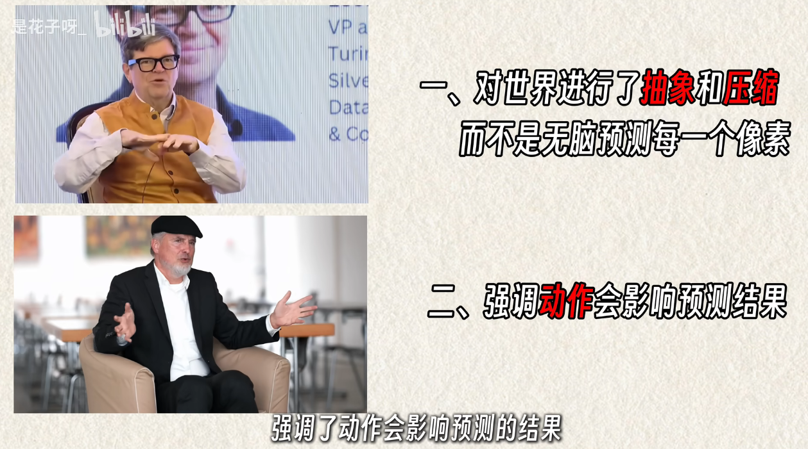

- JEPA的核心思想是，不再直接在**像素级或词元级**的原始数据空间进行预测和生成，而是在一个更高层次的、**抽象的潜在表示空间**中进行预测
- ==JEPA的关键在于，它学习的是**输入数据之间的依赖关系**，而不是直接生成输出==
	- JEPA包含两个主要部分：一个编码器（_Encoder_）和一个预测器（_Predictor_）。编码器负责将输入数据（如一段视频的两帧图像）分别映射到两个潜在向量。预测器则负责根据其中一个潜在向量（代表“源”视图），来预测另一个潜在向量（代表“目标”视图）
	- ==潜在空间通常比原始数据空间维度更低、更结构化，此外可以PA可以自然地忽略掉那些难以预测但对任务不重要的细节==
	- 

- JEPA与生成式模型（如VAE、GAN或LLM）的根本区别在于==其预测的目标空间不同==
	- 生成式模型的目标是重建或生成与原始数据尽可能相似的输出，因此它们需要在高维的原始数据空间（如像素空间）中进行操作。这导致它们需要花费大量的计算资源来学习那些对理解世界动态并不重要的细节，例如图像的纹理、光照等
	- JEPA则完全放弃了在原始数据空间中进行生成，转而专注于在编码器学习到的抽象潜在空间中进行预测
	- 这使得JEPA能够**更快地收敛**，并且学到的表示更具泛化能力。此外，由于JEPA**不进行像素级的重建**，它也避免了生成式模型中常见的“模糊”或“不真实”的问题

# I-JEPA——Encoder+Prdictor+Z
- ==隐空间，而非像素空间，中进行预测==
	- ==不需要 生成完整 的视频帧来预测未来==，而是直接在 隐空间 中 完成预测的过程
	- 更加节省 token
- 难点：需要 学习到现实世界的 ==正确表征而且不能坍缩==
	- 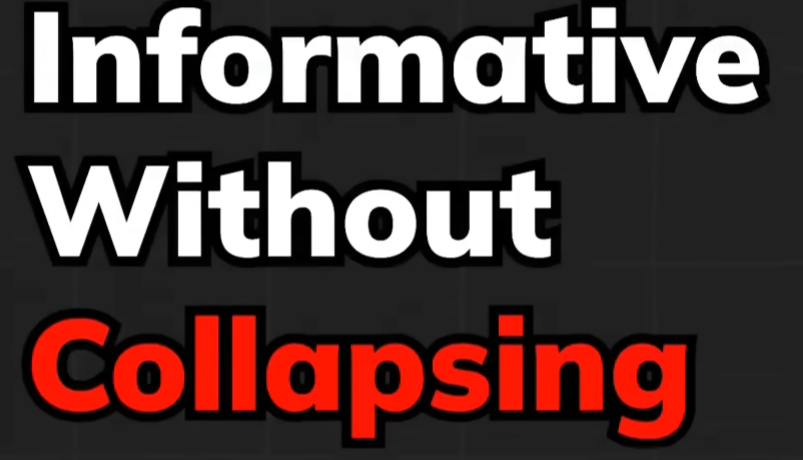
	- 

## 结构
- 一个 视图会作为上下文
- JEPA 不是通过 重建像素或者预测token  来学习，而是会把这两个都转化为 嵌入向量
	- 上下文编码器（当前的观察）——目标编码器（被掩码的片段或者未来的片段）
	- ==从 **上下文嵌入向量** 预测 **目标嵌入向量**，从而保留核心意思，减少噪声==
	- 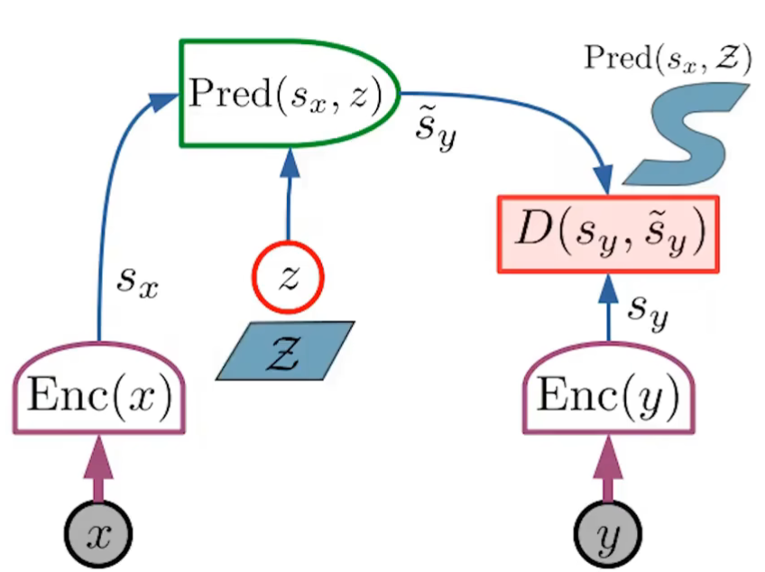
	- 
- ==thousand 千 ($10^3$)   million 表示百万（10⁶），billion 表示十亿（10⁹），trillion 表示万亿（10¹²）==

## 训练和推理
- 训练阶段会用到 Context以及Target
- ==但是 推理阶段 只会用到 训练完成的 上下文Context 编码器==
	- 作为 特征提取器 或者 隐空间状态估计器

## 用途
- 用 上下文编码器 作为 **特征 提取器**或者**基础表征模型**，得到嵌入向量
	- 嵌入向量 可以用于后续的分类、检索、相似性搜索等
	- 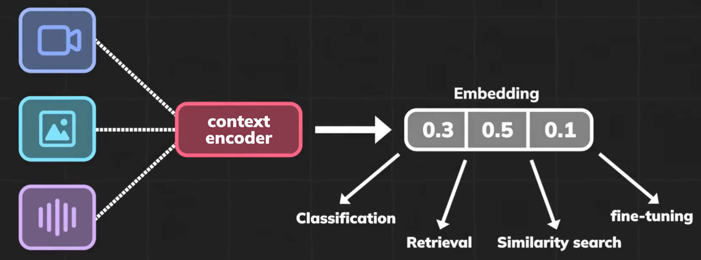
- 如果加入预测器，就可以作为 世界建模器 的**隐空间构建**
	- 预测 未来状态的  嵌入向量
	- 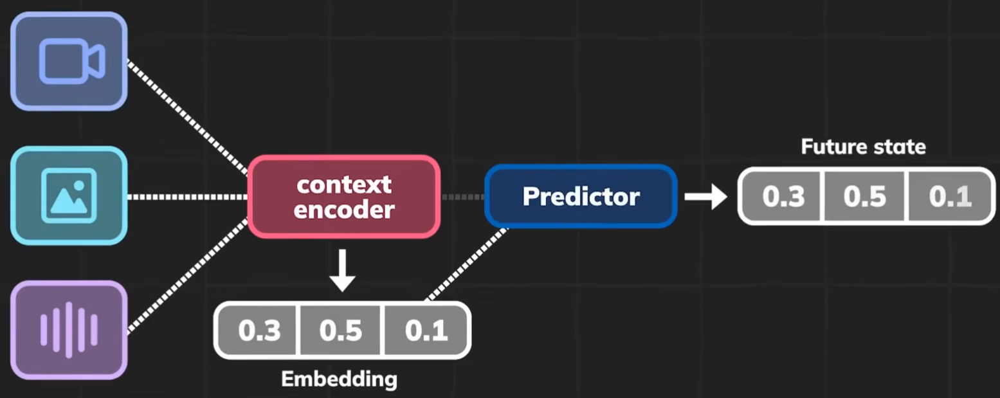
- 如果接上执行器，就可以作为 机器人的规划
	- 会根据 当前视图 还有 机器人的动作 得出 未来的状态
	- 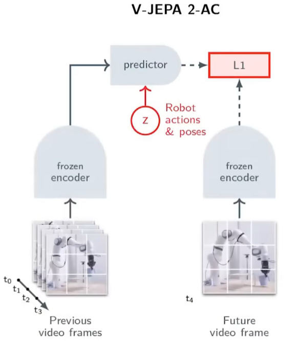
	- 

## 难点——表征坍塌
难点：需要 学习到现实世界的 ==正确表征而且不能坍缩==
- 

- 正是因为 缺少了现实世界的噪声，没有办法阻止 编码器给输入输出 都输出相同的 嵌入向量
	- 就是 偷懒了 ！！！表征坍塌
	- 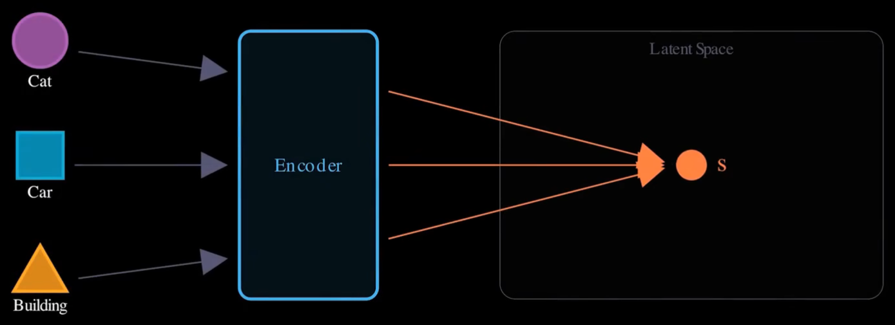
	- 训练 损失变得 很低，但是 没有学习到  任何有用的信息！！！坍缩为了一个不包含 任何有用信息的单点了！！！
### EMA——指数移动平均
- 过对历史价格数据赋予不同权重，使**近期价格变化对指标影响更大**，从而能够更及时地反映市场趋势
- 之前是 一种的  [炼丹训练技巧](https://zhuanlan.zhihu.com/p/68748778)，但是最近 被用于 防止表征坍塌
- 就像 是 上下文表征  的延迟版本
	- 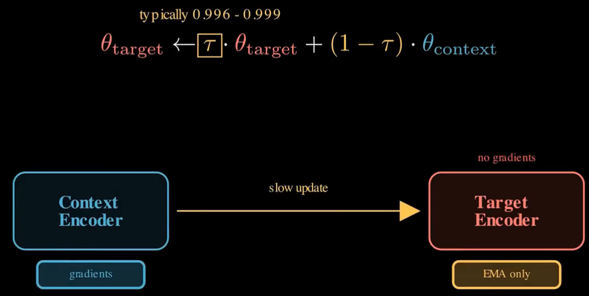
- 实际训练 过程中 ==只有 Context  会通过梯度 **直接训练**==
	- 而 ==Target  根据Context  去滑动平均的==
- 

### 信息最大化——添加正则
- 好的表征 应该尽可能保证 输入的全部信息
	- 所以 应该最大化输入 和表征 之间的互信息

#### [样本对比法——2020simCLR思路](https://zhuanlan.zhihu.com/p/197802321)
- A Simple Framework for Contrastive Learning of Visual Representations
- 其实概念相当简单：(1) 先sample一些图片组为batch；(2) 对batch里的image做两种不同的data augmentation；(3) 希望同一张图像、不同augmentation的结果相近，并互斥其他结果
	- 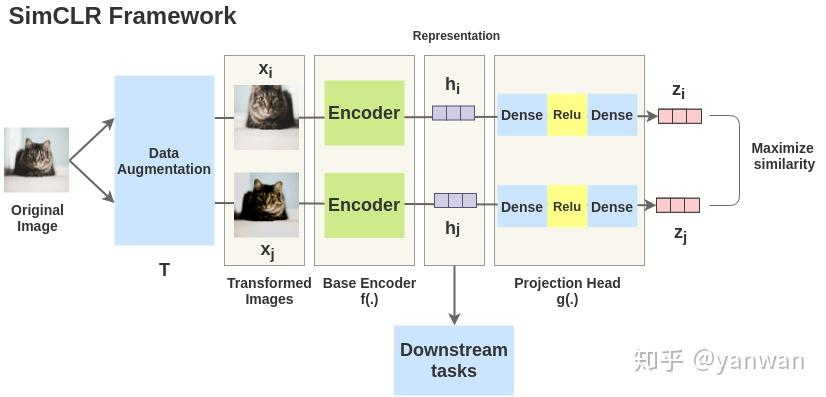
- 从而让表征空间 中的相似的样本更加 接近，无关的东西更加远离
	- 从而 防止表征 坍缩 为单点
- 缺点：计算成本 很高！！！

#### 维度对比法——每个维度捕捉到  不同的信息
- 关注 嵌入向量本身的结构，而不是 让他和别的样本 去对别的
	- 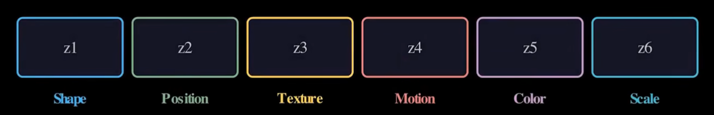
- 实际  就是 在损失当中，加入 正则项，从而惩罚不同维度 之间的冗余

# V-JEPA
- 为了验证JEPA架构的有效性，杨立昆的团队开发了V-JEPA（_Video Joint Embedding Predictive Architecture_），并将其应用于视频理解领域
- V-JEPA的训练方式是，向模型输入一段视频，然后随机地遮蔽（_mask_）掉其中的一部分，让模型根据未被遮蔽的部分来预测被遮蔽部分在潜在空间中的表示。
	- 通过这种方式，V-JEPA被迫去学习视频中的时空关系，例如物体的运动规律、场景的转换等
- 

## LeJEPA——25年11月
- 改变了 思路
- 直接 要求 嵌入向量服从 各向同性高斯分布
	- 让信息 在各个维度上边 分布均匀，不出现 某个方向发生坍塌
- 

# [LeWordModel](https://www.bilibili.com/video/BV1KLXHBTEdh?t=0.0)
- 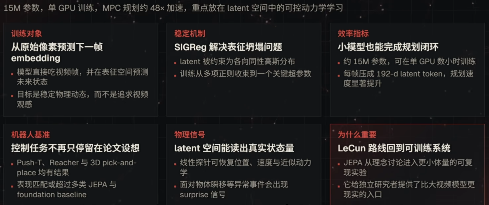
- 

