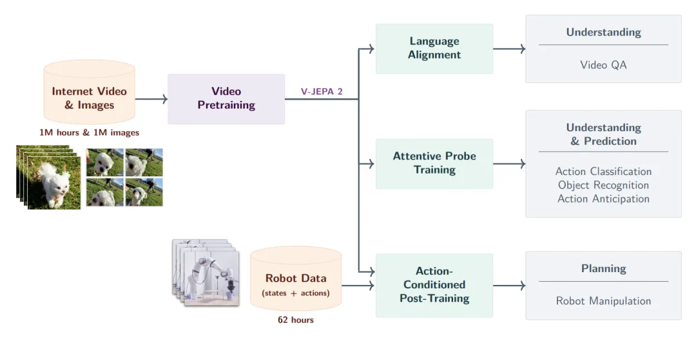
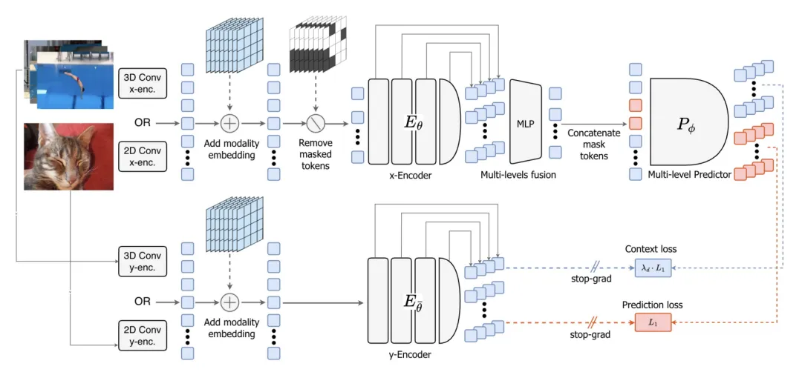
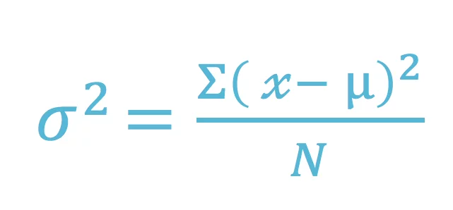
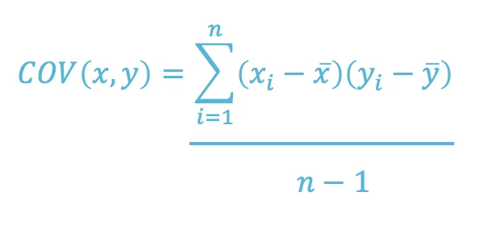
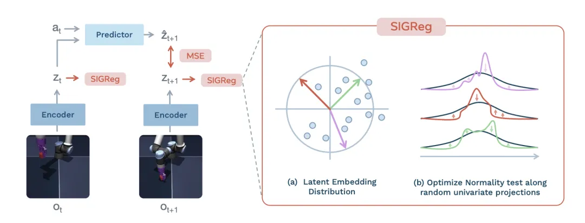

>[!JEPA]
>学习视频：https://www.bilibili.com/video/BV1gWopBsE6D?t=0.1
>

# JEPA（Joint Embedding Predictive Architecture）——自监督学习

## 与直接生成式 的区别

- 和大模型 无脑训练的区别：

- JEPA的核心思想是，不再直接在**像素级或词元级**的原始数据空间进行预测和生成，而是在一个更高层次的、**抽象的潜在表示空间**中进行预测
- ==JEPA的关键在于，它学习的是**输入数据之间的依赖关系**，而不是直接生成输出==
	- JEPA包含两个主要部分：一个编码器（_Encoder_）和一个预测器（_Predictor_）。编码器负责将输入数据（如一段视频的两帧图像）分别映射到两个潜在向量。预测器则负责根据其中一个潜在向量（代表“源”视图），来预测另一个潜在向量（代表“目标”视图）
	- ==潜在空间通常比原始数据空间维度更低、更结构化，此外可以PA可以自然地忽略掉那些难以预测但对任务不重要的细节==
	- 

- JEPA与生成式模型（如VAE、GAN或LLM）的根本区别在于==其预测的目标空间不同==
	- 生成式模型的目标是重建或生成与原始数据尽可能相似的输出，因此它们需要在高维的原始数据空间（如像素空间）中进行操作。这导致它们需要花费大量的计算资源来学习那些对理解世界动态并不重要的细节，例如图像的纹理、光照等
	- JEPA则完全放弃了在原始数据空间中进行生成，转而专注于在编码器学习到的抽象潜在空间中进行预测
	- 这使得JEPA能够**更快地收敛**，并且学到的表示更具泛化能力。此外，由于JEPA**不进行像素级的重建**，它也避免了生成式模型中常见的“模糊”或“不真实”的问题

- 和以往的生成式自监督学习最本质的区别在于，**JEPA 彻底抛弃了像素级重建**
	- LeCun 打破了这一惯性，确立了一个绝对核心的原则：预测必须在**抽象的表征空间**中进行

## 适用的领域/核心要素——🦄
- ==关键：隐空间，而非像素空间，中进行预测==
- 最适合 的场景就是 数据里面 包含大量无关紧要的的底层细节， ==适合图像和视频，不太 适合语言本身==
	- 因为 文本本身就是 对语义进行  符号化的压缩啦，已经去掉了 数据里面的 大部分噪声了，所以不是 预测文本的 最优设计！！！
		- [对于文本 或许可以采用：视觉上下文压缩](https://song2yu.github.io/world-model-vla/visual-context-compression.html)
	- 所以 JEPA 的核心就是：==在预测时候 去掉不可预测的噪声==
	- 所以 JEPA 非常适合 的就是 ==医学影像领域！！！==
- 所以 JEPA 非常适合 的就是 医学影像领域！！！
	- ==EchoJEPA！！！
		- 可以用于 其他的 疾病/其他的超声 迁移过来！！！
		- 把最新 的通用JEPA 的方法迁移过来！！！
	-  因为 很多医学影响 已经包含了 大量噪声和伪影

-  LLM 专为语言设计 通向AGI
- JEPA 专为图像/视频 通向AGI 

# H-JEPA——后续的理论纲领
- 作为早期的概念起点，引入了层级化和多时间尺度的机制
- **2023年是JEPA的“范式确立年”**，两篇核心论文分别从理论与工程层面，为JEPA搭建起完整框架
	- I-JEPA与H-JEPA的双重突破

# I-JEPA——Encoder+Predictor+Z
- ==隐空间，而非像素空间，中进行预测==
	- ==不需要 生成完整 的视频帧来预测未来==，而是直接在 隐空间 中 完成预测的过程
	- 更加节省 token
- 难点：需要 学习到现实世界的 ==正确表征而且不能坍缩==

- 它证明了在**不依赖手工数据增强**的情况下，系统依然能学到深度的语义表征，从而成为掩码自编码器之外的一种极具竞争力的可行路径
	- 此前的对比学习高度依赖色彩抖动、空间裁剪等手工设计的数据增强，引入了较强的归纳偏置。I-JEPA 完全摒弃了这种做法，核心在于引入了多块掩码策略

## 结构
- 一个 视图会作为上下文
- JEPA 不是通过 重建像素或者预测token  来学习，而是会把这两个都转化为 嵌入向量
	- 上下文编码器（当前的观察）——目标编码器（被掩码的片段或者未来的片段）
	- ==从 **上下文嵌入向量** 预测 **目标嵌入向量**，从而保留核心意思，减少噪声==
	- 
	- 
- ==thousand 千 ($10^3$)   million 表示百万（10⁶），billion 表示十亿（10⁹），trillion 表示万亿（10¹²）==

- ==整个 pipeline **基于 ViT 构建**，分为上下文编码器、目标编码器和预测器三部分==
- 目标编码器的参数由上下文编码器的参数通过指数移动平均（EMA）更新而来

## 训练和推理
- 训练阶段会用到 Context以及Target
- ==但是 推理阶段 只会用到 训练完成的 上下文Context 编码器==
	- 作为 特征提取器 或者 隐空间状态估计器

## 用途
- 用 上下文编码器 作为 **特征 提取器**或者**基础表征模型**，得到嵌入向量
	- 嵌入向量 可以用于后续的分类、检索、相似性搜索等
	- 
- 如果加入预测器，就可以作为 世界建模器 的**隐空间构建**
	- 预测 未来状态的  嵌入向量
	- 
- 如果接上执行器，就可以作为 机器人的规划
	- 会根据 当前视图 还有 机器人的动作 得出 未来的状态
	- 
	- 

## 难点——表征坍塌
难点：需要 学习到现实世界的 ==正确表征而且不能坍缩==
- 

- 正是因为 缺少了现实世界的噪声，没有办法阻止 编码器给输入输出 都输出相同的 嵌入向量
	- 就是 偷懒了 ！！！表征坍塌
	- 
	- 训练 损失变得 很低，但是 没有学习到  任何有用的信息！！！坍缩为了一个不包含 任何有用信息的单点了！！！
### EMA——指数移动平均
- EMA（Exponential Moving Average，中文称“指数平滑移动平均线”
- 过对历史价格数据赋予不同权重，使**近期价格变化对指标影响更大**，从而能够更及时地反映市场趋势
- 之前是 一种的  [炼丹训练技巧](https://zhuanlan.zhihu.com/p/68748778)，但是最近 被用于 防止表征坍塌
- 就像 是 上下文表征  的延迟版本
	- 
- 实际训练 过程中 ==只有 Context  会通过梯度 **直接训练**==
	- 而 ==Target  根据Context  去滑动平均的==
- 

### 信息最大化——添加正则
- 好的表征 应该尽可能保证 输入的全部信息
	- 所以 应该最大化输入 和表征 之间的互信息

#### [样本对比法——2020simCLR思路](https://zhuanlan.zhihu.com/p/197802321)
- A Simple Framework for Contrastive Learning of Visual Representations
- 其实概念相当简单：(1) 先sample一些图片组为batch；(2) 对batch里的image做两种不同的data augmentation；(3) 希望同一张图像、不同augmentation的结果相近，并互斥其他结果
	- 
- 从而让表征空间 中的相似的样本更加 接近，无关的东西更加远离
	- 从而 防止表征 坍缩 为单点
- 缺点：计算成本 很高！！！

#### 维度对比法——每个维度捕捉到  不同的信息
- 关注 嵌入向量本身的结构，而不是 让他和别的样本 去对别的
	- 
- 实际  就是 在损失当中，加入 正则项，从而惩罚不同维度 之间的冗余
- [2025 年11月 yann lecun 新提出的 SIGReg 方法](#^0d941f)

# MC-JEPA——引入动态理解
- MC-JEPA（Motion-Content JEPA）[3] 是从静态图像走向动态理解的探索性尝试
- 它通过在**共享编码器中联合学习运动（Motion）和内容（Content）特征**，初步验证了在隐空间中同时捕捉静态细节与动态变化的可行性，为后续处理高维度时空数据做好了铺垫

# Audio-JEPA：模态通用性的确立
- 在视觉与视频领域跑通后，Audio-JEPA  进一步证实了这套架构的底层通用性
	- 将特征预测机制迁移到**音频频谱图**上，通过引入时频感知掩码，让模型在隐空间中预测缺失的音频特征
- 表明避免原始信号重建、**在高度抽象的特征空间中进行局部到局部的预测**，是一种可以跨越感官模态的通用学习法则

# Point-JEPA：点云几何表征的高效提取
- 针对点云无序性带来的上下文块和目标块采样难题，它避免了在原始空间进行坐标和颜色的重建，转而在隐空间中进行特征预测
- Point-JEPA 成功**绕开了原始点云数据中存在的冗余和噪声**，证明了该架构在处理复杂几何表征时依然能够保持极高的效率

# 3D-JEPA：更广泛的3D语义重塑
- 将应用场景从单一的点云数据扩展到了更广泛的三维特征学习。它标志着该架构已经成熟，可以作为处理完整 3D 语义的基础框架

# ACT-JEPA：动作变量的联合预测
- ACT-JEPA [8] 是 JEPA 走向完整控制系统的关键节点。此前的模型大多停留在对观测信号的隐空间预测，而 ACT-JEPA 引入了动作序列这一核心变量
- 系统不再单一预测未来的观测特征，而是**将动作序列与隐式观察序列进行联合预测**

- 

# V-JEPA——视频理解，动态场景
- 为了验证JEPA架构的有效性，杨立昆的团队开发了V-JEPA（_Video Joint Embedding Predictive Architecture_），并将其应用于视频理解领域
- V-JEPA的训练方式是，向模型输入一段视频，然后随机地遮蔽（_mask_）掉其中的一部分，让模型根据未被遮蔽的部分来预测被遮蔽部分在潜在空间中的表示。
	- 通过这种方式，V-JEPA被迫去学习视频中的时空关系，例如物体的运动规律、场景的转换等

- 整个 pipeline 将输入的**视频片段切分**为空间 16x16、时间跨度 2 帧的时空 token 序列

- ==这种在**高度信息缺失下进行的特征预测**，使模型学到了极具通用性的视觉表征==

# V-JEPA 2：具备零样本规划能力的显式世界模型
- 如果说 ACT-JEPA 是**控制架构**的雏形，V-JEPA 2 [9] 则是该系列中具有决定性意义的里程碑
- V-JEPA 2 的核心突破在于其展现出的零样本机器人规划能力。在未经特定环境数据微调的情况下，模型能够在一个完全未知的物理环境中，利用一系列视觉子目标进行多步动作推演

- V-JEPA 2 的核心突破在于其展现出的 **零样本机器人规划能力**。
- 在未经特定环境数据微调的情况下，模型能够在一个完全未知的物理环境中，利用一系列视觉子目标进行多步动作推演

# V-JEPA 2.1：解锁密集特征与深度自监督
- 在建立动作规划能力后，V-JEPA 2.1 [12] 将重心放回了**表征质量的极致打磨**，属于该阶段重点拆解的核心工作
- 它引入了**密集预测损失**，让可见的上下文标记和被掩盖的标记共同参与损失计算，从而大幅强化了模型对时空的精确定位能力
- 与此同时，系统还在编码器的多个中间层级同步应用了**深度自监督机制**，迫使网络在较浅的层级就开始理解复杂的物理逻辑

# LeJEPA——25年11月，回归数学本质
## variance and covariance formula
### vaiance 
- The formula for variance is as follows:
	- 

### covariance 
- The formula for covariance is as follows: 
	- 

## VICReg
- 

## SIGReg
- 改变了 防止表征坍塌的思路
	- 早期的联合嵌入架构在很大程度上依赖**指数移动平均、停止梯度等**启发式技巧来防止模型训练过程中的表示坍塌
- ==直接 要求 嵌入向量服从各向同性高斯分布（SIGReg）== ^0d941f
	- 让信息 在各个维度上边 分布均匀，不出现 某个方向发生坍塌
- 这种优化目标能够主动约束隐空间的数据分布，彻底移除了复杂的教师学生网络架构和繁琐的超参数调度。整个计算流程被精简，让模型的并行训练变得更加纯粹和稳定

# Causal-JEPA：引入对象级掩码的因果推理
- 为了让系统超越表层的视觉关联，Causal-JEPA 将掩码机制从基础的图像块升级到了对象级别。
	- 在训练过程中，模型必须根据环境中的其他对象来推断被掩盖对象的状态。
- 这种强制性的交互推理诱发了**隐空间中的潜在干预机制**。
- 它不仅显著提升了系统在复杂场景下的反事实推理能力，还在智能体控制任务中实现了极高的数据效率——系统仅需极少的隐层特征维度即可完成精准规划

# [LeWordModel——端到端 低参数](https://www.bilibili.com/video/BV1KLXHBTEdh?t=0.0)
- 
-  LeWorldModel [13] 首次实现了完全**从原始像素端到端稳定训练的极简架构**。
	- 先前的方案往往需要拼凑多项辅助损失或依赖外部预训练的编码器
- 整个系统仅依靠两个目标驱动：下一步特征预测以及高斯正则化
	- 

- 从工程角度来看，端到端的模型更易于部署和维护。
	- 传统的 AI 系统通常由多个模块组成，模块之间需要进行复杂的交互和协调。
	- 而端到端的模型可以**将这些模块整合起来，减少人工干预，提高系统的自动化程度**

# ThinkJEPA：融合语义思考的长周期规划
- 它将**视觉语言模型中蕴含的深层语义抽象和通用知识**，巧妙地编织进隐式世界模型的预测路径中
- 它将视觉语言模型中蕴含的深层语义抽象和通用知识，巧妙地编织进隐式世界模型的预测路径中

