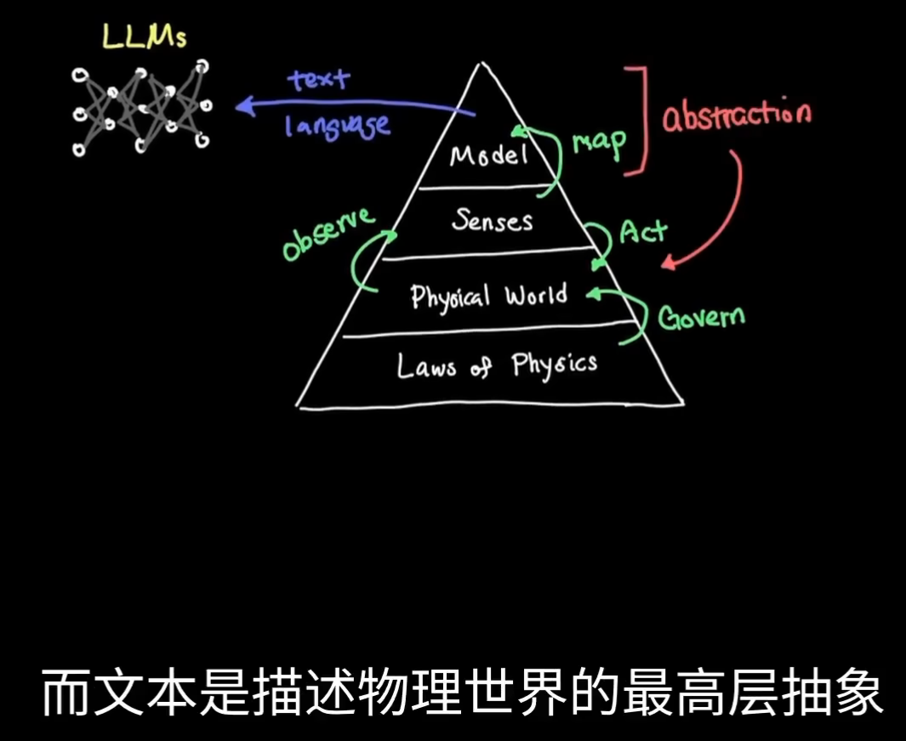
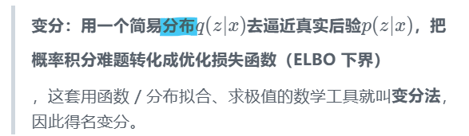
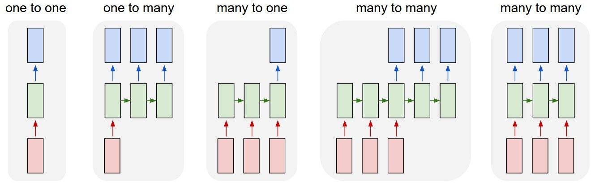
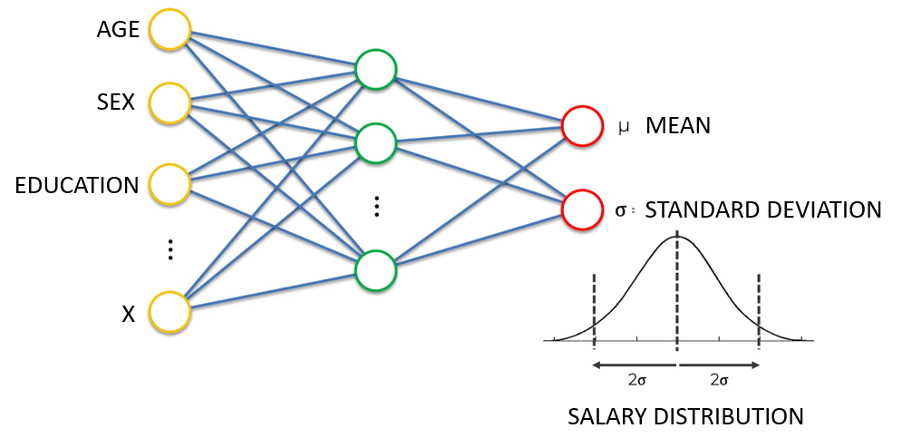
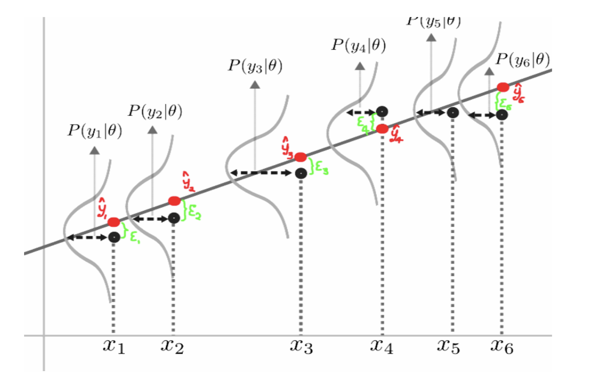
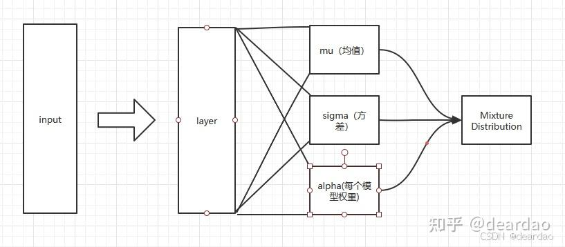
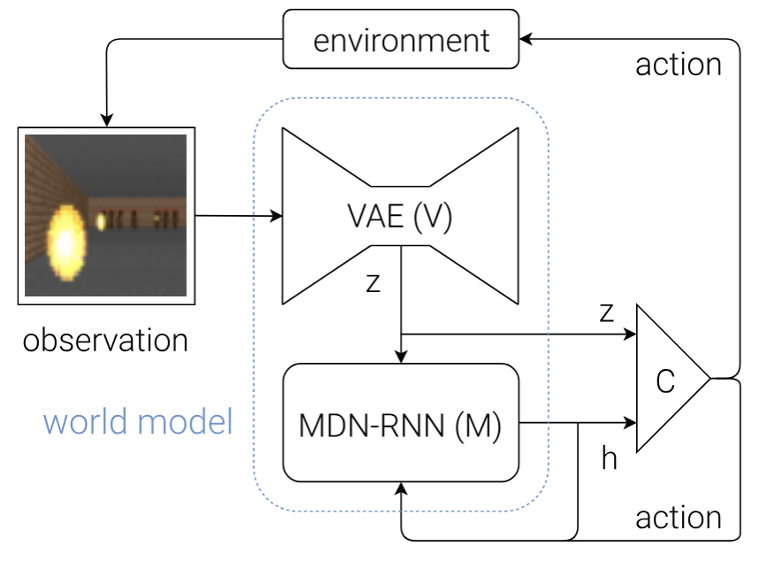
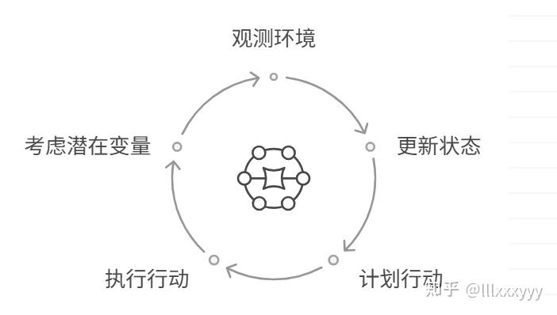

# 基础——模拟和预测物理世界
- 世界模型是：AI系统内部构建的虚拟环境，用于**理解物理世界**、预测未来状态并自主决策，是通向通用人工智能和具身智能的核心技术
- World Models  第一次提出就是 2018年了，由LSTM的作者提出
	- [World Models](https://arxiv.org/abs/1803.10122)
- 模型学习到如何根据**当前的世界状态**和智能体采取的**行动**来预测下一个**状态**
- 

## 区别
### 与传统AI的区别：从被动响应到主动预测
- 传统的监督学习模型，其核心任务是学习一个从输入到输出的映射函数，例如图像分类或语音识别。这些模型在处理一个输入时，并不会考虑这个输入在时间序列上的前后关系，也不会预测未来的状态。它们只是根据训练数据中学到的模式，对**当前的输入做出一个判断**
	- 而世界模型则不同，它关注的是时间序列上的动态变化，致力于理解“世界为什么会这样变化
- 强化学习（_RL_）虽然也与环境的动态变化有关，但其学习方式通常是“试错”。智能体（_Agent_）在环境中通过不断尝试不同的行动，并根据获得的奖励或惩罚来调整其策略。这种方式在简单环境中可能有效，但在复杂、高维度的现实世界环境中，试错学习的成本极高，甚至可能带来灾难性的后果
	- 世界模型则提供了一种更高效的学习方式。它通过观察和学习环境的动态规律，==在内部构建一个模拟器。智能体可以在这个模拟器中进行大量的“想象”和“规划”，从而找到最优的行动序列==，而无需在真实环境中进行大量的试错
### 与VLA的区别
- 利用 V（VIT）和L（LLM） 生成动作token的 模型
- ==但是VLA，MLLM本质 还是缺乏对**物理世界**的空间认知==
- 世界模型：能够理解因果关系、进行零样本学习，并直接输出行动（Action），无需依赖文字或语言中间层
- VLA：==本质上是**模仿学习**，依赖统计关联而非物理理解==
- VLA是“数据饥渴型”的，越多互联网数据越好。世界模型更偏向“**小数据**”学习，它从少量数据中抽象出规律，就可以举一反三。就像人类小孩不需要撞一万次墙才知道会疼，几次就能学会。

- **VLA**：**通才**，**互联网级的模式识别大师**，善于回答“是什么”和“怎么做”，但可能不知其所以然。
- **世界模型**：**专家**，**物理世界的模拟器**，善于回答“为什么”和“将会怎样”，追求对底层规则的理解。

### 与LLM的区别
- ==因为LLM **没有模拟环境** 去测试他的理论，所以 **理解物理世界** 就有先天的缺陷
	- 随着 多模态 技术的发展，纯LLM和 世界模型的 界限 在2023 年变得模糊了
- 所以不同于 LLM直接使用 抽象的文本进行训练，世界模型 使用 最基本的物理规律 进行训练的，从而避免了大语言模型存在的幻觉等问题。
	- 
- 

### 与RL区别
- 世界模型在强化学习中的核心优势在于其卓越的样本效率（`Sample Efficiency`）
	- 样本效率指的是智能体达到特定性能水平所需的环境交互次数
- 在机器人控制、自动驾驶等现实世界应用中，每一次交互都可能意味着物理磨损、能源消耗甚至安全风险，因此高样本效率至关重要。
	- ==世界模型通过将学习过程分为两个阶段——“世界模型学习”和“策略学习”——来解决这个问题==

## 核心技术架构：V-M-C模型
现代世界模型通常由三个核心模块组成：

### 视觉V——去噪降维
- 视觉模型（V）：使用变分自编码器（VAE）或自监督学习，将高维感官输入（图像、视频、传感器数据）压缩为低维潜在向量，提取关键环境特征 
	- 视觉模型的首要任务就是对原始感官数据进行**降维和去噪提纯**，提取出其中最关键、最本质的特征
	- 在技术实现上，视觉模型通常采用变分自编码器（_Variational Autoencoder, VAE_）或其变种来完成从高维感官输入到低维潜在向量的转换

#### Auto-Encoder——特征提取、重构

- $Loss = dist(X,\hat X^R)$
	- dist(⋅,⋅)：距离度量函数（如 MSE、L1、余弦距离等）
	- **重构损失**，核心目标：让模型输出的重构样本 XR 尽可能逼近原始样本 X
- ==一种无监督学习的人工神经网络，用于将输入数据压缩为低维表示并重构输出，从而实现**特征提取、降维或生成**任务==
- ==自 = 用自身数据做监督：，用样本自身当标签==
	- 输入一张数据x，网络自己把x压缩成隐变量z、再还原重构出x^
	- 

#### [Variational auto-encoder，VAE——生成](https://www.cnblogs.com/hblgzsx/articles/18787140)

- ==不同于AE， VAE的encoder网络学习的是一个的分布==
- 不同于AE,    VAE的encoder网络学习的是一个p(z|2)的分布,但是由上图右下角的贝叶斯公式可以知道,这个后验分布很难求出数值解,或者说分母隐空间的2很难全都找出来,致使p(z|ar)很难表示,所以**VAE这里利用变分推断的思想**，也就是通过一个简单的、可处理的分布(称为变分分布)来**近似一个复杂的、难以直接计算的后验分布**
- ==所以学习的分布更通俗来说,其实编码器学习的是分布的均值和方差==

- 通过将隐变量建模为概率分布（通常为高斯分布），解决传统自编码器潜在空间离散化的问题
	- 其核心是通过编码器输出分布参数（均值和方差），**从分布中采样生成新数据**，实现从低维隐空间重构高维输入或生成新样本
- 与传统自编码器相比，VAE通过概率化隐空间和变分推断，解决了后者无法生成新样本的缺陷；
- 与GAN相比，VAE的生成过程可解释性更强，且避免了训练不稳定问题

- **变分 = 变分近似（变分法优化分布）**：改变思路求解分布：
	- 

### 记忆M——时序预测
- 记忆模型（M）：通过循环神经网络（RNN）或混合密度网络（MDN）学习环境动态，预测未来状态，支持多步规划和反事实推理 
	- 主要功能是学习环境在时间维度上的动态变化规律，**捕捉时序和预测**，并基于当前的状态和行动来预测未来的状态 
	- 通过不断地学习和积累这些动态知识，记忆模型就能够在智能体的“脑海”中构建起一个关于世界如何运作的预测模型
	- 在技术实现上，记忆模型通常采用循环神经网络（Recurrent Neural Network, RNN）或其更先进的变种，如长短期记忆网络（LSTM）或门控循环单元（GRU）
#### [RNN](obsidian://open?vault=Chasing&file=%E5%A4%A7%E6%A8%A1%E5%9E%8B%2F%E5%8D%A1%E7%A0%81%2FS2%2F2.NN#NLP)
- RNN之所以称为循环神经网路，即一个序列当前的输出与前面的输出也有关

- 即**隐藏层之间的节点不再无连接而是有连接**的，并且==隐藏层的输入不仅包括输入层的输出还包括上一时刻$S_{t-1}$隐藏层的输出==

#### [密度网络](https://zhuanlan.zhihu.com/p/469446290)

- 密度网络也是神经网络，其目标==不是简单地学习输出单个连续值，而是学习在给定一些输入特征的情况下**输出分布参数**（此处为均值和标准差）==

#### [MDN混合密度网络——为了应对现实的不确定性而存在](https://zhuanlan.zhihu.com/p/469446290)
- Mixture Density Network
- MDN是一种能够输出概率分布的神经网络，它通过学习多个高斯分布的混合来近似任意复杂的概率分布
	- 在记忆模型中，RNN的输出不再是一个确定的潜在向量，而是一个MDN，这个MDN**描述了下一个潜在状态的概率分布**。
	- 通过从这个概率分布中进行采样，智能体就可以生成多个可能的未来场景，从而更好地应对不确定性
- 结合神经网络与概率模型的方法，==用于预测输出的概率分布，而不仅仅是单一值==
- 混合密度网络使用这样的假设：
	- ==任意复杂连续分布，都能被若干个正态分布加权组合（混合）近似表示==
	- MDN 不直接预测单一输出值，而是预测每个正态分量的**权重、均值、方差**，通过加权混合这些高斯分布，建模复杂、多峰、多模态的目标分布

### 控制C——模拟环境中强化学习
- 控制器（C）：它的核心功能是基于视觉模型（_V_）提供的当前**世界表征**和记忆模型（_M_）预测的**未来状态**，来做出最优的决策和规划
	- 控制器并不直接与原始的外部世界交互，而是在一个由视觉模型和记忆模型共同构建的**内部模拟世界中进行“思考”和“规划”**
- 可以通过**向记忆模型提出各种“假设性问题”**（例如，“如果我向左转，会发生什么？”），来评估不同行动可能带来的结果，并选择那个最有可能导向成功的行动。
	- 这个过程可以反复迭代，使得控制器能够规划出复杂的、多步的行动序列，以完成长期目标

#### [策略网络和价值网络](obsidian://open?vault=Chasing&file=%E5%A4%A7%E6%A8%A1%E5%9E%8B%2F%E5%8D%A1%E7%A0%81%2FS2%2F10.RLHF)
- ==控制器的训练通常采用强化学习的方法
	- 控制器通常被设计为一个轻量级的**策略网络**（_Policy Network_） 
- 由于控制器是在一个已经被视觉模型和记忆模型高度抽象和简化的潜在空间中运作，它不需要处理复杂的原始感官数据，因此其结构可以相对简单
	- 一个典型的控制器可以是一个小型的前馈神经网络，其输入是当前的潜在状态（来自视觉模型）和记忆模型的隐藏状态（包含了对未来的预测信息）
	- 输出是一个行动指令（例如，机器人的关节角度、自动驾驶汽车的方向盘转角和油门）

## 应用场景
- 强化学习与游戏
	- 赛车游戏（Car Racing）与Doom游戏
- 自动驾驶
	- 预测交通参与者行为，规划安全路径
- 机器人技术
	- 提升机器人在复杂环境中的操作与导航能力
- 

# 不同流派/发展历史
世界模型可分为四大核心分支：

- **潜空间世界模型**：低维潜在表征，高效计算，适合端侧实时部署（如Dreamer系列、JEPA）
- **观测层生成式世界模型**：直接对高维观测建模，追求物理仿真精度（如OpenAI Sora、NVIDIA Cosmos）
- **强化学习驱动世界模型**：用于模型基强化学习，提供虚拟仿真环境以优化策略（如PlaNet、MBPO、SLAC）
- **对象中心世界模型**：以对象为核心建模单元，捕捉多对象交互动态，适合复杂交通和多智能体任务（如Google Genie 3）

## David Ha与Jürgen Schmidhuber的定义：生成式神经网络模型

- ==将世界模型定义为一个**生成式模型**，该模型能够理解和模拟环境，学习行为策略，并将学到的知识迁移到新的情境中
	- VAE负责将高维的感官输入（如图像）压缩成一个低维的潜在向量（_latent vector_），这个向量**直接捕捉**了环境的关键特征
		- JEPA的核心思想是，不再直接在像素级或词元级的原始数据空间进行预测和生成，而是在一个更高层次的、**抽象的潜在表示空间中**进行预测
		- ==JEPA的关键在于，它学习的是输入数据之间的依赖关系，而不是直接生成输出
	- RNN则负责学习这些潜在向量在时间序列上的动态变化，即预测在给定当前状态和动作的情况下，下一个状态会是什么
	- 智能体（控制器）可以在这个内部世界中进行规划和决策，而无需直接与真实环境交互

## 杨立昆（Yann LeCun）的定义：**抽象的潜在表示空间中**进行预测
- 世界模型不仅仅是一个生成模型，更是一个包含了感知、记忆、预测和规划等多个模块的完整认知架构
- 这个潜在变量（_z(t)_）至关重要，它代表了那些**无法被观测到的、但对预测结果有重要影响的信息**，例如环境中的随机性或不确定性。通过引入潜在变量，世界模型可以处理那些本质上不可预测的事件，从而生成一组合理的未来预测，而不是一个确定性的结果 。
- 杨立昆的定义更加强调了世界模型的认知功能，即它如何帮助智能体理解世界、进行推理和规划，而不仅仅是生成数据
	- JEPA的核心思想是，不再直接在像素级或词元级的原始数据空间进行预测和生成，而是在一个更高层次的、**抽象的潜在表示空间中**进行预测

### AMI Labs(Advanced Machine Intelligence)——世界模型
- 是由图灵奖得主、Meta前首席AI科学家杨立昆（Yann LeCun）于2025年12月创立的AI研究实验室，总部位于**法国巴黎**
	- 2025年11月，[杨立昆](https://baike.baidu.com/item/%E6%9D%A8%E7%AB%8B%E6%98%86/51137221?fromModule=lemma_inlink)宣布将于年底从[Meta](https://baike.baidu.com/item/Meta/62004169?fromModule=lemma_inlink)离职，计划创办专注于先进机器智能研究的公司，并于2025年12月证实创办AMI Labs
- 公司专注于研发基于“世界模型”和联合嵌入预测架构（JEPA）的新一代人工智能系统，旨在使AI具备理解物理世界、持久记忆、推理与规划等核心能力。
- 2026年3月，公司完成10.3亿美元种子轮融资，投前估值达35亿美元，创欧洲种子轮融资纪录，投资方包括英伟达、三星、Bezos Expeditions等
- AMI Labs的社会应用高度聚焦于对可靠性、可控性和安全性要求极高的领域，包括工业流程控制、自动化系统、可穿戴设备、机器人与医疗健康等场景
	- 公司==选择医疗健康作为其世界模型技术的核心试验场，因为该领域对可靠性的顶级要求恰好能凸显其技术相较于大语言模型(LLM)在克服“幻觉”问题上的优势==

### World Labs——空间智能
- 由[斯坦福大学](https://baike.baidu.com/item/%E6%96%AF%E5%9D%A6%E7%A6%8F%E5%A4%A7%E5%AD%A6/278716?fromModule=lemma_inlink)教授[李飞飞](https://baike.baidu.com/item/%E6%9D%8E%E9%A3%9E%E9%A3%9E/7448630?fromModule=lemma_inlink)于2024年4月创立的科技公司，联合创始人包括Justin Johnson、Christoph Lassner和Ben Mildenhall
- 总部地点——加利福尼亚州
- 公司专注于为视频游戏开发商、电影制片厂等客户提供**三维空间智能技术**，并开发面向艺术创作者的专业工具
- Marble的技术底层采用神经辐射场和高斯点云技术，其应用场景聚焦于游戏开发、影视VFX、[VR](https://baike.baidu.com/item/VR/764830?fromModule=lemma_inlink)、机器人训练模拟及精神病学研究等领域 。[李飞飞](https://baike.baidu.com/item/%E6%9D%8E%E9%A3%9E%E9%A3%9E/7448630?fromModule=lemma_inlink)将“[空间智能](https://baike.baidu.com/item/%E7%A9%BA%E9%97%B4%E6%99%BA%E8%83%BD/65168904?fromModule=lemma_inlink)”定义为AI的下一个前沿
- 2025年11月13日，李飞飞创立的公司World Labs宣布推出世界模型Marble
	- Marble支持多模态输入，可以从文本、图像、视频或粗略的3D布局中生成3D世界；该模型能够将输入的文字、图片、全景、视频或3D模型转换为可交互探索的三维场景

# JEPA（Joint Embedding Predictive Architecture）
## 与直接生成式 的区别

- 和大模型 无脑训练的区别：

- JEPA的核心思想是，不再直接在**像素级或词元级**的原始数据空间进行预测和生成，而是在一个更高层次的、**抽象的潜在表示空间**中进行预测
- ==JEPA的关键在于，它学习的是**输入数据之间的依赖关系**，而不是直接生成输出==
	- JEPA包含两个主要部分：一个编码器（_Encoder_）和一个预测器（_Predictor_）。编码器负责将输入数据（如一段视频的两帧图像）分别映射到两个潜在向量。预测器则负责根据其中一个潜在向量（代表“源”视图），来预测另一个潜在向量（代表“目标”视图）
	- ==潜在空间通常比原始数据空间维度更低、更结构化，此外可以PA可以自然地忽略掉那些难以预测但对任务不重要的细节==
	- 

- JEPA与生成式模型（如VAE、GAN或LLM）的根本区别在于==其预测的目标空间不同==
	- 生成式模型的目标是重建或生成与原始数据尽可能相似的输出，因此它们需要在高维的原始数据空间（如像素空间）中进行操作。这导致它们需要花费大量的计算资源来学习那些对理解世界动态并不重要的细节，例如图像的纹理、光照等
	- JEPA则完全放弃了在原始数据空间中进行生成，转而专注于在编码器学习到的抽象潜在空间中进行预测
	- 这使得JEPA能够**更快地收敛**，并且学到的表示更具泛化能力。此外，由于JEPA**不进行像素级的重建**，它也避免了生成式模型中常见的“模糊”或“不真实”的问题
- 

## V-JEPA

## LeWordModel
- https://www.bilibili.com/video/BV1ExRnBtEpk?t=11.8

