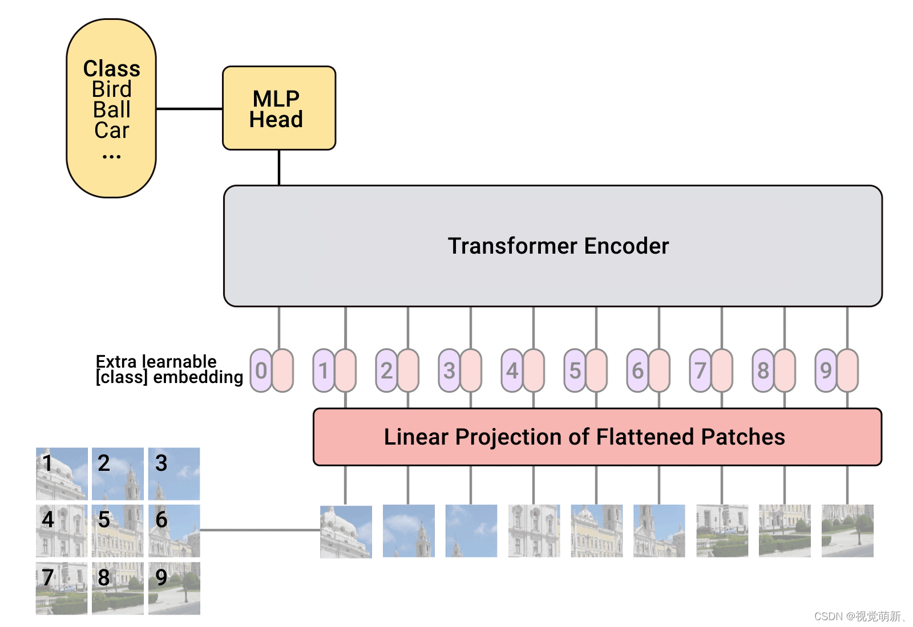

> 论文题目：《AN IMAGE IS WORTH 16X16 WORDS: TRANSFORMERS FOR IMAGE RECOGNITION AT SCALE》
> 
> 会议时间：International Conference on Learning Representations, 2021 (ICLR, 2021)
> 
> 论文地址：[https://openreview.net/pdf?id=YicbFdNTTy](https://openreview.net/pdf?id=YicbFdNTTy)
> 
> 论文源码：https://github.com/lucidrains/vit-pytorch（非官方）

# 题目
## 1. 前半句：AN IMAGE IS WORTH 16X16 WORDS
直译：一张图片抵得上16×16个单词
1. 化用谚语“A picture is worth a thousand words”（一图胜千言）；
2. 核心含义：模型把整张图片均匀切分成**16×16像素大小的图像块（patch）**，每一个patch类比NLP里的单词token，一张图就被转化成若干视觉“词元”，适配Transformer输入格式。

## 2. 后半句：TRANSFORMERS FOR IMAGE RECOGNITION AT SCALE
直译：面向大规模图像识别的Transformer
1. 点明模型核心架构：抛弃CNN，直接用NLP主流的Transformer做图像任务；
2. ==`at scale` 关键词：该模型（ViT视觉Transformer）需要**大规模图像数据集**预训练才能发挥性能，小数据集上效果不如CNN==

## 3. 整题整体逻辑
本文提出视觉Transformer（ViT）：将图像拆分为16×16像素小块当作视觉token，完全复用标准Transformer架构，在大规模数据下实现高精度图像分类，打通Transformer从语言到视觉的应用

# 模型
## 结构

## 模型规格——B/L/H

|Model|Layers|Hidden size D|MLP size|Heads|Params|
|:-:|:-:|:-:|:-:|:-:|---|
|ViT-Base|12|768|3072|12|86M|
|ViT-Large|24|1024|4096|16|307M|
|ViT-Huge|32|1280|5120|16|632M|

另外，还会添加patch大小，例如：`ViT-L/16`表示使用 $16\times16$ 的patch大小切分图片

文本生成

1.请问为什么我通过 超级管理员的身份，在http://127.0.0.1:5175/playground测试rw-query,rw-tts,rw-asr等模型都是报错了类似这样呢：Request error occurred: rw channel: endpoint not supported (request id: 202606170705274757426006JfzFMrZrNBLb5J6)
请问测试连通性是需要通过curl表达式的格式才能 进行测试连通性的嘛？请尝试一下
2.请问为什么配置了vidu-1模型配置价格，在http://127.0.0.1:5175/playground测试报错：Request error occurred: Incorrect API key provided: 1AE570F1********************285F. You can find your API key at https://***.com/***/***
3.请问为什么我以普通用户one的身份登录，但是在 图片生成/视频生成 页面却报错了：No compatible models
The default key is ready, but the default group has no compatible model for this creation mode.
4.

