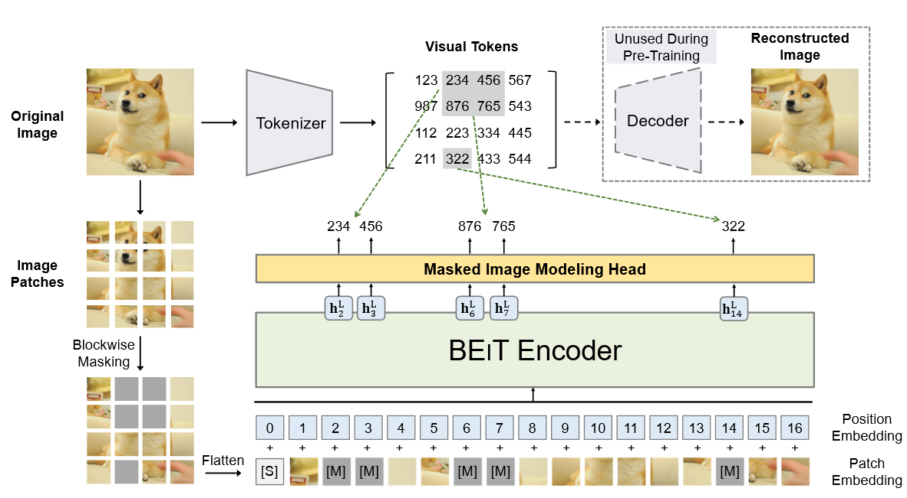
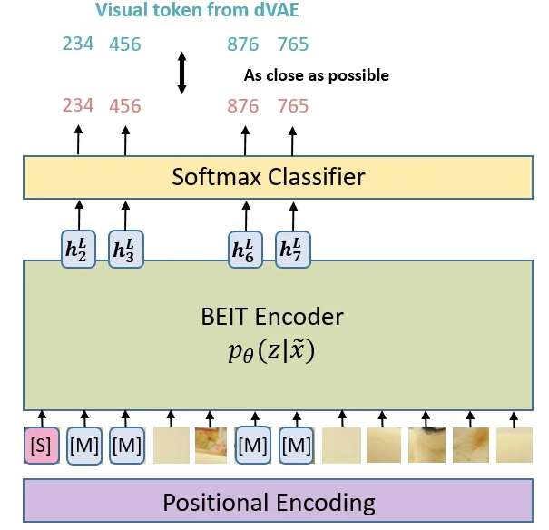

# Pretext
- 在许多无监督学习的研究中，经常提到 **“pretext tasks”**
- **Pretext** 是名词，意思是 **“借口、托词、伪装”**，它通常用于描述一个看似表面上的理由或目的，但实际上它背后可能隐藏着更深层的目的或动机
- **Pretext** = **An excuse or reason given to hide the real purpose**
- 在机器学习和深度学习中，**pretext** 这个词有着稍微不同的含义，它主要指的是为实现某个任务而设计的 辅助任务，这些任务本身并不是最终目标，但它们有助于模型 学习有用的特征
	- ==pretext tasks  不是最终目标任务，但它们帮助模型在没有标签的情况下学习有意义的特征==
	- ==Pretext task也叫surrogate task，辅助任务，代理任务，产生伪标签==
	- 
- 常见的 Pretext Tasks 示例：
	- **恢复受损的输入数据**：例如去噪自编码器（Denoising Autoencoders），在这种任务中，模型的目标是恢复被噪声破坏的图像或数据。
	- **上下文自编码器（Context Autoencoders）**：学习数据中的上下文信息，帮助模型理解数据的局部结构。
	- **跨通道自编码器（Cross-channel Autoencoders，色彩化）**：例如**图像色彩化**，通过在灰度图像中恢复颜色信息来训练模型
	- **图像的变换（例如裁剪、旋转）**：通过对图像进行变换，然后让模型预测这些变换，来学习图像的结构
	- **图像补全任务**：例如**通过部分图像预测剩余部分**，使得模型学习到物体和背景的关系
	- **视频任务**：例如**视频帧排序（patch orderings）**、**视频中的物体跟踪（tracking）**、**分割视频中的物体**等，来学习视频中时序和空间上的特征
	- **聚类特征**：通过聚类无标签数据，模型可以学习数据的内在结构并自动为样本分配标签

# BEIT：Pre-Training of Image Transformer

## 动机
- ==transformer的能力较为有优势，但是transformer架构需要更多的数据进行训练==
- ==借助于Bert在自然语言领域的运用，使用遮盖任务进行恢复是一个非常好的**自监督pretext**==

## 方法
- 

- 具体的思路是每张图像有两种表示，一种是图像的patch（如 16 × 16的像素patch），另一种是视觉token（如不连续的位置表示）。
	- image patch：在patch的分割部分，做法感觉和[ViT](https://zhida.zhihu.com/search?content_id=217912171&content_type=Article&match_order=1&q=ViT&zhida_source=entity)这种很类似，做一个embeding然后也有pos位置向量的信息补充
	- visual token：具体来说是通过一个dVAE
- 最小化通过dVAE的token和真实token（被masked的image patch）之间的差异
	- 
