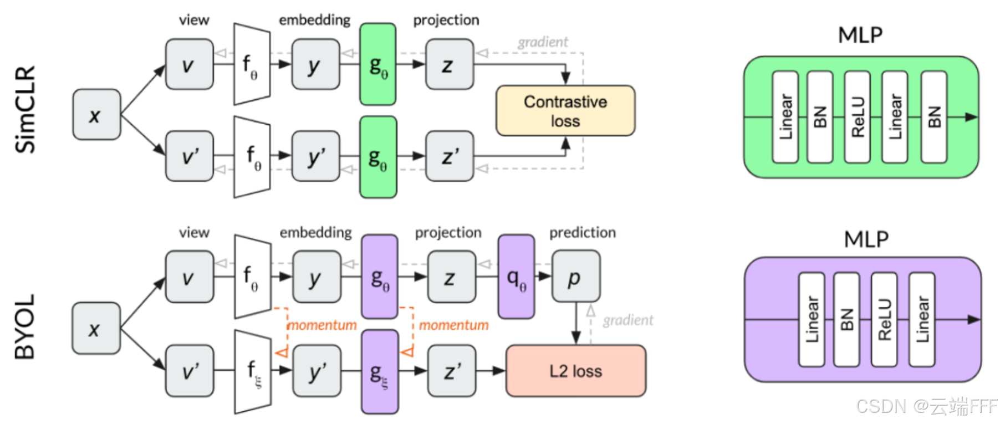

- **Bootstrap Your Own Latent** - A New Approach to Self-Supervised Learning
- BYOL通过两个神经网络的互相学习，提出了一种==无需负样本的新型自监督图像表示学习方法==，且在多个基准测试中超越了当前的最先进技术

- BYOL依赖于两个神经网络，分别称为在线网络 online network 和目标网络 target network ，它们通过相互作用进行学习。**训练过程首先对同一图像生成两张增强视图，然后 online 网络被训练来预测 target 网络对同一图像增强视图的表示，target 网络通过 online 网络的缓慢移动平均进行更新**

# 背景
## 视觉表征学习
- 本文考虑的问题是**以自监督形式学习通用的视觉表征**，即在**无需人工标签**的情况下训练可用于各类下游任务的 **CV backbone**
本文之前的主要有三种技术路线：
1. **生成式方法**：目标是生成或建模输入像素空间，代表方法有 VAE、GAN 等。这类方法的缺点是计算开销大，而且未必对表征学习必要
2. **判别式方法**：通过设计 “监督学习预训练任务” 来学习表征，输入和标签都来自无监督数据。[常见代表任务有图像上下文预测、Jigsaw拼图、图像上色、旋转预测等](https://www.zhihu.com/question/358468168/answer/916701877)
	- 这种方法的核心思想是**设计一个“代理任务”（Pretext Task）**
	- 其标签**完全来自于数据本身的结构或变换**，无需外部的人工标注
3. **自监督学习**：
    1. **基于对比学习的自监督学习**：通过拉近正样本对、推远负样本对来学习潜在空间中的表征，一般认为此类方法学到的视觉表征更倾向于语义级别（物体之间关系、整体布局、类别等抽象特征）。代表方法有 MoCo, [SimCLR](https://blog.csdn.net/wxc971231/article/details/151573325) 等
    2. **基于重建的自监督学习**：让模型通过还原部分缺失的信息来学习有效的特征表示，一般认为此类方法学到的视觉表征更倾向于细节级别（边缘/纹理/局部形状等底层特征）。代表方法有 Autoencoder、BEiT、[MAE](https://blog.csdn.net/wxc971231/article/details/142708130) 等

## 对比学习
- 对比学习的核心思想是：通过构造正负样本对，让模型学到一个判别性的表示空间，在这个表示空间中 **相似的样本尽量靠近，不同的样本尽量分开**
- ==对比学习 是当前自监督学习的主流方法==
- 

# [方法](https://blog.csdn.net/wxc971231/article/details/151836058)
## 移除负样本对
- 传统 SimCLR 等依赖大量负样本拉开不同图片特征距离，无负样本极易出现**模型坍塌**（所有图像输出完全相同特征）。
- BYOL 不靠负样本做排斥约束，改用**双分支不对称网络结构**规避坍塌：

- ==BYOL 不再考虑构造负样本对，此时对比学习的训练目标只剩下 “让正样本图像输出特征接近”
	- 单张原图做两种独立数据增强，得到视图 1（online 分支输入）、视图 2（target 分支输入），==**数据增强**二者天然为唯一正样本对，不引入**其他图片**作为负样本==
	- 但是直接这样训练很容易导致 backbone 出现模型坍塌，即模型对所有输入都输出相同的特征值

## self-distillation/EMA更新/momentum 网络
- 为避免模型坍塌，BYOL不再用一个 backbone 提取视图特征，而是**引入不对称的两个网络分别提取两个增强视图特征**，通过 “教师-学生” 方式进行训练：
	- **在线网络 (online network)**：真正被优化的网络，由编码器 f θ $f_\theta$​（ViT/CNN）、投影头 $g_\theta$（MLP）和预测器 q θ ​（MLP）三部分组成。==它作为 student，要主动拟target network给出的稳定目标表示==
	- **目标网络 (target network)**：结构与在线网络相同，但没有预测器 q qq，==它的参数 $f_\xi$, $g_\xi$  由 online network 的参数做**滑动平均 (EMA)** 得到==。它作为 teacher，通过缓慢更新为 student 提供稳定的学习目标
- 

- ==不对称如何杜绝坍塌==
	1. 结构不对称：学生多一层预测器，教师没有，两者输出空间天然不对等，无法简单映射成常数；
	2. 更新不对称：学生快速迭代、教师缓慢平滑更新，目标不会随梯度剧烈抖动，模型没法轻易找到 “全相同特征” 的偷懒解；

- 学生输出：$q_\theta(g_\theta(f_\theta(x))))$（==多一层非线性变换而已了==）
- 教师输出：$(g_\xi(f_\xi(x)))$（无额外映射）
    两者映射空间、变换复杂度不对等，**常数特征不再是损失最小值**，模型无法走坍塌捷径