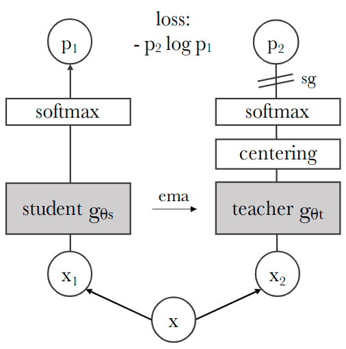

- DINO 是视觉 Transformer 做自监督学习的非常经典的工作
- ==DINO是自监督学习与ViT结合的开创性工作==

# 动机
- 正值Vision Transformer (ViT)大火，其证明了Transformer也可以用于视觉任务，并且在ImageNet取得了SOTA的结果。但ViT尚未展现出相对CNN显著的优势：**ViT对算力要求更高，需要更多的训练数据**，结果看也仅CNN高一点点，并且其训练得到的特征本身并不具备独特的性质
- 作者想探究一下使用自监督学习(Self-supervised Learning)，而不是监督学习(Supervised Learning)的方式，是否会让Vision Transformer性能更好
- 然而，在图像领域，==图像级别的监督训练任务通常会将图像中包含的丰富视觉信息简化，从而导致学习到的特征不够优质==

# DINO v1
## 方法

- 一张图片 x 的两个 View x1,x2 分别输入给学生模型 $g_{θs}$ 和教师模型 $g_{θt}$。两个网络具有相同的架构但参数不同。教师网络的输出通过一个 Batch 的平均值进行 centering 操作，每个网络输出一个 K 维的特征，并使用 Softmax 进行归一化。然后使用交叉熵损失作为目标函数计算学生模型和教师模型之间的相似度。
- ==在教师模型上使用停止梯度 (stop-gradient, sg) 算子来阻断梯度的传播，**只把梯度传给学生模型**使其更新参数。教师模型**使用学生模型的 EMA 进行更新**==

# DINO V2
- DINOv2和DINOv3都是沿着的DINO的核心架构进行scaling up的工作
- scaling up是AI领域常见的发展策略，类似NLP中GPT系列通**过增大模型和数据规模实现能力跃升**，视觉领域通过这种方式能让模型学习到更通用、更精细的视觉特征

## 动机
- 作者参考了各种自监督学习的技术，并将它们整合。主要的贡献是加速和稳定大模型和大数据的训练。在数据层面，作者设计了一套自动化的数据清洗方法，可以将未整理过的数据变为一个专用的、多样的并且整理过的数据，形成[LVD-142M](https://zhida.zhihu.com/search?content_id=262213336&content_type=Article&match_order=1&q=LVD-142M&zhida_source=entity)数据集。在模型方面，作者换了一个1B的ViT作为基座模型
- 

## DINOv3
- DINOv3的核心就是在DINOv2的基础上，继续scaling up。
- 

