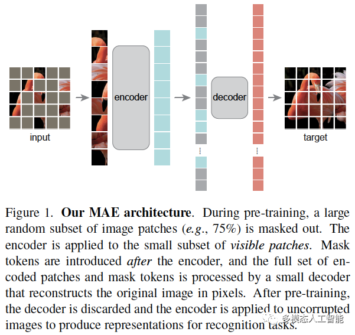

- Masked Autoencoders Are Scalable Vision Learners
- 掩码自动编码器(MAE)是一种可扩展的计算机视觉自监督学习方法

## [方法](https://mp.weixin.qq.com/s?__biz=Mzg5MjYzNTM3MA==&mid=2247486411&idx=1&sn=952d01ab2075f344d5de0f84e78abdae&chksm=c03a5a4ef74dd35894dfd940f40252491602aa6a50432f37cf7e32ea2284d8bddc01d24dde96&scene=21#wechat_redirect)
- 我们开发了一个非对称的编码器-解码器架构
- 其中**编码器仅对可见的patches子集(没有掩码的tokens)进行操作**
- 同时还有一个轻量级的解码器，可以从潜在表示和掩码tokens重建原始图像

