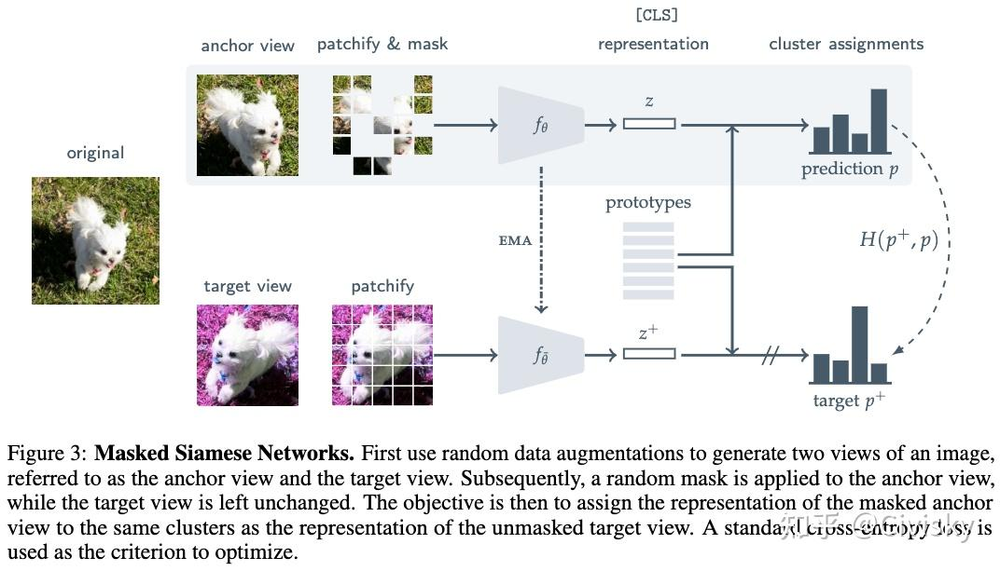

 - Masked Siamese Networks for Label-Efficient Learning
- 这是一种用于图像表示学习的自监督框架。**MSN将随机掩码图像的表示与未掩码图像的表示进行匹配**
- 在 Siamese Network 的基础上使用 Mask Patch 策略，并添加原型监督的方式

## 方法

- 原型监督（Prototype Supervision）
	- 原型 = 每一类所有样本特征的**均值中心向量**：
	1. 在孪生分支输出特征后，==为每个类别计算类别原型==
	2. 新增原型损失：样本特征靠近自身类原型、远离其他类原型；
	3. 弥补孪生网络仅成对约束的短板，引入**全局类别级监督**，解决小样本下类别区分不足问题。

