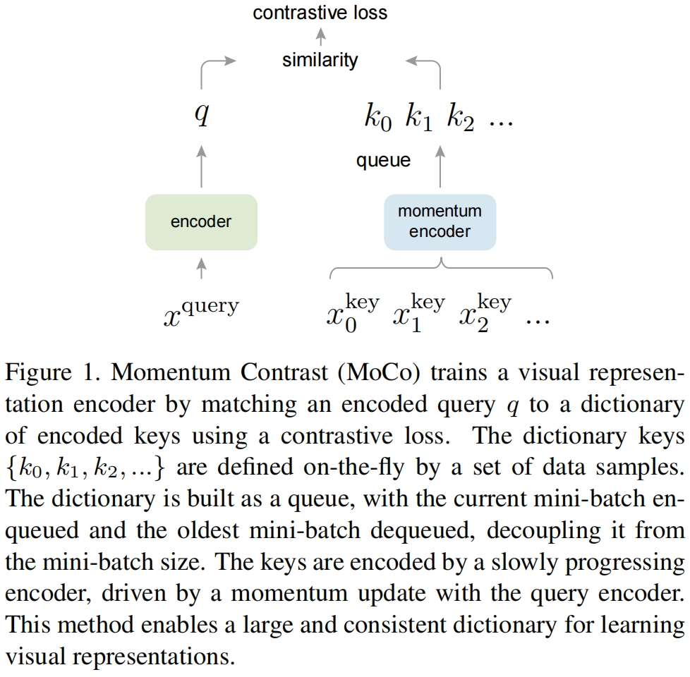

- **Momentum Contrast** for Unsupervised Visual Representation Learning

## 背景
- 最近的一些研究提出使用**对比损失**相关的方法进行无监督视觉表征学习并取得了不错的结果。尽管是受到不同motivation的启发，这些方法都可以看做是在构建一个**动态字典**。
- 字典中的"keys"（tokens）从数据（图片或图片的patch）中采样并用一个编码器encoder网络来表示。无监督学习训练encoder来执行字典查找：==一个encoded "query"应该与它匹配的key相似，而与其它的key不同。学习过程表述为最小化对比损失的过程==

动态字典是对比学习存储负样本键特征的核心载体，作者提炼出它必须满足两个硬性条件：
1. **容量足够大（large）**
    视觉数据是连续高维空间，小字典采样覆盖不足，无法提供足量、多样的负样本，容易出现负样本重复、表征区分度差；大字典能更充分覆盖视觉特征分布，提升对比学习区分正负样本的能力。
2. **训练全程保持一致性**
    字典里所有负样本键，需要出自参数稳定、不变的编码器；如果编码器实时更新，新旧键的特征分布存在偏移，和 query 做相似度对比时标准混乱，损失计算失效。

- 针对 “大字典 + 特征一致” 不能共存的痛点，设计动量对比机制专门构建符合双要求的动态字典，适配无监督对比学习，从架构层面同时解决容量与一致性矛盾

## 动机
- MoCo的提出主要基于之前模型（Fig 1. (a) and (b)）中的两个问题. 总结一下就是：end-to-end性能好但效率不高，memory bank性能不太理想但效率高。所以作者提出了MoCo，性能好效率也高
	- 
- 

## 方法

1. 两路编码器：**query 编码器（快速更新）**、**momentum key 编码器（动量慢更新）**
	- 由于==字典的key来源于之前若干个mini-batch，作者提出了一个**缓慢变化的key encoder**，具体实现为query encoder的**基于动量的移动平均值**，从而保持一致性==
2. 每个图片生成 1 个 query；队列里存海量历史 key 作为负样本库
3. 对比损失：让同一张图的 query-key 相似度最高，和队列里其他 key 相似度尽可能低
4. ==队列循环更新：新 batch 的 key 入队，最老 batch 淘汰，实现超大负样本字典，不受显卡 batch 大小限制==
	- 队列将字典大小和batch size进行解耦从而使得字典可以非常大

