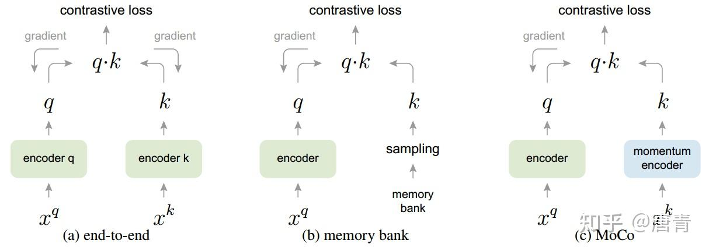

- **Momentum Contrast** for Unsupervised Visual Representation Learning

# 背景
- 最近的一些研究提出使用对比损失相关的方法进行无监督视觉表征学习并取得了不错的结果。尽管是受到不同motivation的启发，这些方法都可以看做是在构建一个动态字典。字典中的"keys"（tokens）从数据（图片或图片的patch）中采样并用一个编码器encoder网络来表示。无监督学习训练encoder来执行字典查找：一个encoded "query"应该与它匹配的key相似，而与其它的key不同。学习过程表述为最小化对比损失的过程

# 方法
- MoCo的提出主要基于之前模型（Fig 1. (a) and (b)）中的两个问题. 总结一下就是：end-to-end性能好但效率不高，memory bank性能不太理想但效率高。所以作者提出了MoCo，性能好效率也高
	- 
- 

