[跟李沐学AI的个人空间-跟李沐学AI个人主页](https://space.bilibili.com/1567748478/lists/32744?type=season)

# [CLIP 论文逐段精读【论文精读】](https://www.bilibili.com/video/BV1SL4y1s7LQ?t=0.3)
[李沐论文精读系列四：CLIP和改进工作串讲（LSeg、GroupViT、VLiD、 GLIPv1、 GLIPv2、CLIPasso）_n-vocabulary object detection via vision and langu-CSDN博客](https://blog.csdn.net/qq_56591814/article/details/127421979)

# [零基础多图详解图神经网络（GNN/GCN）【论文精读】](https://www.bilibili.com/video/BV1iT4y1d7zP?t=0.1)
## 图片转化为 Graph——对角矩阵
- ==对于 图片，就是**每个像素就是 节点了**==
	- 把每个像素 映射为 每个节点哦
- 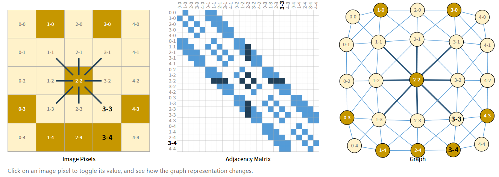

## 文本转化为Graph——有向图
- 对于文本，就是**每个文本就是 节点了**
- 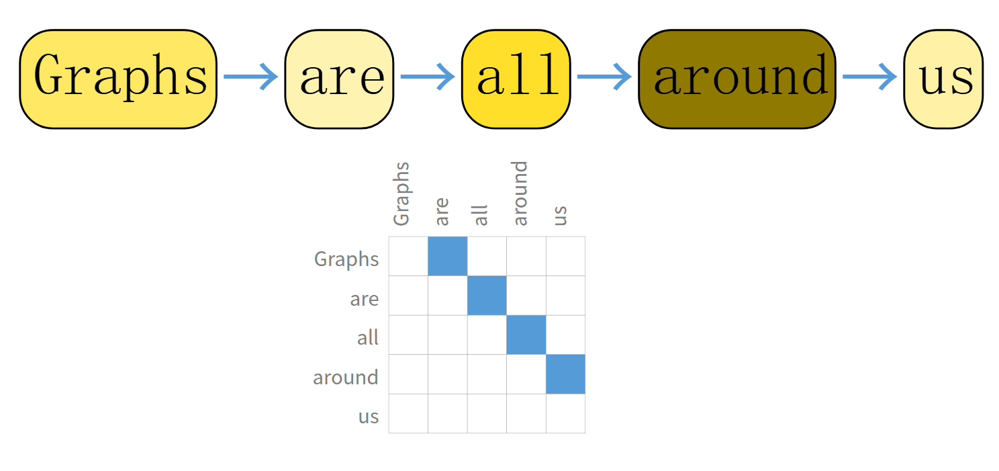
- 

## 难题
### 连接性
- 如果直接 使用 邻接矩阵
	- 遇到 顶点很多的情况 没办法处理
	- 是一个 稀疏矩阵

### permutation invariant
- 需要 把邻接矩阵 的**行和列交换/排列 其实并不会 影响结果**的 GNN的输出的

## 邻接表法——表示稀疏矩阵
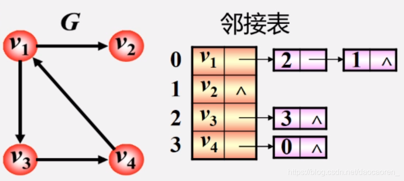
- ==邻接表找 出度==
- 邻接表是一种简洁且**节省内存的稀疏矩阵表示方式**
	- 由于图中的边数通常远少于邻接矩阵的元素总数（节点数的平方​），因此该方式能够省去图中非连通部分的计算与存储开销
- 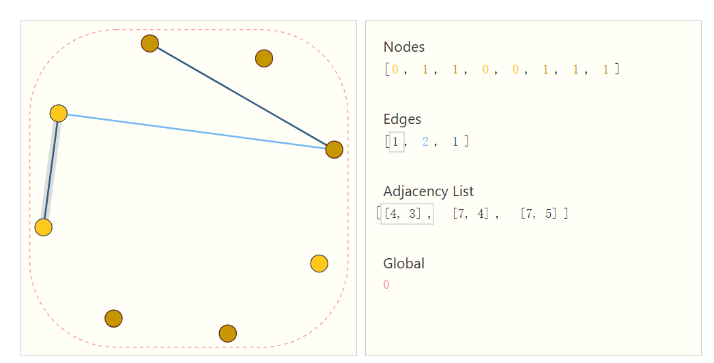

## 基于信息传递的逐层传递——🦄
### 直观理解
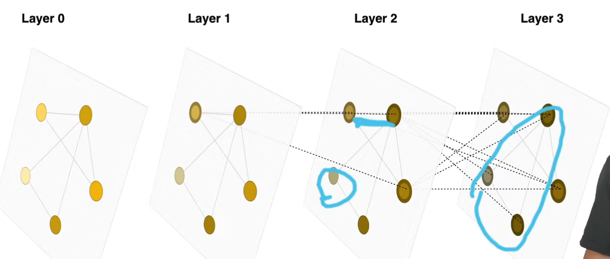
- 类似 就是感受野的样子！！！，逐步去看 深层的信息，进而捕捉到全局的
- ==输入输出：graph-in, graph-out==
	- ==就是图的 **结构** 不变，只是对顶点和边的向量信息进行交换和重构==
	- ==将图的每一个 **节点** 都编码  为 **Node Embedding**==
		- ==向量 是地位连续稠密的，能够反映 节点在原图的连接和属性==
		- 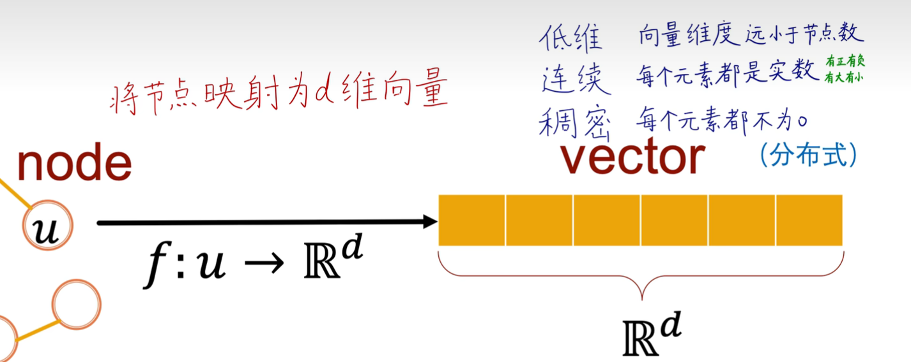
	- ==**Node embedding** 通过 **消息传递** 就会进而 得到 **子图和整个图** 的==
- 通过邻居 拿到 信息的过程 就是称为 `Pooling` 或者 `aggregation`
	- 这里信息的汇聚是指把相邻节点的属性以**相同权重**的形式进行相加，使得该节点汇聚了其他节点的信息
- 动态演示：https://www.bilibili.com/video/BV1Hs4y157Ls?t=538.4

### 针对一个节点的——简单的数学表示
- ==$h_{v}^{0}$  代表 v节点 在第0层的嵌入 
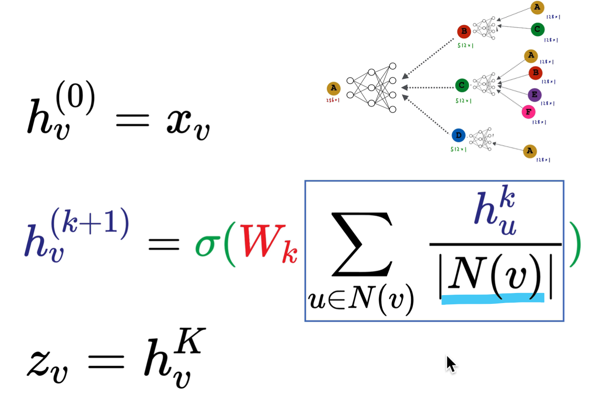

### 针对一个节点的——矩阵去表示
#### 计算公式
- 大量文献认为**列向量**是向量默认的方式，实际上**记住**就行了
	- 既然是向量是列向量，也就是相乘的时候基本在**矩阵的右面**。`m*n`的矩阵乘 `n*1`的向量得到`m*1`的向量。
- 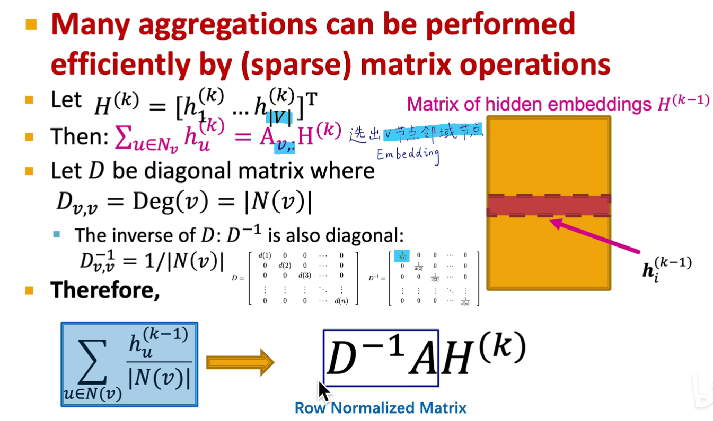
	- A 是**邻接矩阵**就是**按照 key 进行筛选了**，$AH$ 就是 求和邻接节点的Embedding 了！！！
	- D 是**对角矩阵**，$D^{-1}$就是 求平均，除以邻接的数量了！！！

- Half 矩阵就是 开根号

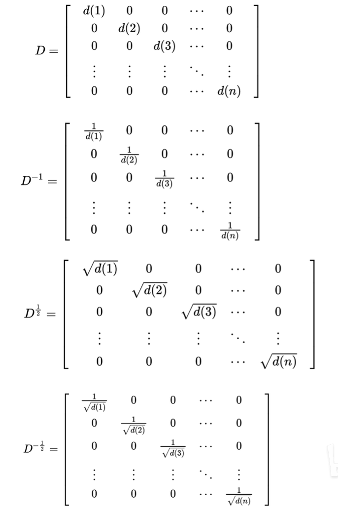

#### Row/Column normalization matrix
- $AH$ 是求**按照key  筛选**后求和
- $D^{-1}A$  是 作用于 $A$，把 **权重平均分配注意到A的每一行**，就是平均 分配个$A$的每一个 连接者
	- 按照 出度平均分配权重 进行归一化
	- 但是 这样只是考虑到了 我的出度，没有考虑到 **对方的出度**！ 所以 右边 再乘以一个去！
- $AD^{-1}$ 是  把 A的每一列 进行 归一化，因为A是对称矩阵，所以就是 上述结果的转置！
- $D^{-1}AD^{-1}$ 是==作用于A，即考虑到了 自己的出度，也考虑到了对方的出度！==总的 分配是 
	- 但是 特征值介于 $-1\sim1$，左乘就会 影响大小，所以再次进行 升级！！！

- **∼（波浪号/相似）**：使用 `\sim`，例如 `$A \sim B$` 显示为 A~B 
- **≃（同构/近似相似）**：使用 `\simeq`，例如 `$A \simeq B$` 显示为 A≃B 
- **≅（全等/几何相似）**：使用 `\cong`，例如 `$A \cong B$` 显示为 A≅B

### Symmetric Normalized Matrix
- $D^{-\frac{1}{2}}AD^{-\frac{1}{2}}$ 保持了最大特征值 是1 ！！！
	- 是 `Symmetric Normalized Matrix`，
	- 也叫做 `Normalized diffusion Matrix`
	- ==其实 **就是邻接矩阵，但是不再是0/1**，而是里面的权重根据连接数进行分配的，就是 开根号再相乘==
		- 而且 **不是 需要学习**的，直接 给定结构 就是固定的
		- ==只有  神经网络的权重，是需要学习的，其他都是不用的==
		- ==这个 是一个**稀疏的矩阵**，所以 可以高效的进行 稀疏矩阵的乘法！==
	- 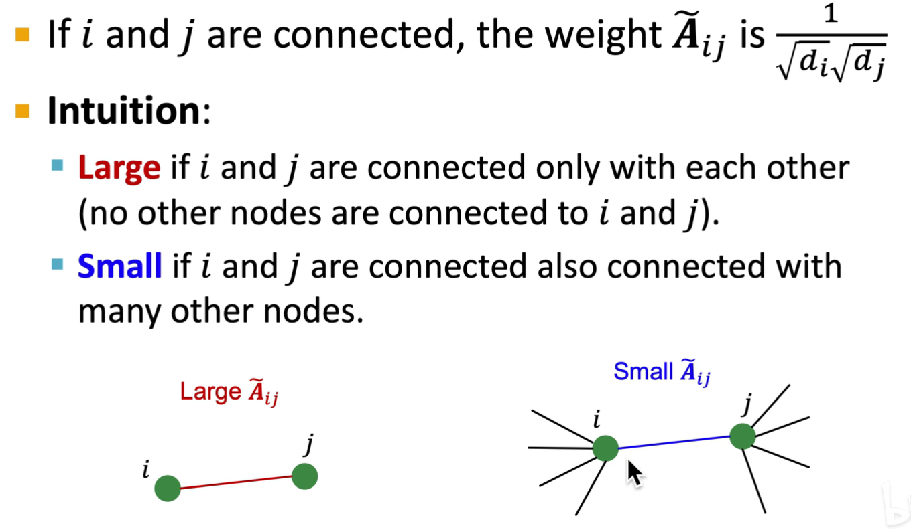

- 直接 用 Symmetric Normalized Matrix 进行实现了
	- 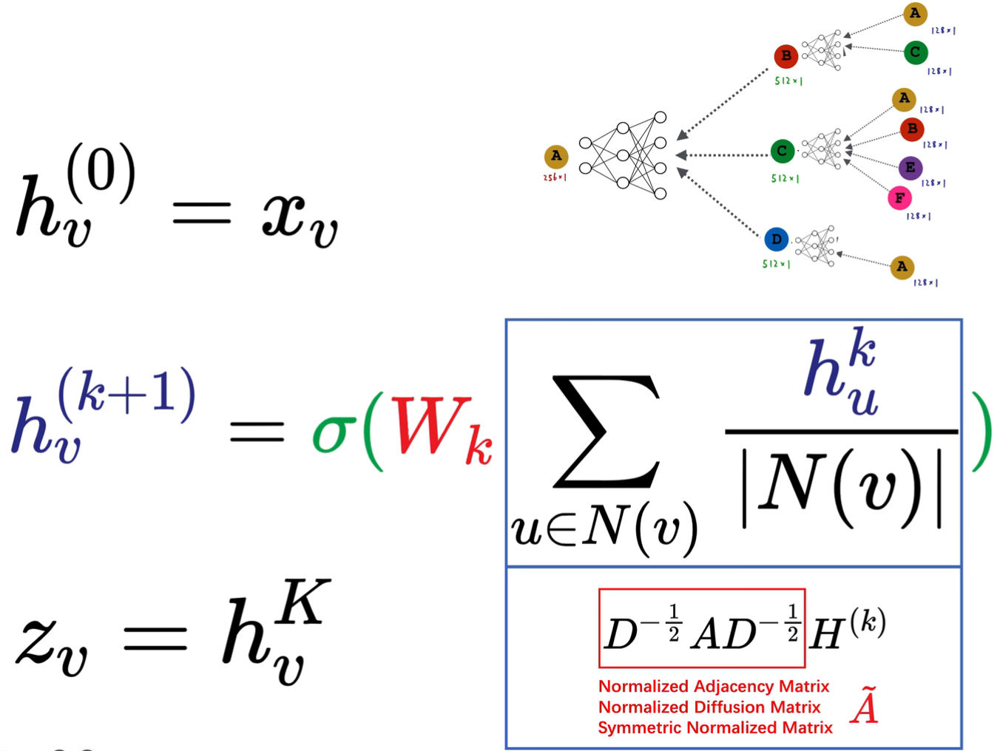

- 特征值eigenvalue和特征向量eigenvector描述了矩阵变换对向量的影响。
	- ==特征向量在变换过程中保持**方向不变**，而特征值则表示该向量的**缩放因子**==
	- 例如，如果特征值为2，则特征向量的长度会变为原来的两倍；如果特征值为-1，则特征向量的方向会反转，同时长度保持不变

### 最终
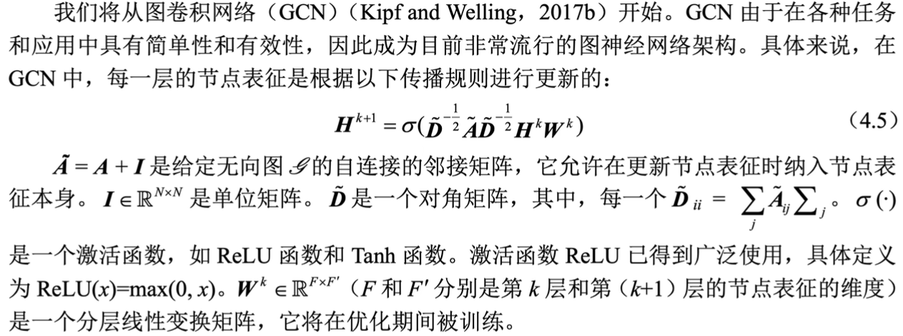

### 可学习参数与节点个数无关
- 是计算图 的层次数量

### Normalized Laplacian matrix 
- 通过 `normalized adjacency matrix` 就可以算到 `Normalized Laplacian matrix `
- 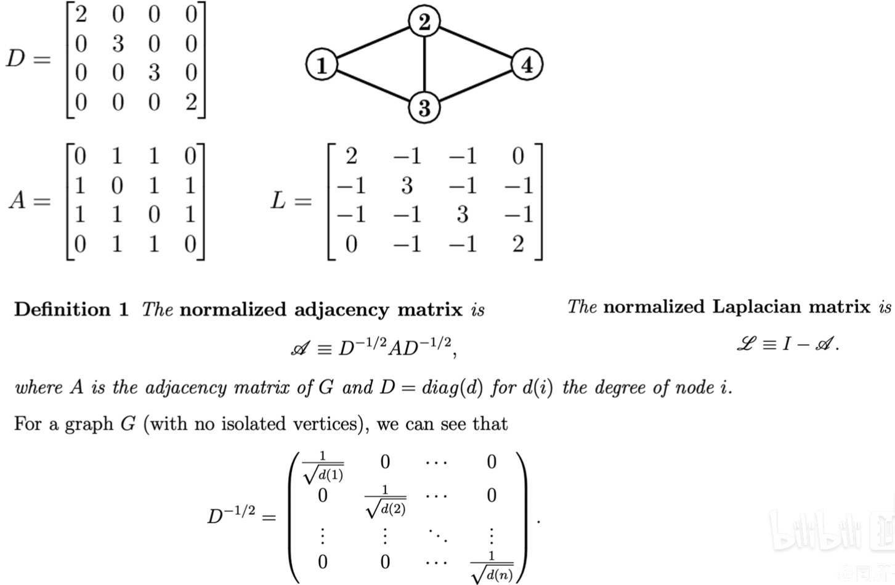
- 

### master  node
- 全局信息/master node/context vector
	- 前文介绍的图网络存在短板 —— 图中相距较远的节点，即便多次执行消息传递，也难以高效互通信息
	- 若预测任务依赖远距离节点 / 节点群组，该局限会直接影响模型效果

## 训练GNN
### 图里面的Batch训练——🦄
- 就是以 ==**每个节点基于邻居**就可以构建自己的计算图，**每一个计算图就是 作为一个样本**，然后多个  就是会作为一个 Bath了==，输入到 GNN 中进行 训练的
- 每个 计算图 就是一个子图
	- 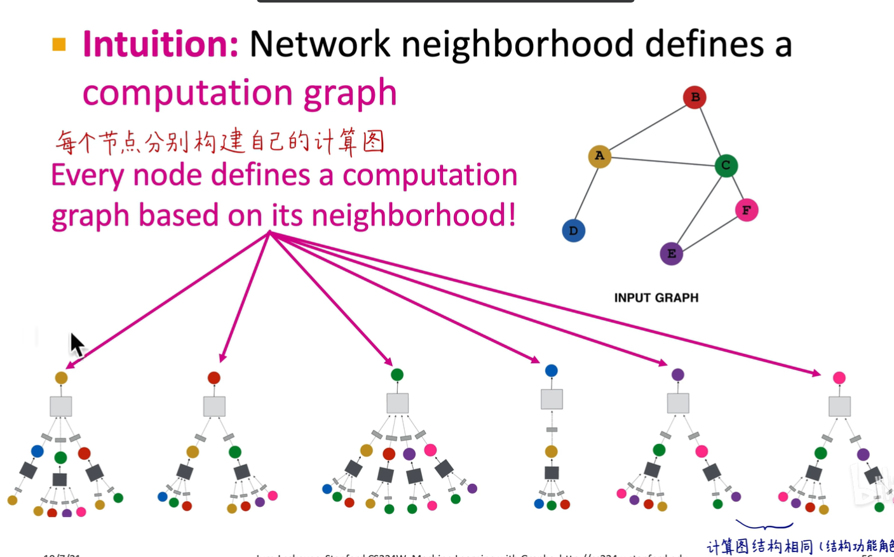

	- ==然后 就可以通过 mini-batch  去训练模型了！！！

### 定义损失函数 优化参数权重
- 监督 的形式 去训练：
	- 节点的 Embedding 会通过 一个预测头，然后和 标签进行 损失函数的计算
	- 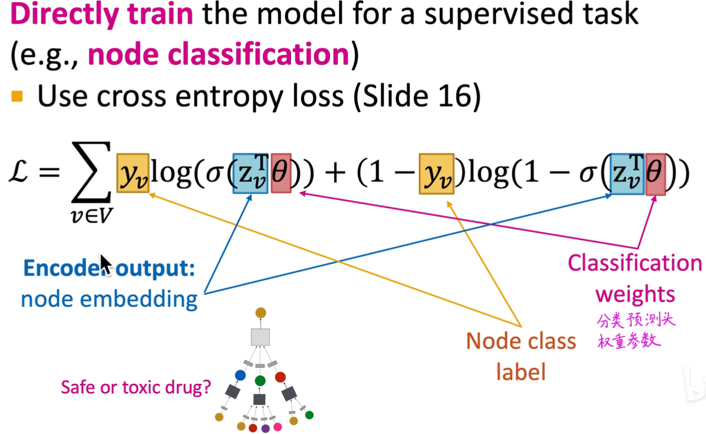

- 半监督的形式  去训练：
	- 直接用 图本身的结构，让 图中本来就是**相连的节点的嵌入 是尽可能接近的**
	- 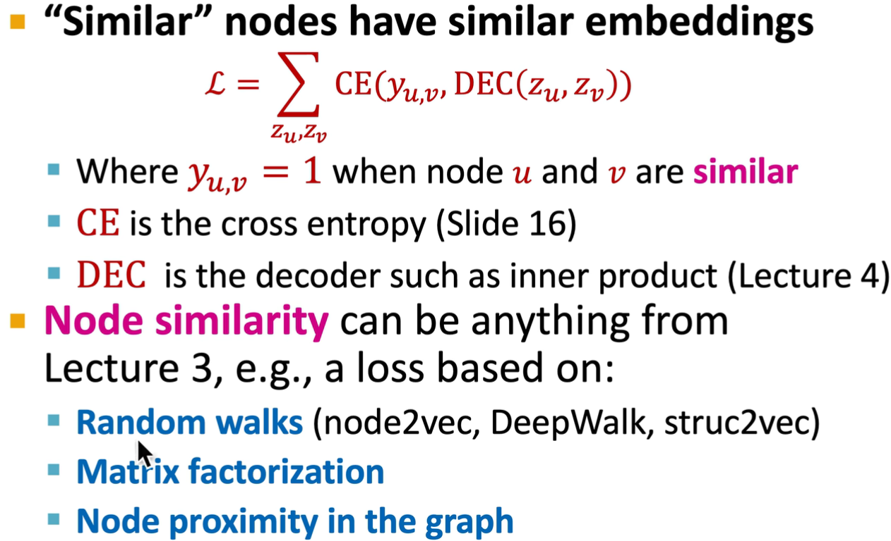

	- 编码器 就是 神经网络，就是把 节点变成了 Embedding，==解码器就是 把Embedding 变为数值，比如说是 数量积/内积的计算==

### [inductive learning 与 transductive learning](https://www.zhihu.com/question/68275921/answer/529156908)
- 我们平时所说的learning一般指的是inductive learning
- transductive和inductive的区别在于我们想要预测的样本，是不是我们在训练的时候已经见（用）过的
- 

- GCN、GAT等都是 inductive learning的，可以泛化到 其他节点的，可拓展性 很强
	- pagerank，deepwalk  就是 直推式学习，需要利用  已有的消息 才能进行推理的

## 图神经网路的层数
- 图神经网路的 ==层数 是 计算图的层数==，不是 所有神经网路的层数
	- 因为神经网路 的层数本身 可以达到很多的
	- 就是 k-跳 的网络
- 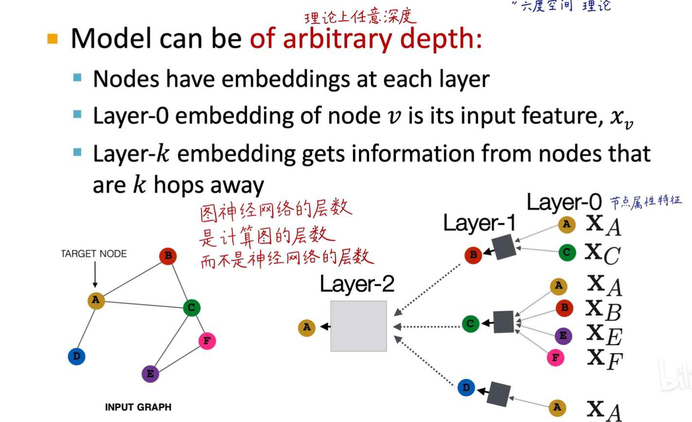
- GNN  不能无限的深，但是理论是可以的
	- 因为 过深的话，最后 所有节点的计算图 最后都会 很类似的，产生 `over-smoothing` 的问题， 所有节点的 嵌入Embedding  都会 收敛到 同一个值！！！
	- ==所以不能过深，2-3层就是可以的==
- 黑盒子 就是 可以是MLP 的！！！

	

## 图的采样   Sample
 - 每次 对于最近的邻居进行 采样，从而就是在 子图中进行了
	 - 就可以 减少前向传播 的梯度的累计
- 有点像dropout
- 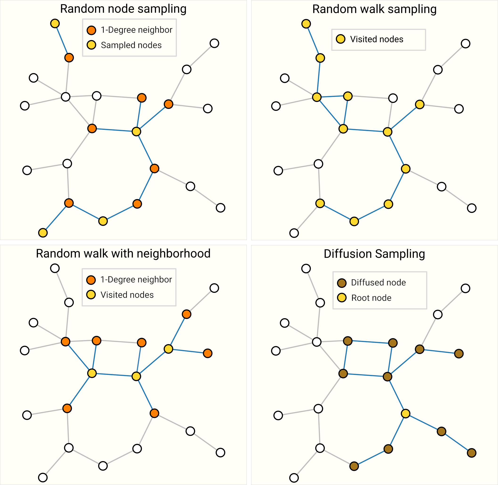

- ==有了 batch  之后就可以 并行运算的了==

## 图的 可解释的方法
- GNNExplainer：核心思路是提取对任务至关重要的关键子图，以此实现模型解释
- 归因分析法 Attribution techniques：为图中各组成部分标注重要性排序分值，区分要素对任务的影响程度。

## Inductive biases 归纳偏置
- CNN 的局部感受野、权值共享：偏好**局部相关性、平移不变性**；
- RNN 假设的是  时序的连续性
- GNN  就是：graph symmetries (permutation invariance)

## 其他类型的图
- multigraph   and  hierarchical graph
- 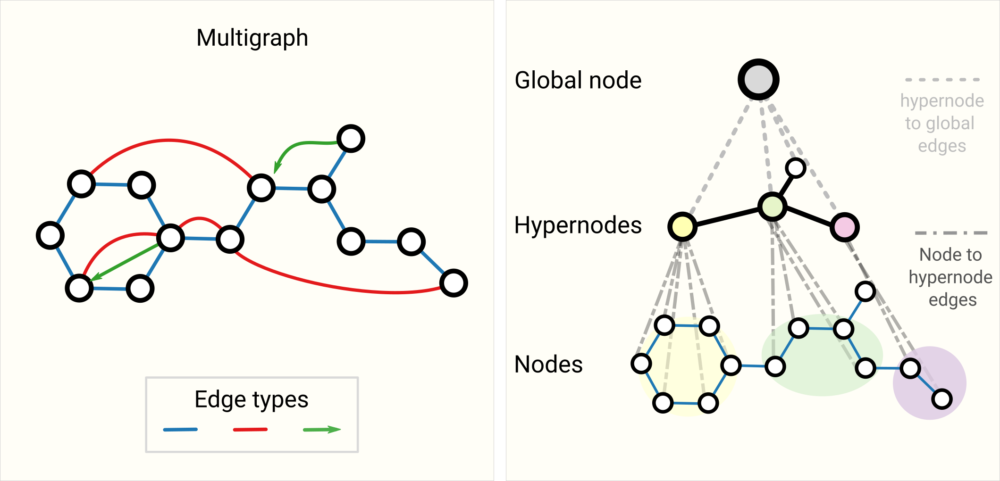

- Table of Contents（目录）

