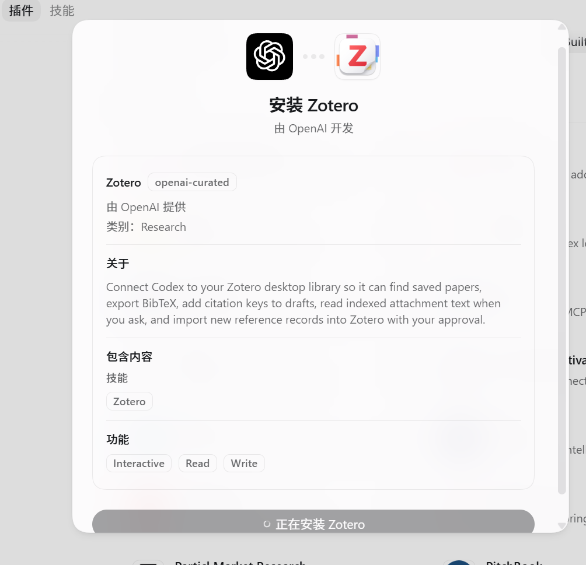

# 科研
- [是zotero的一个插件 叫zotero-ai-bulter 在中文社区里找的](https://www.xiaohongshu.com/discovery/item/69c4da1c000000001d01810a?source=webshare&xhsshare=pc_web&xsec_token=ABvvQfEB5glWhciCDiyd1ZrkrSv3RFi1QFvpkTv6AU-m0=&xsec_source=pc_share)
	- zotero和插件都不用 魔法，就可以使用
- 

- 去授权 codex 这两个应用，先去注册账号了解一下 ：
	- 

# 解螺旋课程

- 关键是平权了能力了！
	- 能力边界就是 想象力的边界哈
- 龙虾 就是适配自己的习惯
	- 把会员给龙虾，能**自动化直接操作网页**了，所以重要 的是 skill 给到他
	- 读取微信/飞书的，还能**直接远程执行的**

