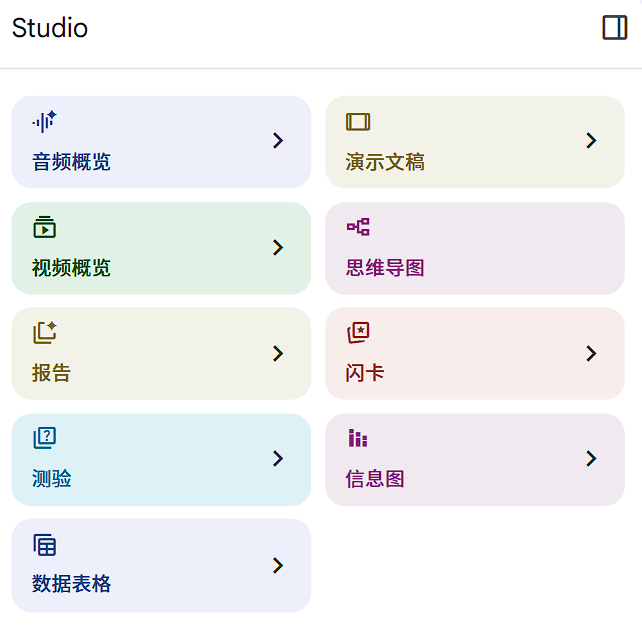

# 非开发的Prompt
## 小组报告
```

我是一名大三学生，正在完成课程设计作业，现在有个学校的java作业需要您帮忙完成概要设计以及详细设计模块。
相关的内容如下： 
养殖管理系统可以大致划分为以下模块： 基础管理模块主要包含对人员、设备、栏舍、动物的管理。日常喂养管理包含饲料管理、投喂记录、动物指标记录、特殊情况上报等。病症预防与治理包含疫苗、病症、药品管理、病症记录、动物防疫隔离等。屠宰管理包括防疫证明检测、屠宰组人员分配、具体屠宰等。物流及仓储管理包括车辆安排与运输、仓库基本管理与出入库操作等。 
系统采用的技术栈：mybatis，Mysql、Java、Maven、SSM，swagger，前后端交互，统一异常和结果的响应
整体系统最终包括了：栏舍、栏圈的管理模块（包括分页查询，指定查询，增删改查，修改启用状态等）检疫登记模块（分页+条件查询检疫记录，查询未检疫的批次、添加/修改检疫登记信息）、病症记录模块（查询所有病症信息、分页+条件查询病症记录、添加/修改病症记录信息）、动物管理模块（分页+条件查询动物、查询所有批次信息、查询所有可用栏圈、新增/修改动物），数据大屏（统计数量、年度销量、病症数量、动物体重等信息）这六个模块 
明白的话，回复1

详细设计可以选择，栏圈模块作为描述，该文件是是相关的文档描述。同时需要您按照如下的模板进行回复，图可以采用mermaid进行生成，这个是相关的模板：

```


## 论文撰写
```
我正在投递GRSL的期刊论文，目前已经经历过了一次大修，一次小修。这个是小修的返修意见。前者是我的论文，后者是编辑给的意见。请你根据Associate Editor Comments帮助我一下，think step by step, 指出修改的思路。我目前认为出了审稿人指出的三条语句之后，我应该至少也得找出2处语法/逻辑有问题的语句，并且一同附上response letter中。希望您可以帮助我完成这次修改


```


# AI 论文工作流
>实验是自己的 idea也是自己的 ，CC 只是加速了流程，其实就是润色和英文写作辅助
>**读论文：**：用 Gemini/NotebookLM读科研论文，翻译等，精度论文 使用 Deepsider 的 CC 
>**写论文：** 用小马API 的 Claude  
>**写代码：**：Copilot写代码，超过额度之后 用中转站的：unvibe 和 modelAPI


### Gemini + Claude + codex的GPT
- Gemini擅长信息检索和批量处理，适合前期文献梳理；
- Claude逻辑严密、长文输出稳定，适合提纲设计、正文撰写和语言润色
- Codex 的GPT 5.5 去写代码，这段正好 实习经历也用过 codex 的
	- Claude Code：去负责 0-1 搭项目


###  **文献调研**（Gemini/NBLM 的Deep research工具）
>批量导入文献PDF，生成对比表格，快速定位研究空白 
>放几篇 survey 综述，这样 AI 可以理解这个方向在研究什么，以及文章一般是怎么写的

- Gemini 的 `deep research`直接 输出加工后的信息，但是NotebookLM 是输出 最初的信息，**第一手的资料**
	- 一次过滤：`创建一个表格,列出每个来源的发布日期、作者背景,以及来原类型。区分它是事实数据,还是观点偏见` 输入提示，进行筛选一些
	- 整体认识：对于剩余的信源：`在我勾选的这16个来源中,有哪些核心结论是所有报告共识的?又有哪些观点是相互矛盾的?`

我希望你扮演一位拥有【XX领域XX年研究经验】的学术专家，擅长文献阅读与价值判断。请帮我速读并筛选我上传的这篇/多篇文献【上传文献】，完成以下任务: 
- 信息提炼：提取研究主题、问题、理论框架、方法、样本、结论及创新点；
- 相关性评估：说明该文献与我【XX研究主题】的相关度（高/中/低）及理由
- 价值判断：基于方法论和结论，判断是否值得深入阅读
- 格式要求：以结构化表格呈现上述信息。 

多文献比较与整合：请你以【XX领域资深研究员】的身份，对我上传的多篇文献【上传文献】进行横向比较与整合，具体要求: 
- 梳理各文献在研究对象、问题、方法、结论、理论框架上的异同； 
- 识别文献间的观点冲突或互补关系； 总结主流观点、边缘观点，并指出潜在研究空白； 
- 格式要求：以对照表+归纳分析段落的形式输出


### [文献精读（Gemini canvas 或者 NotebookLM）](https://www.xiaohongshu.com/discovery/item/69affd2e0000000022022350?source=webshare&xhsshare=pc_web&xsec_token=AB5XYE_scYTMhSF8fipjpR-oqvigRJGV1Vb-jS8cYXc2E=&xsec_source=pc_share)
#### 直接去NotebookLM 的studio 功能，生成 详细模式的演示文档，方便学习！

- Tips：左边可以选择 不同的来源
	- 选择一个，就是 精读
	- 选择几个，可以 对比
	- 选择全部，就是 综述
- [NotebookLM ——知识的提炼(deepresearch)和排版(studio)](../../Common%20Sense/上网必备.md#使用指南)
- ==如果想给 生成的回答 转化为 演示文档，需要先 **保存到笔记**，然后 右边更多里面 **转化为来源**，就可以 **只勾选这个去生成 演示文档！！！**
- 




#### 或者canvas去生成信息图的HTML：无question版本
```
Prompt B：无 Question，纯逻辑分析版

请将以下学术论文制作成一个完整的双栏批注HTML文件，重点呈现论文的论证结构与逻辑层次。

【文件要求】
输出单个 .html 文件，包含以下结构：

1. 顶部导航栏
   - 标题：论文名 + 课程信息
   - 颜色图例：对应以下分析维度：
     • 黄色 = 核心论点/thesis
     • 红色 = 关键概念/术语
     • 蓝色 = 实证证据/数据
     • 绿色 = 让步/反驳处理
     • 紫色 = 方法论说明

2. 章节导航条（sticky，可跳转各节）

3. 主体内容：左右双栏布局
   左栏：论文原文
     • 按上述五类维度高亮标注关键内容
     • 保留原文分段，Lora 衬线字体
   右栏：中文批注（逐段对应）
     • 每段批注包含：
       ① 段落功能（如：引出问题/提供证据/反驳异议/总结）
       ② 逻辑角色（该段在整体论证链中的位置）
       ③ 值得注意的论证技巧或潜在漏洞

4. 底部论证结构总览
   - 全文逻辑骨架（问题→论点→证据→反驳→结论）
   - 作者核心主张一句话版本
   - 论证最强处 vs 最弱处各一条

【设计风格】
深海军蓝导航栏 + 米白纸张底色 + 五类维度分色高亮
字体：正文 Lora，界面 IBM Plex Sans
批注卡片：左边边 + 浅背景，响应式（移动端单栏）

【论文信息】
- 标题：【填写】
- 课程/周次：【填写】

【论文原文】
【粘贴全文】
```


#### 或者canvas去生成信息图的HTML：有question版本

```
请将以下学术论文制作成一个完整的双栏批注HTML文件。

【文件要求】
输出单个 .html 文件，包含以下结构：

1. 顶部导航栏
   - 标题：论文名 + 课程信息
   - 颜色图例：每个问题对应一种颜色标签

2. 章节导航条（sticky，可跳转各节）

3. 主体内容：左右双栏布局
   左栏：论文原文
     · 与某题直接相关的关键词/核心句用 <mark> 高亮，颜色与题号对应
     · 保留原文分段，Lora 衬线字体
   右栏：中文批注（逐段对应）
     · 批注卡片注明题号（如【Q2 核心论点】）
     · 内容包括：① 段落功能 ② 论证逻辑 ③ 该段回答哪道题的哪个层次

4. 底部 Worksheet 答题索引
   - 双栏卡片，每题一块，带彩色题号标签
   - 答案要有分析深度：核心论点 + 关键证据 + 潜在反驳/局限

【设计风格】
深海军蓝导航栏 + 米白纸张底色 + 各题分色高亮
字体：正文 Lora，界面 IBM Plex Sans
批注卡片：左边边 + 浅背景，响应式（移动端单栏）

【论文信息】
- 标题：【填写】
- 课程/周次：【填写】

【问题清单】
Q1：【填写】
Q2：【填写】
...（按实际数量填写）

【论文原文】
【粘贴全文】

```

### 代码完成（Vscode）


### **提纲**设计（Claude）
>==不要在 中文路径 去启动，不仅消费token而且可能报错！！！使用 数字-字母-下划线！！！==
>按框架生成三级大纲，务必人工审查逻辑链条 

- **直接 在 Vscode 中生成 LaTeX 论文**： 我让 Claude Code 直接生成 LaTeX 文件，包括： 论文结构section，table / figure，基本可以直接编译
- ==第一次交互的时候就 可以告诉Claude 分为哪些tasks==，这样每完成一个都会停止一次的
- 


### **分段写作**（Claude）
>每次只写一个小节，喂入真实数据，避免一次性生成全文
>/effort ->必须 是 HIGH 才会认真思考的！！！

- 把**所有材料放到一个 folder**：把之前的实验资料都放进去，比如： 模型对比实验，ablation，实验数据，实验记录 不用一开始就整理得很完美，先集中起来就行
- **如果有代码，可以让CC一起基于代码分析一下**： 很多实验是以前做的，自己已经忘记了一些细节。Claude Code 可以直接读代码，帮你理解实验流程、补充 method 描述，有时候甚至能发现你当时没有写出来的细节


	
英文论文框架搭建我需要你协助我撰写一篇关于【XX研究主题】的英文论文，请按照以下结构逐步生成内容，使用【XX领域】正式学术语言，现在首先生成 引言吧
- 标题：设计具有吸引力的学术标题； 
- 摘要：150-200字的论文总结；<最后再去生成>
- 引言：阐述研究背景、意义及研究问题；
- 文献综述：分析领域内关键研究； 
- 方法论：描述研究思路与方法； 
- 结果：清晰呈现研究发现； 
- 讨论：解读结果并关联现有文献； 
- 结论：总结核心观点并提出未来研究方向；
- 参考文献：按【XX引用格式】列出来源


### 修改为对应 期刊/会议的格式（univibe的GPT 省token）
- 先生成 通用的格式，然后再修改为具体的 会议/期刊的格式
- cc-switch 去更换，还是之前的哪个对话，但是需要 首先执行 `/compact`的！！！


### [生成和修改图（Gemini/NotebookLM/Nano）](obsidian://open?vault=obsidian-app-data&file=AI%20%E8%B5%8B%E8%83%BD%20%E5%86%85%E5%8C%96%20%E5%8E%9F%E7%94%9F%20%E5%B5%8C%E5%85%A5%2F%E7%94%9F%E5%9B%BE)
- 把现在版本的文字喂给，直接生成 Draw.io可以导入的XML格式
- 或者 用canvas 功能生成 html 的结构图 
- 或者  直接去NotebookLM 里面对这个 笔记本生成 信息图！
- 或者  Gemni生成对应的提示词，然后提示词 给到 nano 的
	- ==有生图、canvas、deep research需求直接 去 gemini 官网，aistudio 只用于对话的思考(更加聪明一点)==


### **润色**规范/扩大字数（使用 coplit 的免费）
>请您首先阅读 "C:\Users\86182\.claude\CLAUDE.md"
>存一个副本去！！！要不然修改了 关键文件
>精修术语、优化句式、统一表述，降重靠重组逻辑而非换词


- 多轮 review 写完初稿：之后我一般会做几轮 review，我自己作为读者读一遍 再让 AI 作为 reviewer 给出 critique
- 你不能完全放任 这个是初稿，还是要验证参考文献 和 措辞的


请您首先阅读 "C:\Users\86182\.claude\CLAUDE.md"
请以【XX期刊审稿人】的视角，优化我论文的讨论部分【粘贴文本】，要求:  
- 保持学术严谨性，避免简单陈述，融入深度分析； 
- 补充该部分与前文【XX章节】的逻辑衔接； 
- 预留与后文【XX章节】的过渡语句； 
- 控制字数在【XX字】左右，涵盖【XX关键要点】并整合【XX文献】

# 降低重复率和AIGC 率
AI写的东西，有这4个典型特征：
1. 过度完美的逻辑链。从问题到结论的每一步都严丝合缝，没有真人写作时的犹豫和不通顺。
2. 模板化的表达。喜欢用"综上所述"、"不难看出"、"值得注意的是"这类衔接词，每段结尾必有总结句。
3. 无意义的填充。为了凑字数，会加入大量正确但是无用的信息。比如"随着科技的飞速发展"。
4. 结构僵化。千篇一律的五段式作文，段落长度均匀，过渡句生硬


降重：同义词替换、语序调整（主动变被动）、拆分或合并句子。
降AI：术语口语化解释：在专业术语后，用换句话说、通俗地讲引入一个简单解释。
==以第一读者和共同创作者的身份代入，读一下内容是否通顺，口语化==
加 的，加了
一些复杂、具体的数字/指标/技术 包含的段落，一般问题不是很大哦


## 指令——不要用豆包，用元宝/Deepseek！！！
你是一个降AIGC的大师，请在不改变原意的情况下，把这段话变得通俗易懂，不要大白话也不要太专业，按照 维普网AIGC检测逻辑 去避免疑似AIGC生成，结合本科论文自然，平实，不生硬，低AI痕迹的要求，给我改成口语化但正式，通顺好读的版本，要适用于本科论文的语境，改变段落文章的结构，保留留每句的专业词汇，然后复述。
下面的段落被检测出使用AIGC，请对其进行润色，使其更贴近真实人类的写作风格。
- 原则是在专词不改变的情况下保持原意，或者直接替换下同义句
- 一是多添加使用“**的，了，会，还会，就可以，到，过，有，能，把，还**”这种废话字
- 二是把首先，其次，最后这种词语删了，可以用一是，二是，三是，一方面，另一方面，第一点(个方面)第二点(个方面)，第三点(个方面)进行代替
- 三是减少句号的使用，用逗号或；代替
- 四是长短句交替使用，经常出现的词换成同义词，把比较标准正式的词换成简单易懂的词

最后请在思考一遍全文，**进一步软化语句节奏**，再加少量虚词彻底抹平 AI 生硬感

这个是 结论 部分，疑似AIGC生成文字/章节总字数结果：2145/2236	95.0%，需要修改部分很多的呢！！！

段落：

