# 笔记软件
## [obsidian](https://obsidian.md/) 
==Cmd + P： 新手神器！按此快捷键，输入你想要做的操作（如"创建新笔记"），无需点击菜单==
### 优势
-   纯文本与开放生态，基于 Markdown 和本地文件。
-   链接系统构建网状知识结构，比传统树状笔记更适合学习与整理
- Obsidian 的强大之处，很大程度上来自于其插件市场。插件允许用户根据自己的需求，将 Obsidian 从一个基础的 Markdown 编辑器，扩展成一个功能无限的瑞士军刀
- 【发布】可以用其他软件替代，【同步】可以用git实现
- 【Typora】仅是Markdown文本编辑器，不具有知识管理的功能
- Remnote可以一较高下甚至很有希望超越Obsidian，但是收费很高
- Obsidian的LaTeX支持是mathjax渲染的吧，感觉比Roam等软件漂亮多了


### 价格
- Free without limits.
- No sign-up required.
- No strings attached.
- 
 


==个人账户完全免费==


---

### Tips
#### 边编辑边预览
- 只要在obsidian里，把同一个笔记打开两次（也就是分两个屏），一个笔记窗口切换到编辑模式，另一个则切换到预览模式，即可
#### 自动转化md
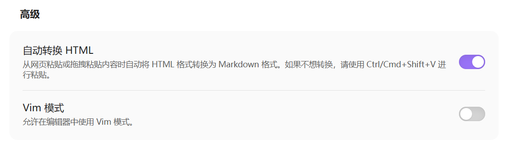
#### 链接
- 选择**文件与链接**，在**内部链接**中选择基于当前相对路径，默认是_尽可能短的形
- 关闭使用wiki 链接，便于迁移到其他 软件
- 删除文件
- 移动到当前的软件回收站(.trash文件夹)，这样就不用占用 混乱了系统的回收站了
- ==按`[[`自动 提示关联到那个页面！==
- ==`[[`可以连接到文件的对应小节，#注意紧跟，没有空格==
-  编辑模式和 阅读模式都有 **链接的文件的预览功能**


#### 快捷键——🎈
- 查看关系图谱：  ctl + G
- ==快速切换：ctrl + O==
- ==命令面板：ctrl + P==
- 切换预览视图：ctrl + E
- 
- 当前文件搜索：ctrl + F
- 所有文件搜索：ctrl + shift + F
- 新建笔记：ctrl + N 
- 新建标签页：ctrl + T
- 为当前文件添加属性： ctrl+ ;
- 显示大纲页面： ctrl + 0  
- 
- 加粗：ctrl + B
- 倾斜：ctrl + I
- 待办列表：ctrl + shift +c
- 插入代码块：ctrl + shift + k
- 插入链接：alt + shift +L 
- 插入删除线：ctrl + shift + D
- 注释：ctrl +shift + /
- 斜杠快捷命令： / 
- 
- Slide演示： --- 


#### 在其他设备上同步
1. 克隆仓库到新设备：
	- 确保新设备已安装 Git 和 Obsidian。
	- 打开终端，克隆仓库：
```
git clone https://github.com/你的用户名/Obsidian-Notes.git
```
	-  输入 GitHub 用户名和 PAT 进行认证。
2. 打开 Vault：
	- 在 Obsidian 中，选择 **Open folder as vault**，导航到克隆的文件夹（例如 Obsidian-Notes）
3. 安装和配置 Git 插件：
	- 重复步骤四的插件安装和配置。
	- 确保所有设备的插件设置一致（例如自动提交间隔、认证信息）。
4. 同步测试：
	- 在一台设备上编辑笔记，等待自动提交和推送。
	- 在另一台设备上启动 Obsidian，确认是否自动拉取了更改

#### 共享插件配置
[Obsidian 如何多个仓库用同样的配置和插件 - 知乎](https://zhuanlan.zhihu.com/p/25299428077)
```bash
mklink 命令
```

#### [链接笔记](https://publish.obsidian.md/help-zh/%E9%93%BE%E6%8E%A5%E7%AC%94%E8%AE%B0%E4%B8%8E%E6%96%87%E4%BB%B6/%E5%86%85%E9%83%A8%E9%93%BE%E6%8E%A5)
- 当你重命名某个文件时，Obsidian 会自动更新仓库中指向这个文件的内部链接。如果你不希望自动更新，而是在可以更新时手动选择是否更新，则可以按以下操作进行关闭这个功能：

- **设置 → 文件与链接 → 自动更新内部链接**
- 在编辑视图下，你可以通过以下几种方式链接附件：
	- 输入`[[`，然后选择要链接到的附件。
	- 选择编辑器中的文本，然后按下`[[`，随后选中的文本将自动转变为链接。
	- 打开[命令面板](https://publish.obsidian.md/help-zh/%E6%A0%B8%E5%BF%83%E6%8F%92%E4%BB%B6/%E5%91%BD%E4%BB%A4%E9%9D%A2%E6%9D%BF)，然后选择**插入链接**命令

- 链接笔记小标题
- 但如果你想逐级链接，那么你可以在链接中加入多个井号
- ==空格不能直接写为空格，而是要写成`%20`==

- 块引用是 Obsidian 特有的语法，其不是标准的 Markdown 语法。因此，包含块引用的链接在其他笔记软件无法生效
 ^942e66
- ==输入`[[`,#是当前文章的标题，^是当前文章的块，两个的话就是当前仓库去搜索的了，所以一般就是 去搜索的==


#### [插入文件](https://publish.obsidian.md/help-zh/%E9%93%BE%E6%8E%A5%E7%AC%94%E8%AE%B0%E4%B8%8E%E6%96%87%E4%BB%B6/%E6%8F%92%E5%85%A5%E6%96%87%E4%BB%B6)
- ==要在当前笔记中插入另一篇笔记，你只需要在链接这篇笔记的语法前加一个感叹号==
- ==可以指定插入图片的高宽，可以指定插入PDF的页数==


### 插件
#### [Custom Attachment Location](https://blog.csdn.net/qq_52357217/article/details/127562163)
- `./${noteFileName}.assets`   // typora 格式
- `./assets/${noteFileName}`  // 当前文件夹下的
- `assets/${noteFileName}`  // 就是根目录下的
- `imgs/${date:{momentJsFormat:'YYYY-MM-DD'}}` //stackedit 格式
- 
- YYYY：四位年份（如2026）
- MM：两位月份（01-12，不足两位补零）
- DD：两位日期（01-31，不足两位补零）
- HH：24小时制小时（00-23）
- mm：分钟（00-59）
- ss：秒（00-59）
- `SSS`：毫秒（000-999，精确到千分之一秒）

#### [Obsidian Git](https://www.cnblogs.com/water-peace/articles/19620112) 

- [Github 存储库限制](https://blog.csdn.net/qq_41653564/article/details/156830834)
	- 磁盘上大小：10 GB
	- 推送大小：此限制强制为 2GB
	- 单个对象大小：建议的最大限制为 1MB。 此限制强制为 100MB
- 


## scholaread——靠岸学术
### 功能

- 将Zotero里面的文献一键导入，即可 **重新排版为单栏布局、一对一逐句翻译、公式/图表AI解析、智能划重点、帮你定选题**等
- 电脑、手机、平板多端同步，你的文献库随时随地触手可及
	- 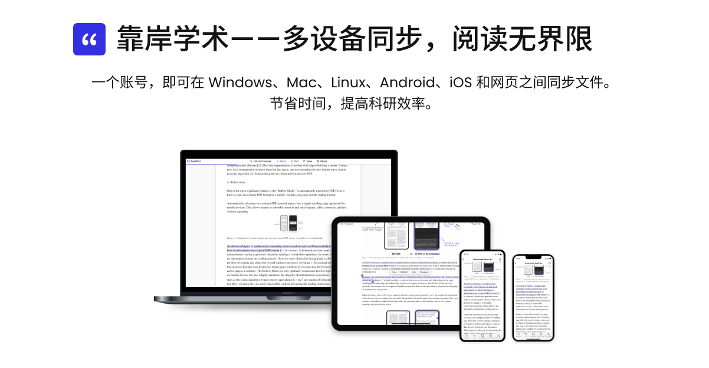
- 

### 专业版——199.9
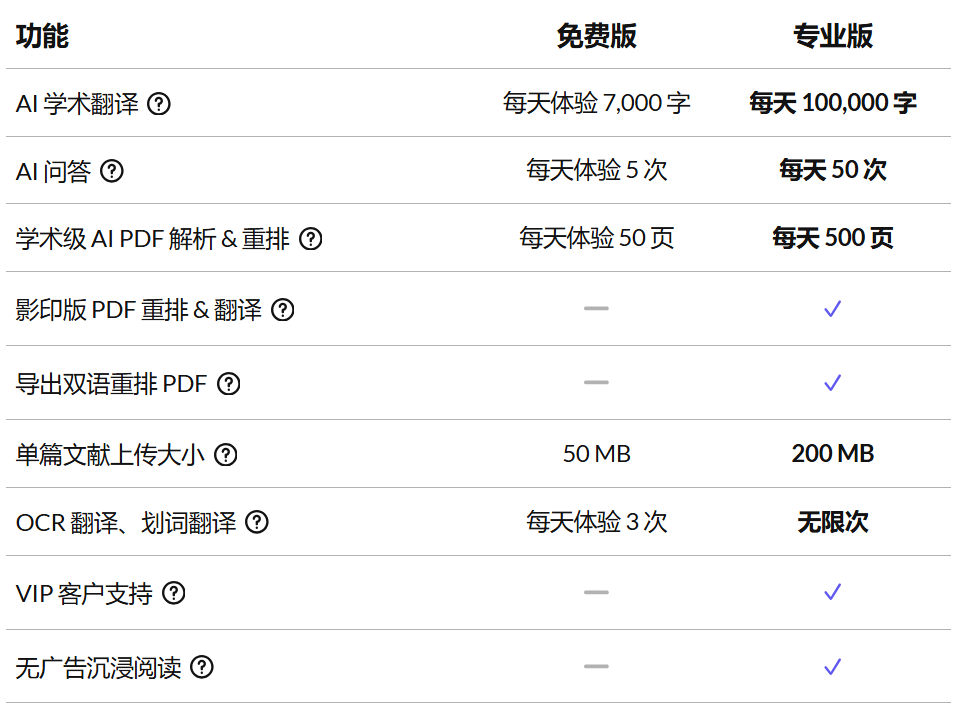

- 划词功能 还是使用 豆包可能更好？**不仅划词翻译，还有划词 解释**


## [Zotero](https://www.bilibili.com/video/BV1TM411t7Un?t=2.1)
### 同步
#### 数据同步
- ==是将 项目、笔记、链接、标签等（除附件文件外）进行合并，就是除了 附件的文件外了！！！==
- 数据同步是免费且无限的，并且可以在不启用文件同步的情况下使用
- 当Zotero同步时，它会自动**双向应用更改**——您在一个地方所做的任何更改都将应用于所有其他同步的计算机。
	- 如果在同步之间某个项目在多个地方以冲突的方式发生了变化，您将收到一个冲突解决对话框，询问您希望保留哪个版本
- 


#### 文件同步
- Zotero免费提供**300MB**的附件存储空间
	- 一旦超过300MB，同步就会停止。您必须付费购买更大的存储方案（如2GB/20美元/年，6GB/60美元/年），才能继续同步。对于文献量大的用户来说，这是一笔持续的开销。
- 扩展方法：大都都是 使用 坚果云的：
	- [突破Zotero 300MB限制，如何实现文献无限同步？坚果云+Zotero保姆级教程 | 坚果云博客](https://blog.jianguoyun.com/?p=3652)
	- 坚果云：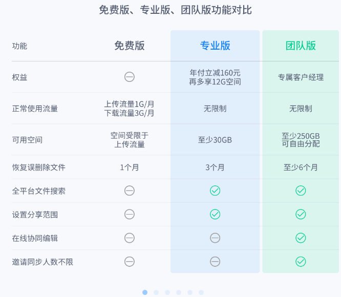
	- ==坚果云不是按照容量计算的，是按照流量计算。每个月有3G的上传流量和1G的下载流量==
- 可以 使用外国的 webdav 也有更大的同步 空间的


### 导入文献
- 可以 直接输入 DOI 号 进行导入
- 也可以 浏览器打开对应的文献，然后点击插件 就会**自动导入该文献**
- 第三种 就是有了 下载的PDF 就可以直接拖入的
- 可以无限创建 子分类的


### 插入文献


### [插件下载安装](https://www.bilibili.com/video/BV1as4y1a7iA?t=2.7)
To install a plugin in Zotero, download its `.xpi` file to your computer. Then, in Zotero, click “Tools → Plugins” and drag the `.xpi` onto the Plugins window

#### scholaread
- 不再通过传统插件安装，而是通过客户端
- ==一键导入Zotero文献库之后，手机平板都会同步更新


#### Sci-Hub plugin for Zotero ——抓取英文文献
- 利用 Sci-Hub 自动下载带有 DOI 条目的 PDF 文献，后续会自动更新
- **失效后手动更新步骤：**
- **编辑→首选项→sci-hub→更新链接**


#### [Ethereal Style](https://zotero-chinese.github.io/plugins/#search=Ethereal%20Style)
- 考虑到众多第三方应用有查询期刊等级的需求，于是开放此接口供用户免登录查询
- 该接口不与会员服务绑定，目前免费对所有用户开放，祝各位科研工作者一切顺利！
	- [zotero中的配置 secrectkey](https://zhuanlan.zhihu.com/p/670327264)

- [功能介绍](https://www.notion.so/Zotero-Style-bc2aebbbb6df4b7baa858e376e4fc5be)


#### [Better Notes for Zotero](https://zotero-chinese.github.io/plugins/#search=Better%20Notes%20for%20Zotero)
[如何去使用](https://github.com/windingwind/zotero-better-notes#readme)
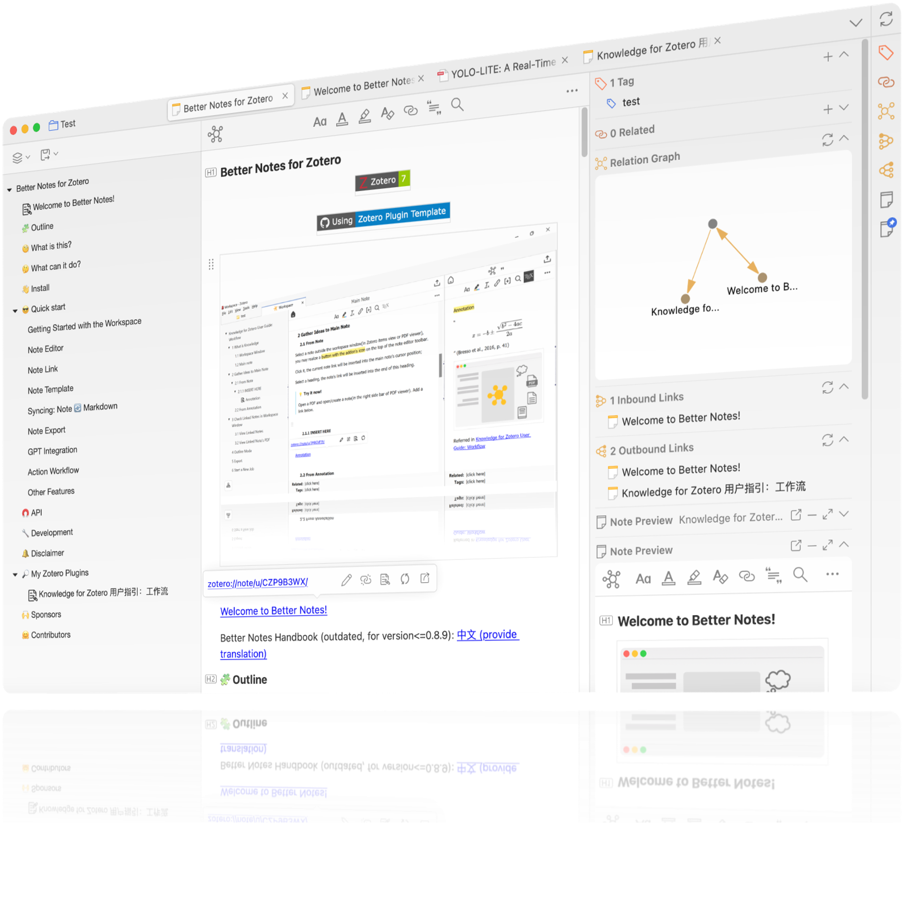
##### 同步
同步，需要better notes设置导出为maarkdwon-将链接的笔记分别导出-勾选为每个笔记设置自动同步，才可以！！！

##### 将Obsidian的库设置为Zotero的根目录
- 实现可以在Obsidian中调用Zotero中的PDF附件


#### [Better BibTeX for Zotero](https://zotero-chinese.github.io/plugins/#search=Better%20BibTeX%20for%20Zotero)
- [如何去使用](https://github.com/retorquere/zotero-better-bibtex#readme)


### 用平板 快速阅读论文
#### 平板
- https://www.bilibili.com/video/BV1BP411J72b?t=0.4
- 平板是平板电脑的总称，是一个大的品类
	- 而`iPad`是美国苹果公司生产的平板电脑的品牌名称
	- 普通Pad也能提供基本的娱乐和办公需求

#### 声音朗读：
- 朗读功能目前仅在桌面版应用中可用，很快将推出 iOS 和 Android 应用版本
- 

##### 配置本地的语音
- [使用微软离线语音Yunxi和Xiaoxiao来朗读书籍和文献](https://www.zhihu.com/question/402589277/answer/1936056106607683561?share_code=K8l6zkNGDvYp&utm_psn=2027723489851744519)
	- 程序 应该解压至一个文件夹。
	- ==安装完成后，不要再移动、重命名或删除这些文件。若需要移动或删除文件，应先卸载==
- 支持如下自然语音：
	- Windows 11 中的讲述人自然语音
		- 目前不再推荐在 Windows 11 上安装讲述人自然语音，因为当前的商店版本的最新版本的语音包不能在该程序中使用。建议下载[最后一个可使用的语音版本](https://github.com/gexgd0419/NaturalVoiceSAPIAdapter/wiki/%E8%AE%B2%E8%BF%B0%E4%BA%BA%E8%87%AA%E7%84%B6%E8%AF%AD%E9%9F%B3%E4%B8%8B%E8%BD%BD%E9%93%BE%E6%8E%A5)，并使用该版本
		- [(Windows 4种安装程序格式MSI，EXE、AppX和MSIX优缺点对比](https://zhuanlan.zhihu.com/p/571758477)
	- Microsoft Edge 中“大声朗读”功能的在线自然语音
	- 来自 Azure AI 语音服务的在线自然语音，只要你有对应的 key
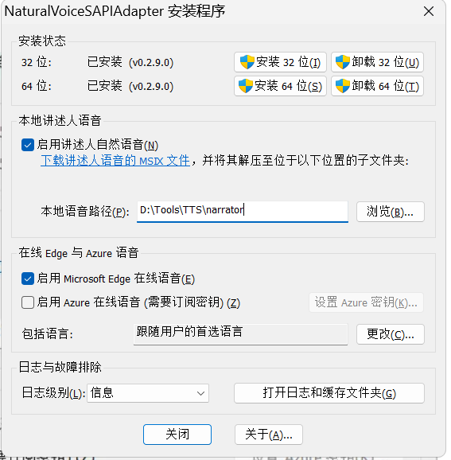


| 语言        | 名称                 | 当地名称    | 性别  | 下载链接                                                                                                                                                                                                                                                              |
| --------- | ------------------ | ------- | --- | ----------------------------------------------------------------------------------------------------------------------------------------------------------------------------------------------------------------------------------------------------------------- |
| 中文(简体，中国) | Microsoft Xiaoxiao | 晓晓      | 女   | [链接](https://dl.nvdacn.com/NVDA-Addons/TTS/NaturalVoices/MicrosoftWindows.Voice.zh-CN.Xiaoxiao.1_1.0.9.0_x64__cw5n1h2txyewy.Msix)                                                                                                                                 |
| 中文(简体，中国) | Microsoft Yunxi    | 云希      | 男   | [链接](https://dl.nvdacn.com/NVDA-Addons/TTS/NaturalVoices/MicrosoftWindows.Voice.zh-CN.Yunxi.1_1.0.4.0_x64__cw5n1h2txyewy.Msix)                                                                                                                                    |
| 英语(英国)    | Microsoft Ryan     | Ryan    | 男   | [链接](https://dl.nvdacn.com/NVDA-Addons/TTS/NaturalVoices/MicrosoftWindows.Voice.en-GB.Ryan.1_1.0.3.0_x64__cw5n1h2txyewy.Msix)                                                                                                                                     |
| 英语(英国)    | Microsoft Sonia    | Sonia   | 女   | [链接](https://dl.nvdacn.com/NVDA-Addons/TTS/NaturalVoices/MicrosoftWindows.Voice.en-GB.Sonia.1_1.0.3.0_x64__cw5n1h2txyewy.Msix)                                                                                                                                    |
| 英语(美国)    | Microsoft Aria     | Aria    | 女   | [v2链接](https://dl.nvdacn.com/NVDA-Addons/TTS/NaturalVoices/MicrosoftWindows.Voice.en-US.Aria.2_1.0.1.0_x64__cw5n1h2txyewy.Msix)，[v1链接](https://dl.nvdacn.com/NVDA-Addons/TTS/NaturalVoices/MicrosoftWindows.Voice.en-US.Aria.1_1.0.8.0_x64__cw5n1h2txyewy.Msix)   |
| 英语(美国)    | Microsoft Guy      | Guy     | 男   | [v2链接](https://dl.nvdacn.com/NVDA-Addons/TTS/NaturalVoices/MicrosoftWindows.Voice.en-US.Guy.2_1.0.1.0_x64__cw5n1h2txyewy.Msix)，[v1链接](https://dl.nvdacn.com/NVDA-Addons/TTS/NaturalVoices/MicrosoftWindows.Voice.en-US.Guy.1_1.0.5.0_x64__cw5n1h2txyewy.Msix)     |
| 英语(美国)    | Microsoft Jenny    | Jenny   | 女   | [v2链接](https://dl.nvdacn.com/NVDA-Addons/TTS/NaturalVoices/MicrosoftWindows.Voice.en-US.Jenny.2_1.0.1.0_x64__cw5n1h2txyewy.Msix)，[v1链接](https://dl.nvdacn.com/NVDA-Addons/TTS/NaturalVoices/MicrosoftWindows.Voice.en-US.Jenny.1_1.0.8.0_x64__cw5n1h2txyewy.Msix) |


## 飞书
### 快捷键
- 截屏：alt + shift + s
- 历史记录：ctrl + h
- 查看快捷键：ctrl + /
- 设置：ctrl + ,
- 


## 小绿鲸


# [浏览器插件](https://zhuanlan.zhihu.com/p/682317996)
## [Zotero Connector](https://chromewebstore.google.com/detail/zotero-connector/ekhagklcjbdpajgpjgmbionohlpdbjgc)
- 使用 Zotero Connector 需要有两个注意点
	- 第一点必须首先打开 Zotero 的客户端，这样 Zotero Connector 才能自动连接到 Zotero 上
	- 第二点 Zotero Connector 只是一个下载功能，它不是 SCI-HUB，因此如果你访问的论文需要付费或者其他权限，Zotero Connector 并不能帮你破解这个限制


## 沉浸式翻译
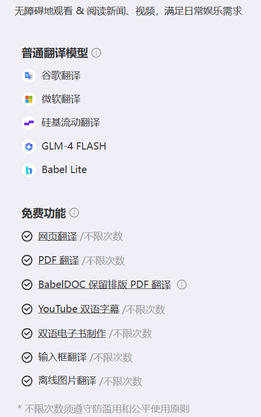


- ==免费版 只有保留排版的PDF 翻译 不限次数！！！所以不用购买升级了！==


## [easyScholar](https://www.easyscholar.cc/#pricing)


- 付费的 话只是多了 自定义数据集有用！！！
- ==免费的仍然有点击页面中的logo，即可跳转PDF全文==
- 文献管理用 zotero 就可以
- 在线翻译 有 沉浸式翻译
- ==显示期刊等级  免费也可以的！！！==
- 所以没必要 购买！！！！！！！！！！


## [Pagenote一页一记](https://link.zhihu.com/?target=https://chromewebstore.google.com/detail/pagenote%25E4%25B8%2580%25E9%25A1%25B5%25E4%25B8%2580%25E8%25AE%25B0/hpekbddiphlmlfjebppjhemobaopekmp)


## [Auto Sci-Hub](https://zhuanlan.zhihu.com/p/297672974)
### 无法安装扩展程序，因为它使用了不受支持的清单版本。 无法加载清单
https://blog.csdn.net/SuvanCode/article/details/149478755

[众多解决方法——快捷方法增加 启动参数](https://zhuanlan.zhihu.com/p/1927399384947065539)


## [Google 学术搜索 PDF 阅读器](https://www.youtube.com/watch?v=dmTD67eidWc)
- 首先 设置PDF 的默认打开 文件就是 Google，然后 Google 里面设置`chrome://settings/content/pdfDocuments`:
	- 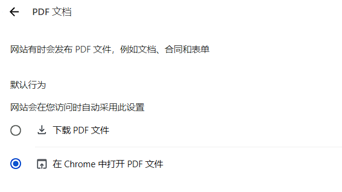
- 在 Google 打开 PDF 之后会弹出 这样的，按照提示进行：
	- 
	- 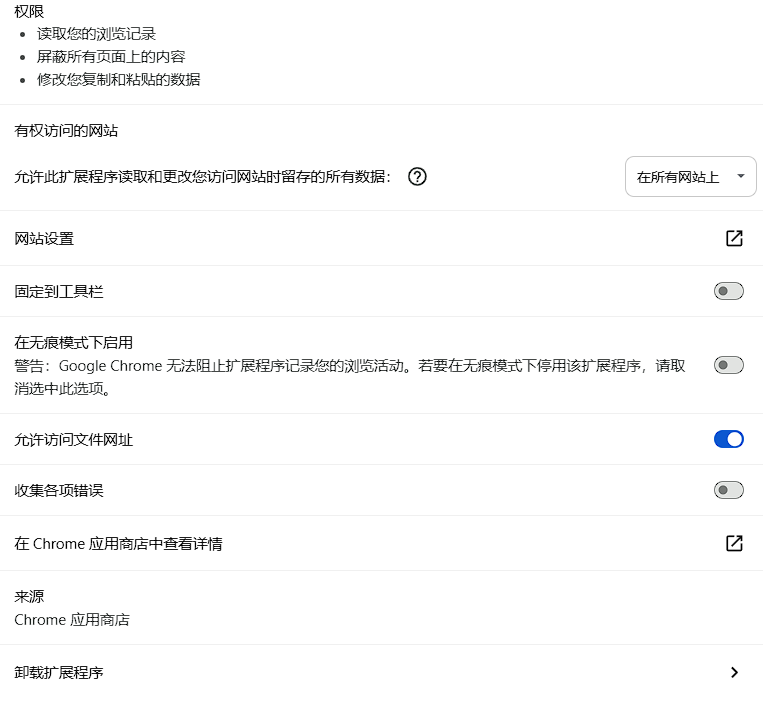
- 太牛啦！！！新神
	- 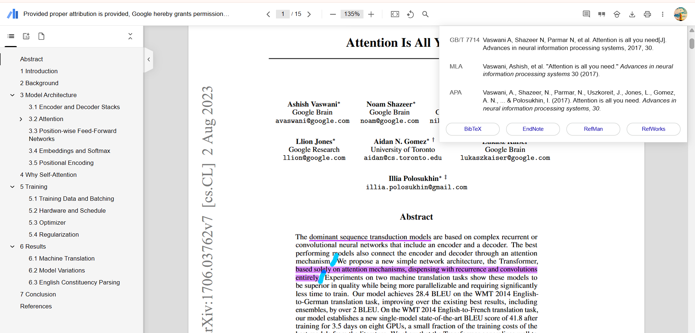


# 搭配使用
## 阅读PDF——🦄
- 平时阅读 主要还是 在 **zotero** 上边进行的，还能**本地 TTS 阅读的**
	- 如果删除 的话，直接 划==红色的  ❌  吧，不要太固执了！！！==
		- **删除**可以选择 Foxit-PDF
	- 去理解 具体的，解释、翻译、总结：**豆包划词** 
	- **全文对照 翻译**：**豆包浏览器**  去 AI阅读的
	- **每一段**的 "重点高亮"、解释每一个公式、总结全文： 可以结合  Scholaread，一年200！！！
- 如果是 **ArXiv 或者 顶会venues**  的，去https://chatpaper.com/zh-CN/chatpaper，这里有现成的 翻译和解释呢
	- 不推荐  这里去上传pdf  去解析的，不是免费全部翻译的！！！
	- 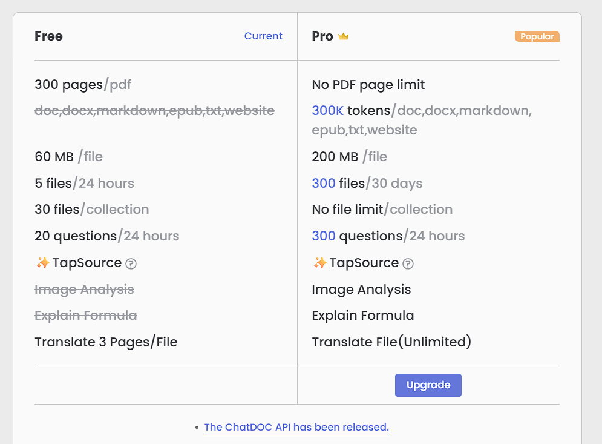
	-  GPT-5 Mini is Now Free for All Users!
- 如果是 能获取到PDF的，而且**多个文献 直接对比分析**，可以给到 NoteBookLM 的！！！


- PDF翻译：
	- 先使用 购买的 Scholaread
	- [Doc2X，也有一些免费签到额度，每天 25 页PDF](https://doc2x.noedgeai.com/?invite_code=ZHDAPC)
	- 还有  网易每个月 5w 字符
	- 最后 试试 豆包浏览器里面直接 翻译呢！！！


- **识别公式和图表** 为markdown：[公式/文档识别](https://simpletex.cn/ai/latex_ocr)
	- 当前SimpleTex各渠道一直是免费使用的且从来没有改变
	- 识别完成后可以导出Word（Docx）或者Markdown（[LaTeX](https://zhida.zhihu.com/search?content_id=242856310&content_type=Article&match_order=1&q=LaTeX&zhida_source=entity)公式）等格式
	- 


- [豆包 如果收费的话，插件连接 DeepSeek](https://www.bilibili.com/video/BV1cnLq6EErh?t=0.2)


